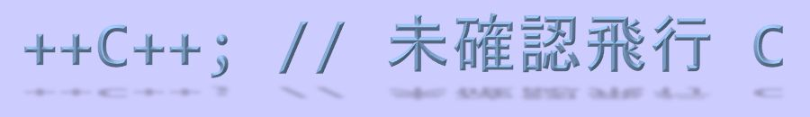

# ++C++; // 未確認飛行 C をリニューアルしました

「++C++; // 未確認飛行 C [ufcpp.net][1]」 をリニューアルしました。これに伴い、ブログも統合し「WordPress [https://ufcpp.wordpress.com/][2]」から「[http://ufcpp.net/blog][3]」へ変更となります。

2000年よりサイトを運営しているため、一部古い内容のものがあります。ご了承ください。

誤字・脱字・バグを見つけた場合や、ご意見・ご要望等がございましたら、[GitHub の Issues][4] までご連絡いただけますと助かります。

前のバージョンでは XML を XSLT でパースし、静的に HTML をホストしていました。リニューアル後では、[Umbraco 7][5] を使用しています。Umbraco は、.NET Framework, ASP.NET で動作するオープンソースの CMS です。 [ASP.NET 公式サイト][6]も Umbraco で構築されています。

  [1]: ../../../../index.md "ufcpp.net"
  [2]: https://ufcpp.wordpress.com/
  [3]: ../../../index.md
  [4]: https://github.com/ufcpp/UfcppSample/issues
  [5]: http://umbraco.com/
  [6]: http://www.asp.net/
