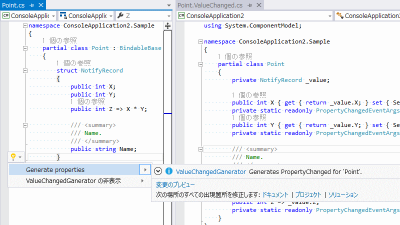

# 【Roslynメタプログラミング】ValueChangedGanerator

多少やりすぎ感があって大々的に推すかどうかは迷っているものの…

- [ValueChangedGanerator](https://github.com/ufcpp/ValueChangedGanerator)

[.NET Compiler Platform](https://github.com/dotnet/roslyn) (コードネーム Roslyn)を使ったメタプログラミングというか、結構なコード生成ツールを作ってしまっていたり。

[今度やる勉強会](https://csugjp.doorkeeper.jp/events/26140)で.NET Compiler Platformの話をするのと、一度作ってしまえば仕事でも活用できそうだったので。

## 生成ツールの概要

要するに、たびたび出てくる「`INotifyPropertyChanged`の実装めんどくさい問題」に対する、Roslyn使った解決方法の1つ。

`INotifyPropertyChanged`実装はめんどくさいものの、用途が限られてる(ほとんどの場合、クライアント開発者にしか使われない。サーバー側でも`INotifyPropertyChanged`自体は使われることあるけども、そっちは完全に自動生成の中に隠れてたり)のと、実装方法がたまーにカスタマイズしたいことがあって、C#言語構文としてコンパイラーが何か補助するような機能は作りにくいものです。

で、こういうめんどくさいくせに「用途限定」「実装に幅あり」なものに対して有効な解決策がメタプログラミングなわけですが。最近、Roslynを使ったコード生成にだいぶ慣れてきてしまい、作ってみたのがこの[ValueChangedGanerator](https://github.com/ufcpp/ValueChangedGanerator)。

今回僕が作った実装以外にも、つい最近、[ノイエさん](http://neue.cc/)が[NotifyPropertyChangedGenerator](https://github.com/neuecc/NotifyPropertyChangedGenerator/)というやつも作っていたり。というか、これがこっち作るきっかけ。[NotifyPropertyChangedGenerator](https://github.com/neuecc/NotifyPropertyChangedGenerator/)と[こっち](https://github.com/ufcpp/ValueChangedGanerator)の違い(pull-req 送るとかでなく別実装した理由)は:

- プロパティ自身の書き換えでなく、コード生成元にはノータッチで、完全に別の場所にコードを生成
- コード生成先を、同一ファイル内の #region ではなく、別ファイルに分離
- `SetProperty()`まではコード生成せず、こいつは元々ある想定

の3点です。

## 生成方式

- 生成元には、`NotifyRecord`という名前で入れ子になった構造体を定義します。
- この名前の入れ子構造体があると、Quick Action(電球マーク)が出ます
- 「Generate properties」を選択すると、コードが生成されます。



例えば、以下のようなコードが Point.cs と言う名前であったとします。

```csharp
partial class Point : BindableBase
{
    struct NotifyRecord
    {
        public int X;
        public int Y;
        public int Z => X * Y;

        /// <summary>
        /// Name.
        /// </summary>
        public string Name;
    }
}
```

このファイル自体も、`Point`クラスに対して`partial`修飾子がつく修正がかかります。

そして、Point.ValueChanged.cs という名前で、以下のようなコードが生成されます。

```csharp
using System.ComponentModel;

partial class Point
{
    private NotifyRecord _value;

    public int X { get { return _value.X; } set { SetProperty(ref _value.X, value, XProperty); OnPropertyChanged(ZProperty); } }
    private static readonly PropertyChangedEventArgs XProperty = new PropertyChangedEventArgs(nameof(X));
    public int Y { get { return _value.Y; } set { SetProperty(ref _value.Y, value, YProperty); OnPropertyChanged(ZProperty); } }
    private static readonly PropertyChangedEventArgs YProperty = new PropertyChangedEventArgs(nameof(Y));

    /// <summary>
    /// Name.
    /// </summary>
    public string Name { get { return _value.Name; } set { SetProperty(ref _value.Name, value, NameProperty); } }
    private static readonly PropertyChangedEventArgs NameProperty = new PropertyChangedEventArgs(nameof(Name));
    public int Z => _value.Z;
    private static readonly PropertyChangedEventArgs ZProperty = new PropertyChangedEventArgs(nameof(Z));
}
```

`SetProperty`と`OnPropertyChanged`の実装は、元のクラス(今回の場合`Point`)が持っている前提でコード生成します。今回は、基底クラスで実装している想定。その基底クラス`BindableBase`は以下のような実装になっています。

```csharp
using System.Collections.Generic;
using System.ComponentModel;
using System.Runtime.CompilerServices;

class BindableBase : INotifyPropertyChanged
{
    #region INotifyPropertyChanged

    public event PropertyChangedEventHandler PropertyChanged;

    protected void OnPropertyChanged(PropertyChangedEventArgs args) => PropertyChanged?.Invoke(this, args);

    protected void OnPropertyChanged([CallerMemberName] string propertyName = null) => OnPropertyChanged(new PropertyChangedEventArgs(propertyName));

    protected void SetProperty<T>(ref T storage, T value, PropertyChangedEventArgs args)
    {
        if (!EqualityComparer<T>.Default.Equals(storage, value))
        {
            storage = value;
            OnPropertyChanged(args);
        }
    }

    protected void SetProperty<T>(ref T storage, T value, [CallerMemberName] string propertyName = null) => SetProperty(ref storage, value, new PropertyChangedEventArgs(propertyName));

    #endregion
}
```

もちろん、このためにだけに継承を使うのは嫌という話もあります。それはまた[別の方法](https://github.com/ufcpp/MixinGenerator)で解決しようかなぁと(未実装。Test-Firstで先に生成前後のサンプルだけあり)。そっちもやりすぎ感あふれてて悩ましいですが…

## 実装の理由

### 生成元は正規のC#文法

「似て非なる何か」、「亜種」を作らないように、生成元のコードは通常のC#の文法に収まるようにしています。

なので、多少冗長な感じは残ります。今回の実装だと、一段階入れ子にした構造体に元定義を書くので、3行(`struct NotifyRecord`, `{`, `}`)と、1インデント分の無駄はあります。

### 生成は静的に/生成結果がC#コードとして見れる

デバッグ上、生成結果のC#コードが見れるというのは非常に重要。

他の言語で見られるような、動的な処理とか、ビルド後コード挿入でやるようなメタプログラミングは、だいたいデバッグできなくて泣きそうになるので。

.NET Compiler Platformを使ったコード生成でやっているので、この条件は自然と満たします。

### 生成元と生成結果が分かれるように

生成の前後のコードが混ざると、再生成時にどこを書き替えたらいいのか分からなかったり、機械生成の部分に手を入れてしまって再生成で消してしまったりするので。

今回は、元は入れ子の構造体なので、生成元と生成結果がかち合うことはない。
また、`partial`にして別ファイルに分離。

### docコメントも付くように

生成結果が`public`なプロパティなので、ここにdocコメントが付いていてほしい。でないと、「doc XMLを出力する」設定でビルドした時に警告が大量に出てしまうので。

今回は、生成元のフィールドに付けたdocコメントをそのまま移植する実装になっています。

## 利用方法

[github公開してるソースコード](https://github.com/ufcpp/ValueChangedGanerator)の他に、パッケージ化してギャラリーに置いてあります。

- [VSIX(Visual Studio拡張)形式をVisual Studio Galleryに](https://visualstudiogallery.msdn.microsoft.com/bf5dbce2-b73d-4f5f-8e1c-0e1de386b7ce)
- [NuGet形式をNuGet Galleryに](https://www.nuget.org/packages/ValueChangedGanerator/)
