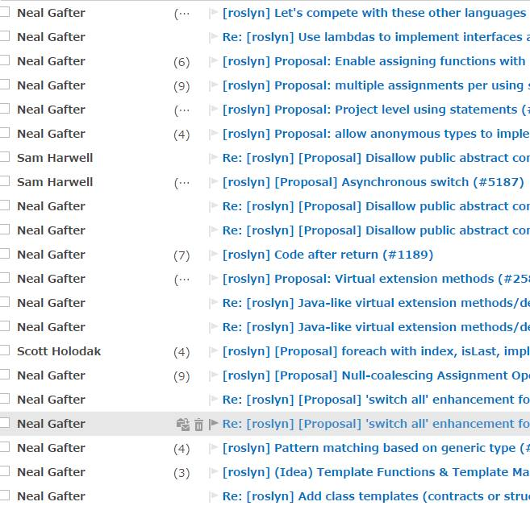

# ピックアップRoslyn 9/13

なんか大変なことになってる。

メールの大半を占めてる「Neal Gafter」はC#チームでGitHub Issue対応してくれてる人。

これまでの提案Issueページの整理作業を一気にやった様子。

多くのものは、

- Close 作業
  - C# 7.0に向けてやり始めたよ
  - 重複だから別エントリーに移って
  - ちょっと無理/費用対効果合わない
  - 試験的な実装始めたしIssueは閉じる
- 提案が不明瞭だからもう少し説明求

で、いくらか、C# 7.0に向けた新文法の提案が出ています。

## throw を「式」に

[[Proposal] Make "throw expression" an expression form #5143](https://github.com/dotnet/roslyn/issues/5143)

- 条件演算子で `condition ? 値 : throw new InvalidOperation()` とかが書けるように

「throw の結果は任意の型に変換可能」と判定。[never型](https://github.com/dotnet/roslyn/issues/1226)とかがあるともうちょっと融通効くようになるものの、そこまでやるのは CLR レベルの変更が必要なのでもうちょっと先になりそう。

## 式ベースの swich ステートメント

[[Proposal] expression-based switch for pattern matching #5154](https://github.com/dotnet/roslyn/issues/5154)

前々から出てる、パターンマッチングに対応した分岐構文をどうするか。

結局、match 式みたいな新しいキーワードを追加するんじゃなく、switch の拡張になりそう。

## immutable データの書き換え (with ステートメント)

[[Proposal] "with" expressions for record types #5172](https://github.com/dotnet/roslyn/issues/5172)

immutable なデータを書き換えたければ、大部分のメンバーを丸ごとコピーした上で、書き換えたい場所だけ新しい値で、別インスタンスを作る必要があって大変面倒という問題の解消。レコード型に対する with ステートメントってのを足すという提案。

## 非同期スイッチ(selectステートメント)

[[Proposal] Asynchronous switch #5187](https://github.com/dotnet/roslyn/issues/5187)

「`Task.WhenAny` して、最初に返ってきたタスクがどのタスクかを判定して分岐」みたいな処理を構文化。確かに、個人的に`WhenAny`後の分岐面倒に思うこと多い。
