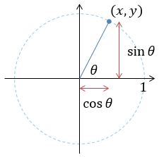
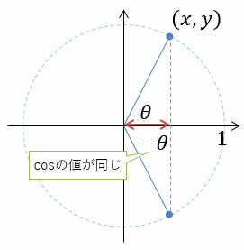
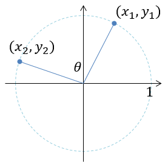

# 小ネタ atan2

今日は、`Math`クラスの`Atan2`メソッドの話。あんまり数学がわかってない人だと、「tanの逆関数」なのにどうして2引数あるのかとか、`Atan`と`Atan2`で戻り値の範囲が違う(前者が-90度～90度、後者が-180度から180度)のが不思議だったりするみたいですね。

大元をたどるとatan2はFORTRANとかC言語とかの頃からあって、ちょっと調べれる範囲でもFORTRAN 77の時点であったらしいので、少なくとも1977年より前まで遡ります。なのでC#の小ネタというよりはプログラミング全般の小ネタだったり、むしろ、単に数学の話だったり。

## x軸とのなす角

単純化のために、まずは半径1の円周上の点(x, y)の1点だけを考えて、原点からこの点までの線分と、x軸がなす角を考えます。以下の絵のような感じ。



この絵を見ての通り、以下の条件を満たすθを計算することになります。

<math xmlns="http://www.w3.org/1998/Math/MathML" ><mi>x</mi><mo>=</mo><mrow><mrow><mi mathvariant="normal">cos</mi></mrow><mo>⁡</mo><mrow><mi>θ</mi></mrow></mrow></math>

<math xmlns="http://www.w3.org/1998/Math/MathML" ><mi>y</mi><mo>=</mo><mrow><mrow><mi mathvariant="normal">sin</mi></mrow><mo>⁡</mo><mrow><mi>θ</mi></mrow></mrow></math>

「逆三角関数を使えば簡単」と思うかもしれませんが、それだと半分だけ正解。<math xmlns="http://www.w3.org/1998/Math/MathML" ><mi>θ</mi><mo>=</mo><mrow><mrow><msup><mrow><mi mathvariant="normal">cos</mi></mrow><mrow><mo>-</mo><mn>1</mn></mrow></msup></mrow><mo>⁡</mo><mrow><mi>x</mi></mrow></mrow></math>だと、x軸を中心に左右どちら周りなのかがわからなくなります。



同様に、<math xmlns="http://www.w3.org/1998/Math/MathML" ><mi>θ</mi><mo>=</mo><mrow><mrow><msup><mrow><mi mathvariant="normal">sin</mi></mrow><mrow><mo>-</mo><mn>1</mn></mrow></msup></mrow><mo>⁡</mo><mrow><mi>y</mi></mrow></mrow></math>だとy軸中心の折り返しがわからないです。さらにいうと、以下の式もダメ。y/xしている時点でわかると思いますが、符号が消えます。x, yともに正の場合と、共に負の場合が同じ値になってしまうので、やっぱり半円分しか計算できません。

<math xmlns="http://www.w3.org/1998/Math/MathML" ><mfrac><mrow><mi>y</mi></mrow><mrow><mi>x</mi></mrow></mfrac><mo>=</mo><mrow><mrow><mi mathvariant="normal">tan</mi></mrow><mo>⁡</mo><mrow><mi>θ</mi></mrow></mrow></math>

<math xmlns="http://www.w3.org/1998/Math/MathML" ><mi>θ</mi><mo>=</mo><mrow><mrow><msup><mrow><mi mathvariant="normal">tan</mi></mrow><mrow><mo>-</mo><mn>1</mn></mrow></msup></mrow><mo>⁡</mo><mrow><mfrac><mrow><mi>y</mi></mrow><mrow><mi>x</mi></mrow></mfrac></mrow></mrow></math>

ということで、角度θを360度ちゃんと求めるためには、x, y、すなわち、cos, sinの両方の値が必要です。実際、`Atan2`は大体以下のような感じの分岐をしています。

```csharp {title="Atan2 の中身(抜粋)"}
static double Atan2(double y, double x)
{
    var z = Math.Atan(Math.Abs(y / x));
    if (x > 0)
    {
        if (y > 0) return z;
        else return -z;
    }
    else
    {
        if (y > 0) return Math.PI - z;
        else return z - Math.PI;
    }
    // ほんとは0, infinity, NaN の場合分けあり
}
```

## 2点のなす角

ここからは完全におまけ。ちょっとした数学の話。2点だとどうでしょう。(x<sub>1</sub>, y<sub>1</sub>)と原点と(x<sub>2</sub>, y<sub>2</sub>)のなす角。



これも、正弦定理・余弦定理からの変形で、以下のような式が成り立ちます。

<math xmlns="http://www.w3.org/1998/Math/MathML" ><mrow><mrow><mi mathvariant="normal">cos</mi></mrow><mo>⁡</mo><mrow><mi>θ</mi></mrow></mrow><mo>=</mo><msub><mrow><mi>x</mi></mrow><mrow><mn>1</mn></mrow></msub><msub><mrow><mi>x</mi></mrow><mrow><mn>2</mn></mrow></msub><mo>+</mo><msub><mrow><mi>y</mi></mrow><mrow><mn>1</mn></mrow></msub><msub><mrow><mi>y</mi></mrow><mrow><mn>2</mn></mrow></msub></math>

<math xmlns="http://www.w3.org/1998/Math/MathML" ><mrow><mrow><mi mathvariant="normal">sin</mi></mrow><mo>⁡</mo><mrow><mi>θ</mi></mrow></mrow><mo>=</mo><msub><mrow><mi>x</mi></mrow><mrow><mn>1</mn></mrow></msub><msub><mrow><mi>y</mi></mrow><mrow><mn>2</mn></mrow></msub><mo>-</mo><msub><mrow><mi>x</mi></mrow><mrow><mn>2</mn></mrow></msub><msub><mrow><mi>y</mi></mrow><mrow><mn>1</mn></mrow></msub></math>

内積がcosで、面積(交代積)がsin。これらを`Atan2(sin, cos)`の順で与えれば角度θが求まります。

## オイラーの公式

もう1つおまけ。
「オイラーは数多の公式を残しすぎてどの公式だよ」という話もあるんですが、ここで話すのは複素解析におけるオイラーの公式です。有名なあれ。
<math xmlns="http://www.w3.org/1998/Math/MathML"><msup><mrow><mi>e</mi></mrow><mrow><mi>i</mi><mi>θ</mi></mrow></msup><mo>=</mo><mrow><mrow><mi mathvariant="normal">cos</mi></mrow><mo>⁡</mo><mrow><mi>θ</mi></mrow></mrow><mo>+</mo><mi>i</mi><mrow><mrow><mi mathvariant="normal">sin</mi></mrow><mo>⁡</mo><mrow><mi>θ</mi></mrow></mrow></math>

これを逆に、<math xmlns="http://www.w3.org/1998/Math/MathML"><mrow><mrow><mi mathvariant="normal">cos</mi></mrow><mo>⁡</mo><mrow><mi>θ</mi></mrow></mrow><mo>+</mo><mi>i</mi><mrow><mrow><mi mathvariant="normal">sin</mi></mrow><mo>⁡</mo><mrow><mi>θ</mi></mrow></mrow><mo>=</mo><mi>x</mi><mo>+</mo><mi>i</mi><mi>y</mi></math>だと考えた場合、両辺の対数を取ることで、

<math xmlns="http://www.w3.org/1998/Math/MathML"><mi>i</mi><mi>θ</mi><mo>=</mo><mrow><mrow><mi mathvariant="normal">log</mi></mrow><mo>⁡</mo><mrow><mfenced separators="|"><mrow><mi>x</mi><mo>+</mo><mi>i</mi><mi>y</mi></mrow></mfenced></mrow></mrow></math>

<math xmlns="http://www.w3.org/1998/Math/MathML"><mi>θ</mi><mo>=</mo><mo>-</mo><mi>i</mi><mrow><mrow><mi mathvariant="normal">log</mi></mrow><mo>⁡</mo><mrow><mfenced separators="|"><mrow><mi>x</mi><mo>+</mo><mi>i</mi><mi>y</mi></mrow></mfenced></mrow></mrow></math>

となります。
ここで、`Atan2`の使い道を思い出してみます。`θ=Atan2(y, x)`なわけで、

<math xmlns="http://www.w3.org/1998/Math/MathML"><mrow><mrow><mi mathvariant="normal">Atan</mi><mn>2</mn></mrow><mo>⁡</mo><mrow><mfenced separators="|"><mrow><mi>y</mi><mo>,</mo><mi> </mi><mi>x</mi></mrow></mfenced></mrow></mrow><mo>=</mo><mo>-</mo><mi>i</mi><mrow><mrow><mi mathvariant="normal">log</mi></mrow><mo>⁡</mo><mrow><mfenced separators="|"><mrow><mi>x</mi><mo>+</mo><mi>i</mi><mi>y</mi></mrow></mfenced></mrow></mrow></math>

です。`Atan2`は、絶対値が1の複素数に対する対数関数と関連していたりします(指数関数が三角関数と関連しているんだから、対数関数(指数関数の逆関数)が逆三角関数と関連しているのも当然の話です)。

てことで、実のところ、`Atan2`って、「複素対数関数」だと言っても過言ではなかったり。
実装都合の変な関数ではなくて、割かし「数学的にあり得る関数」です。
