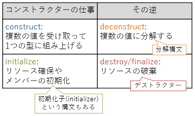
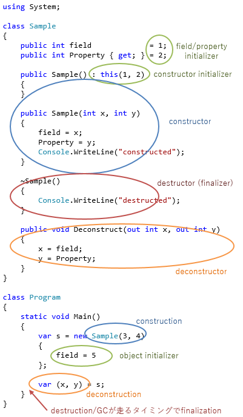

# 小ネタ 「deconstruct」という単語

今日も、小ネタなような、C#7思い出話なような。

C# 7で、[分解](../../../../study/csharp/datatype/deconstruction.md)という機能が入ったわけですが、英語だと deconstruction という単語になります。

分解という機能のおさらいですが、以下のような書き方でタプルなどの型のメンバーを抽出できる機能です。

```csharp
var (x, y) = tuple;
```

これ、他のプログラミング言語だと、destructuring とか呼ばれたりしています。
といっても、文法上正式に destructuring と呼ばれているわけではないんですが(大体の言語は文法上は単に「pattern」とか呼ばれる機能)…
まあ、解説ページなんかでは destructuring と呼ばれます。

で、今日、何が言いたいかというと、

- deconstruct  : デコンストラクト
- destructuring: デストラクト

並べるとわかりますかね。
「con」の有無。
<span style="color:#a00000">de</span><span style="color:#00a000">con</span><span style="color:#0000a0">struct </span>
と
<span style="color:#a00000">de</span><span style="color:#0000a0">struct</span>uring。

用語として多少もめてたりするみたいです。

- 他の言語に合わせてdestucturingであるべきじゃないか。
- construct (con(共) + struct(築))の逆はdestruct (de(脱) + struct(築))じゃないのか
- でも、destuctureだと[デストラクター](../../../../study/csharp/oop/oo_construct.md#dtor)と紛らわしくないか。
- C#のデストラクターって、あれ、実際にはfinalizerだし。誰だよ、destructorって名前にしたやつ

みたいな雰囲気。

日本語だとたぶん、僕みたいに「分解」とかに訳しちゃうんでそんなに変でもないんですが、
英語だとdestructorとdeconstructionが並ぶことになるんで気持ち悪いみたいですね。

まあ、デストラクターも分解も、どちらもコンストラクターの逆ではあります。



ちなみに、コンストラクター、初期化子、デストラクター、分解の例をまとめて挙げると以下のような感じ。



そもそも英語でdestroyの名詞形がdestructionなのが良くないかも。
「destruct」で切った場合、それはdestroy(破壊)のことなのかdestructure(脱構造化)のことなのかそもそもわからず。

それに、C#で破棄用の構文をデストラクターと呼ぶのはC++から持ってきた言葉なわけですけど、
これ、やっぱりJavaみたいにfinalizerって呼んでおくべきだったのかも。
デストラクターに関しては、分解が絡まなくても元々名前には悩んでいるみたいです。

- .NET的には finalizer って呼び名になってる。destructor って呼び名はC#だけ
- ECMAに出しているC#仕様書上は finalizer って呼び名になっているらしい
- MSDN上に出してるC#仕様書は destructor になってる
  - 今、ECMA版とMSDN版の統合を考えてるんで、なおのこと問題に
- [Roslyn](https://github.com/dotnet/roslyn) の API 中でも destructor という単語を使ってる
  - これがあるんで、単純に文章上だけの変更ってわけではなくて、ソースコードにも影響あり

とりあえず、現状のC#チームの希望的には以下のような雰囲気です。

- 分解は deconstruction のまま(de + con 付き)
- デストラクターって呼び名は微妙なので変えることも視野に入ってるみたい
