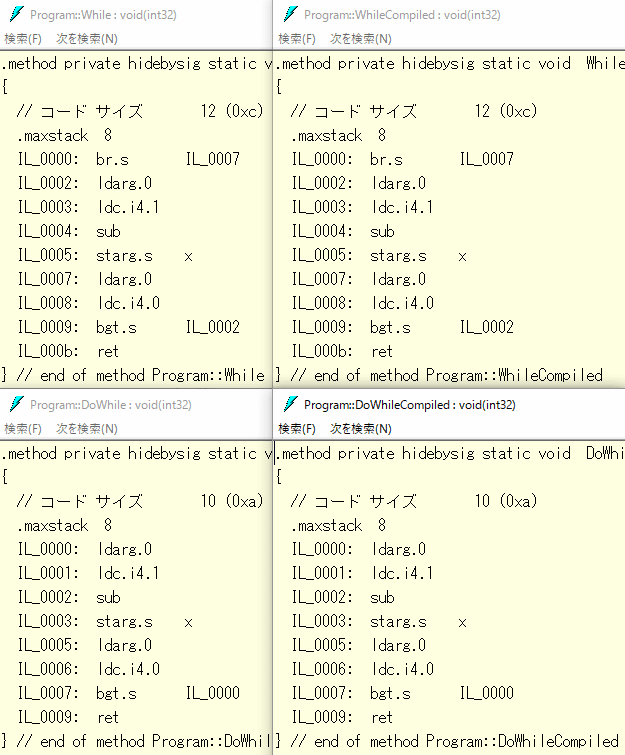

# 小ネタ do-while

[do-whileステートメント](../../../../study/csharp/structured/st_loop.md#dowhile)とか使っていますか？

あんまり実際に使われているコードを実務で見たことはなく。
[使われていないキーワードランキング](http://blog.modd.com/entry/2016/09/21/120442)的にも`do`は使われてない方から数えて27位。
もしかしたら使われないどころか存在を忘れてる人すらいるんじゃないかというこの文法。

「使ってる？」とか人に聞いてみたところ、
「初心者の頃にちょっと」「もしかしたら初心者ほど使ってるかも」とかいう回答も得られたり。
確かに、入門書とか([うちのサイト](../../../../study/csharp/index.md)含めて)には書かれてますもんね。書かれてば使うか。

たぶん、徐々に、以下のように `while (true)` になっていくのかなぁとか。
まあ、そもそも、ループの大半が `foreach` ですけど。`do-while` どころか `while` もそこそこレア。

<pre class="source" title="while (true)">
<code><reserved>while (true)
{
    // 前にも書きたいことあるし、
    if (条件) break;
    // 後ろにも書きたいことある
}
while (true)
{
    // というか、メソッド抽出して return する方が多いかも
    if (条件) return ...;
}
</code></pre>

さて、そんな`do-while`がなぜあるか、ですが。
確かに`do-while`の「最低1回は実行したい」という要件はそもそも出番が少ない上に、やろうと思えば`while`だけで書けます。
要するに、レアケースのために専用構文がある意味はあったのかという問題が。

ご存知の通り、この構文はC言語からあります。
「その当時ならば使ったのか」と言われると、やっぱりそんなに使いはしなかったと思うんですけど…

実は、生成されるコードが`while`よりも`do-while`の方が短いんですよね。
ということで、おそらく、`do-while`があるのは、そういうパフォーマンス上の理由かなぁと思います。

どういうことかというと、例えば、`do-while`は以下のように展開されます。

<pre class="source" title="do-whileの展開">
<code><reserved>static void DoWhile(int x)
{
    do
    {
        --x;
    } while (x &gt; 0);
}
// ↓
static void DoWhileCompiled(int x)
{
    BEGIN_DO_WHILE:;
    --x;
    if (x &gt; 0) goto BEGIN_DO_WHILE;
}
</code></pre>

これに対して、`while`だと以下のように、`goto` (IL 的には `br` 命令。x64 系 CPU のネイティブコード的には jmp 命令)が1個多く展開されたりします。

<pre class="source" title="whileの展開">
<code><reserved>static void While(int x)
{
    while (x &gt; 0)
    {
        --x;
    }
}
// ↓
static void WhileCompiled(int x)
{
    goto END_WHILE;// この goto がいまいち好きになれない
    BEGIN_WHILE:;
    --x;
    END_WHILE:;
    if (x &gt; 0) goto BEGIN_WHILE;
}
</code></pre>

この、`while`、`do-while`を使ったものと、展開結果の`goto`を使ったものが本当に一緒になるかも確認してみましょう。
上記コードをコンパイルして、ildasmを掛けた結果は以下の通りです。
上が`while`、下が`do-while`。
左が展開前、右が展開後。

ついでに、`do-while`の方が数バイト小さくなることもわかります。
ここではILしか出していませんけども、たいていのCPUで、ネイティブ コードでもやっぱり`do-while`の方が短くなると思います。

とはいえ、この微々たる要件のためにいまだにこの構文が必要かと言われると微妙なラインですかね。
