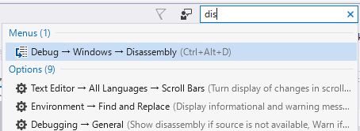
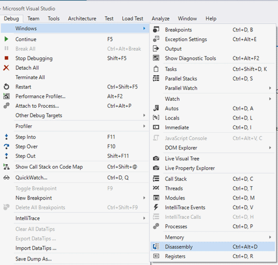
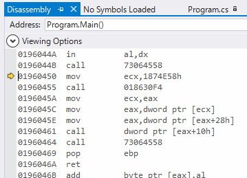
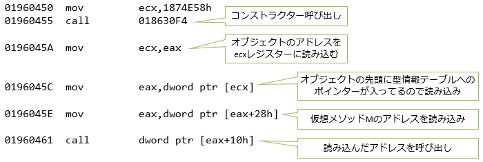

# 小ネタ コンパイル結果を覗いてみよう

めったにはないんですが、パフォーマンス チューニングとかを始めると、C#のコンパイル結果がどうなっているかを覗きたくなることがあります。C#の場合は、C#コード → IL (.NETの中間コード) → ネイティブ コードという2段階の変換が掛かります。

ということで、その極々まれにやりたくなることをやってみましょう。ILとネイティブ コードをそれぞれ覗いてみます。

例として、以下のようなC#コードを考えます。単純にvirtualなメソッドを呼び出すだけのコードです。主に、Mainメソッドの中身を見ていきます。

```csharp
using System;

class Base { public virtual void M() => Console.WriteLine("Base.M"); }
class Derived : Base { public override void M() => Console.WriteLine("Derived.M"); }

class Program
{
    static void Main()
    {
        Base b = new Derived();
        b.M();
    }
}
```

## IL逆アセンブル

まずはILがどうなっているかを覗いてみましょう。ildasm というツールを使います。ildasmは、以下の場所にあります。

- `"C:\Program Files (x86)\Microsoft SDKs\Windows\v10.0A\bin\NETFX 4.6.1 Tools\x64\ildasm.exe"`

ちなみに、ildasmは IL disassembler (IL逆アセンブラー)の略です。

10.0Aや4.6.1という数字の部分はバージョンによって変わります。あと、x64フォルダーの中と、直上の両方にildasm.exeがあります。ildasmはバージョン違い、x86かx64か違いでいくつか見つかりますが、まあ、大体どれも同じです。

これを使って先ほどのC#コードのコンパイル結果を覗いてみると、`Main`メソッドは以下のようになっています。

```cil
.method private hidebysig static void  Main() cil managed
{
  .entrypoint
  // コード サイズ       11 (0xb)
  .maxstack  8
  IL_0000:  newobj     instance void Derived::.ctor()
  IL_0005:  callvirt   instance void Base::M()
  IL_000a:  ret
} // end of method Program::Main
```

ILは、インスタンス生成や仮想メソッド呼び出し用の命令を持っています。

- `newobj`: インスタンス生成
  - new objectの略
  - 引数には、コンストラクターを参照するためのIDを渡します
  - 命令1バイト + オペランド4バイト
- `callvirt`: 仮想メソッド呼び出し
  - call virtualの略
  - 引数には、メソッドを参照するためのIDを渡します
  - 命令1バイト + オペランド4バイト
- `ret`: メソッドを抜ける
  - return

ILは、アセンブリ言語ではあるものの、かなり高級言語なことがわかります。仮想メソッド呼び出しのようなオブジェクト指向プログラミングの基本操作が1バイト・1命令で書けるので、ILにコンパイルされた命令列はサイズがかなり小さくなります。

## JIT結果の逆アセンブル

ILからネイティブ コードへの変換はJIT (Just-in-Time)、すなわち実行時に行われます。そこで、ILから生成されるネイティブ コードを覗くためには、実際に実行してみる必要があります。Visual Studioには、実行時にJIT生成されたネイティブ コードを覗く機能が備わっているので、これを使って覗いてみましょう。

場所は以下の通りです。メニューを `[Debug]` → `[Windows]` → `[Disassembly]` とたどったところにあります。ただし、このウィンドウは、デバッグ実行中しか表示されません。





これで、先ほどのプログラムを実行して、`Main`メソッドの辺りでブレイクして中身を見てみると、以下のような状態になります。



## ブレイク ポイント

この画面で、黄色い矢印は、ブレイク ポイントを仕掛けて止めた位置になります。ネイティブ コードの中から、コードを読み進めつつ自分が調べたいコードがどこかを探し出すのは至難のわざなので、こうやって、見たい場所にブレイク ポイントを仕掛けて止めるのがいいでしょう。

ただ、Releaseビルド(というか、最適化オプションを付けてコンパイル)すると、ブレイク ポイントの位置がずれて、自分が狙った位置でプログラムが止まってくれなくなります。最適化された結果のネイティブ コードを確認したいときにはちょっと困ります。

そこで、ちゃんと狙った場所でプログラムを止めるためには、`Debugger`クラス(`System.Diagnostics`名前空間)の`Break`メソッドを使うといいでしょう。このメソッドを書いた位置で必ずプログラムが止まってくれます。

```csharp
        System.Diagnostics.Debugger.Break();
        Base b = new Derived();
        b.M();
        System.Diagnostics.Debugger.Break();
```

## 生成されたネイティブ コード

さて、先ほどの`Main`メソッドからどういうネイティブ コードが生成されるかを改めてみてみましょう。
x64環境で実行すると以下のようになります。

```csharp
01960450  mov         ecx,1874E58h  
01960455  call        018630F4  
0196045A  mov         ecx,eax  
0196045C  mov         eax,dword ptr [ecx]  
0196045E  mov         eax,dword ptr [eax+28h]  
01960461  call        dword ptr [eax+10h]  
```

それぞれの命令がどういう意味かというと、以下の通りです。



仮想メソッドの仕組みが分かってもらえるでしょうか。2段ほど間接参照が挟まります。

この例でいうと、コンストラクター呼び出しは通常のメソッド呼び出しになるわけですが、こちらは最初からメソッドのアドレスがわかっているので直接呼び出しています(01960455の行)。

一方、メソッドMの呼び出しは、オブジェクトのヘッダー → 型情報テーブル → メソッドのアドレスと参照してからのメソッド呼び出しになります(0196045A～01960461の行)。

## 実行が必要

ここで話したように、JIT結果を覗くためには実際に実行してみる必要があるわけですが…

開発機上での実行だと、Visual Studio = Windowsデスクトップ = Intel CPUなわけで、x86かx64のコードを見ることになります。
一応、UWPプロジェクトを作って、ARMなWindows 10 Mobile実機をPCにつないで実行することで、ARMコードの逆アセンブルも見れることは確認しています(もっと楽な方法ないかな？)。Xamarin.Androidではダメでした。
