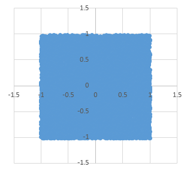
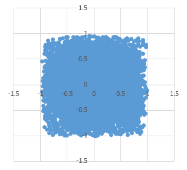
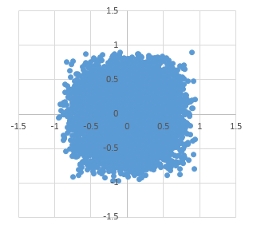
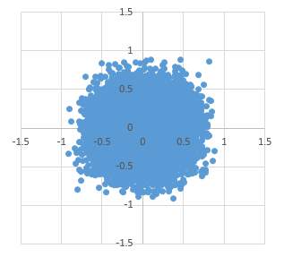
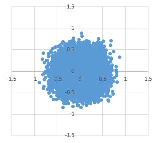
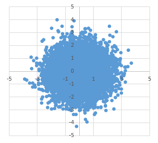
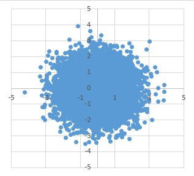

# 小ネタ 正規分布の丸み

今日もたいがい、数学の話です。
一瞬、「[動きにコクが出る](http://togetter.com/li/1044668)」って表現で話題になったあれの話。

そっかー、アニメーション付ける人に一言で説明するには「コク」って言葉になるのかー…
という衝撃は結構ありますが、まあ、乱数をいくつか足すと丸みが出るというの自体は事実。

## 正規分布

ちゃんとした数学的な説明をすると、

- [中心極限定理](https://ja.wikipedia.org/wiki/%E4%B8%AD%E5%BF%83%E6%A5%B5%E9%99%90%E5%AE%9A%E7%90%86)によって、独立な乱数を数多く足せば足すほど正規分布に近づく
- 自然界は多数の独立な乱雑さが重なってできてるので結構な頻度で正規分布が出てくる
- 正規分布で作った図形は丸みがかってる(というか、完全に真円・真球を作れる)

みたいな話です。

C#関係ない… こころなし程度にC#に関係している点というと、「[Math.NET](http://www.mathdotnet.com/) っていう数学ライブラリがあるよ」という話。

## 例: 2次元上の点の分布を作る

「丸み」の例として、2次元上の点(x, y)を乱数を使って作ることを考えます。

以降のサンプル コードでは、[Math.NET Numerics](https://www.nuget.org/packages/MathNet.Numerics/)を使って、
以下の`using`ディレクティブがあるものとして説明します。

```csharp {title="MathNet.Numerics.Distributions"}
using MathNet.Numerics.Distributions;
using static System.Math;
```

例えば、x, yそれぞれに対して、一様乱数(一定の範囲内で、全ての値が均等な確率で出現する乱数)を使って点を作ると、完全に真四角になります。

```csharp {title="一様乱数を2個使って2次元座標を作る"}
var rand = new ContinuousUniform(-1, 1);
var p = (rand.Sample(), rand.Sample());
```

このコードで1万点ほどプロットすると、以下のようになります。



で、四角いのはあまりに不自然なので、これを丸くしたいです。
割と軽い計算量で実現する方法があって、
それが冒頭で言った、「乱数をいくつか足す」というやつです。

乱数を足すために、以下のようなメソッドを用意してみます。
`n`個足して平均を取るだけの関数です。

```csharp {title="一様乱数を n 回重ねて平均を取る"}
static double Mean(IContinuousDistribution d, int n)
    => Enumerable.Range(0, n).Select(_ => d.Sample()).Sum() / n;
```

これを使って、`n` = 2～5に対して、以下のコードで点を生成してみます。

```csharp {title="一様乱数を重ねたもので2次元座標を作る"}
var rand = new ContinuousUniform(-1, 1);
var p = (Mean(rand, n), Mean(rand, n));
```

先ほどと同様、1万点ずつプロットした結果を以下に示します。
上から順に、`n` = 2～5です。






`n` = 5 くらいまでくると、だいぶ丸くなります。

ちなみに、正規分布乱数を使うと、真円になります。

```csharp {title="正規分布乱数で2次元座標を作る"}
var rand = new Normal(-1, 1);
var p = (rand.Sample(), rand.Sample());
```



要するに、以下のような感じ。

- 一様乱数を足していくと、数が多いほど正規分布乱数に近づく
- 5個も足すと結構いい感じに丸くなる
- 正規分布乱数は真円(理論上、本当に完全に円)

## 乱数の和

まあ、一様乱数を複数足すと正規分布乱数になるってのは、
結構難しい話になります。

確率って、連続な分布を持つものをまっとうに考えようと思うと、
[測度](https://ja.wikipedia.org/wiki/%E6%B8%AC%E5%BA%A6%E8%AB%96)とか、
[ルベーグ積分](https://ja.wikipedia.org/wiki/%E3%83%AB%E3%83%99%E3%83%BC%E3%82%B0%E7%A9%8D%E5%88%86)とか、
[フーリエ変換](https://ja.wikipedia.org/wiki/%E3%83%95%E3%83%BC%E3%83%AA%E3%82%A8%E5%A4%89%E6%8F%9B)とか、
数学の中でもそこそこ高等な部類に入る理論が出まくる結構ガチな分野です。

とりあえず、大学学部くらいで習う言葉で要約すると、

- 乱数の和を取ると、確率密度関数が畳み込み積(convolution)になる
- 一様分布を何度も畳み込みしていくと、徐々に正規分布に収束する
  - 参考: [確率変数の和 -合成積との関係-](http://ogyahogya.hatenablog.com/entry/2014/09/22/%E7%A2%BA%E7%8E%87%E5%A4%89%E6%95%B0%E3%81%AE%E5%92%8C_-%E5%90%88%E6%88%90%E7%A9%8D%E3%81%A8%E3%81%AE%E9%96%A2%E4%BF%82-)
  - 参考: [連続型一様分布の和の分布](http://www.biwako.shiga-u.ac.jp/sensei/mnaka/ut/irwinhalldist.html)
- 正規分布同士を畳み込みすると、結果もまた正規分布になる
  - 参考: [確率・統計 正規分布](http://fussy.web.fc2.com/algo/stat5_gaussian.htm)

という感じ。

微分しても元通りになる指数関数が微分・積分の分野で最も自然な関数になるのと同様に、
確率分布では正規分布が最も自然な分布になる、という感じです。

## 正規分布は丸い

まあ、「正規分布乱数を使うと自然に見える」というのは正しいんですが。
ちょっとまだ不思議なことがあります。

これまで例を示してきた話はまとめると以下のようになります。

- 一様乱数は四角い、そして、不自然に見える
- 正規分布乱数は丸い、そして、自然に見える

ここで疑問に思うべきは、丸いのは自然なのか。
自然は丸くなるのか。

まあ実際、丸いんですよね。自然物にはあんまり角がない。
いろいろ根拠はあるんですが。
いろんな物理法則が、計算してみると円や球を解に持ちます。
例えば、わかりやすい例だと以下のようなやつ。

- 距離に反比例するような物理法則が多くて、等ポテンシャル面をプロットすると球
- 体積に対して表面積が最小になる図形が球なので、真球状態が一番安定して存在できる

そして、正規分布乱数の話でも、やっぱり真円や真球が出てきたりします。
先ほど、「正規分布同士を畳み込みすると、結果もまた正規分布になる」と書きましたが、
これから言えることは、「正規分布乱数同士の和や差は、やっぱり正規分布乱数になる」ということです。

回転を表す座標変換は、以下の通り、和と差になるので、
<math xmlns="http://www.w3.org/1998/Math/MathML"><msub><mrow><mi>x</mi></mrow><mrow><mn>1</mn></mrow></msub></math>, <math xmlns="http://www.w3.org/1998/Math/MathML"><msub><mrow><mi>y</mi></mrow><mrow><mn>1</mn></mrow></msub></math>が正規分布乱数で作られているとき、
回転した結果の <math xmlns="http://www.w3.org/1998/Math/MathML"><msub><mrow><mi>x</mi></mrow><mrow><mn>2</mn></mrow></msub></math>, <math xmlns="http://www.w3.org/1998/Math/MathML"><msub><mrow><mi>y</mi></mrow><mrow><mn>2</mn></mrow></msub></math> も正規分布乱数になります。

<math xmlns="http://www.w3.org/1998/Math/MathML"><msub><mrow><mi>x</mi></mrow><mrow><mn>2</mn></mrow></msub><mo>=</mo><mrow><mrow><mi mathvariant="normal">cos</mi></mrow><mo>⁡</mo><mrow><mi>θ</mi></mrow></mrow><mi> </mi><msub><mrow><mi>x</mi></mrow><mrow><mn>1</mn></mrow></msub><mo>-</mo><mrow><mrow><mi mathvariant="normal">sin</mi></mrow><mo>⁡</mo><mrow><mi>θ</mi></mrow></mrow><mi> </mi><msub><mrow><mi>y</mi></mrow><mrow><mn>1</mn></mrow></msub></math>

<math xmlns="http://www.w3.org/1998/Math/MathML"><msub><mrow><mi>y</mi></mrow><mrow><mn>2</mn></mrow></msub><mo>=</mo><mrow><mrow><mi mathvariant="normal">sin</mi></mrow><mo>⁡</mo><mrow><mi>θ</mi></mrow></mrow><mi> </mi><msub><mrow><mi>x</mi></mrow><mrow><mn>1</mn></mrow></msub><mo>+</mo><mrow><mrow><mi mathvariant="normal">cos</mi></mrow><mo>⁡</mo><mrow><mi>θ</mi></mrow></mrow><mi> </mi><msub><mrow><mi>y</mi></mrow><mrow><mn>1</mn></mrow></msub></math>

正規分布乱数は、回転対象な分布を作ります。
どの方向も均一です。

例えばの話、以下のような乱数で2次元の点を作ってみましょう。
角度を一様分布にしたものです。

```csharp {title="確度を一様分布にして作った2次元座標"}
var chi = new ChiSquared(2);
var uni = new ContinuousUniform(0, 2 * PI));
var r = Sqrt(chi.Sample());
var θ = uni.Sample();
var p = (r * Cos(θ), r * Sin(θ));
```

`ChiSquared`は[カイ二乗分布](https://ja.wikipedia.org/wiki/%E3%82%AB%E3%82%A4%E4%BA%8C%E4%B9%97%E5%88%86%E5%B8%83)っていうやつで、
正規分布なx, yに対して、<math xmlns="http://www.w3.org/1998/Math/MathML"><msup><mrow><mi>x</mi></mrow><mrow><mn>2</mn></mrow></msup><mo>+</mo><msup><mrow><mi>y</mi></mrow><mrow><mn>2</mn></mrow></msup></math>
の分布がカイ二乗分布になります。

これも1万点プロットすると、以下のようになります。



比較のために、正規分布乱数でx, yを作ったものを再度並べてみましょう。


ほとんど同じ分布になっていると思います。
理論上は完全一致するはずで、点の数を増やせば増やすほど一致するはずです。

適当にx軸、y軸を決めて、それぞれ独立に乱雑に座標を振っても、
x, yともに正規分布乱数(= 自然な乱数)になっている限り、
軸のとり方に依らない(回転する座標変換を掛けても、元の法則と同じ式が現れる)ということです。

自然物は向きを持たなくて、自然法則は軸のとり方に依らない。
ということが、自然法則を表すいろいろな数式上に現れます。
その結果が、真円や真球に結びついたりします。
