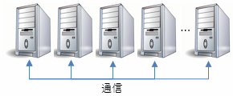
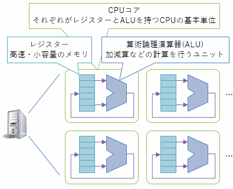
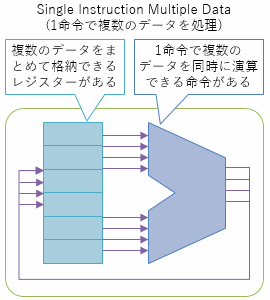

# 小ネタ 並列化

よく目にする話題だと思いますが、ここ10数年くらい、CPUの性能は高クロック動作化ではなく、並列化によって向上しています。
CPU律速になるような計算処理は、ガチガチに最適化するなら並列処理を考える必要が出てきます。

並列化によって高速化しやすい計算の例として、浮動小数点数のデータ列の積和演算を考えてみます。
例えば、以下のようなコードになります。

<pre class="source" title="シングルスレッド実行">
<code><span class="reserved">private</span> <span class="reserved">static</span> <span class="reserved">float</span> SingleThreadScalar(<span class="reserved">float</span>[] x, <span class="reserved">float</span>[] y)
{
    <span class="reserved">var</span> prod = 0f;

    <span class="reserved">for</span> (<span class="reserved">int</span> i = 0; i &lt; N; i++)
        prod += x[i] * y[i];

    <span class="reserved">return</span> prod;
}
</code></pre>

## 並列化のレイヤー

まあ、一口に並列化と言っても、いくつかの手段があります。

- 分散コンピューティング
- CPU間並列
- CPU内並列

### 分散コンピューティング

1つ目は、複数台のマシンに処理を分散する方法。



要はビッグデータ(big data)とかHPC (high perfomance computing)とか言われている分野です。
どういうコンピューターを、どういうネットワークでつなげて、どう大規模に運用していくか、みたいな個人ではどうにもならないノウハウが必要なので、
並列処理コードを書くというよりは、大手クラウド業者から提供されているサービスを使って計算するという感じになります。

今回さらっと試して見せれるような面白いデータを持っているわけでもないので、今日はこのレイヤーには触れません。

### CPU間並列

2つ目は、複数のCPUで一斉に計算する方法。
1台のマザーボードに複数のCPUを刺して使ったりするやつです(マルチCPU)。
あるいは最近のCPUであれば、同じ機能を有した「コア」が、1つのチップ内に複数並んで配置されていて、OSから見ると複数のCPUが刺さっているように見えます(マルチコア)。

また、ハイバースレッディング(hyper-threading)なんていう手法もあります。
これは、あるCPUコア内で、内部の演算器で暇になっているやつがある場合に、仮想的にもう1個CPUがあるように見せかけて暇な演算器を活用できるようにする仕組みです。

いずれにしても、それぞれ独立したCPUが、1つのマザーボードやメインメモリを共有して動いています。



それぞれが独立して動いているので、CPUコア間での同期はそれなりの負担になります。
分散コンピューティングと比べると微々たるものですが、CPU内部で完結した処理と比べるとかなり遅いです。

複数のCPUを使って並列に処理するためには、C#だとスレッドを使います。
と言っても、`Thread`クラス(`System.Threading`名前空間)を直接使うことはあまりなくて、
`Task`クラスや`Parallel`クラス(`System.Threading.Tasks`名前空間)を使います。

積和演算くらいの小さな処理を`Parallel`クラスを使って高速化するのは難しいようです。
そこで、ここでは`Task`クラスを使った例を挙げます。
以下のような書き方になります。

<pre class="source" title="マルチスレッド実行">
<code><span class="reserved">private</span> <span class="reserved">static</span> <span class="reserved">float</span> MultiThreadScalar(<span class="reserved">float</span>[] x, <span class="reserved">float</span>[] y)
{
    <span class="reserved">var</span> windowSize = N / NumWorkerThread;

    <span class="reserved">var</span> prod = 0f;

    <span class="reserved">var</span> partialProds = <span class="type">Task</span>.WhenAll(
        <span class="type">Enumerable</span>.Range(0, NumWorkerThread)
        .Select(n =&gt; <span class="type">Task</span>.Run(() =&gt;
        {
            <span class="reserved">var</span> local = 0f;
            <span class="reserved">for</span> (<span class="reserved">int</span> i = n * windowSize; i &lt; (n + 1) * windowSize; i++)
                local += x[i] * y[i];
            <span class="reserved">return</span> local;
        }))
        ).GetAwaiter().GetResult();
    prod = 0f;
    <span class="reserved">for</span> (<span class="reserved">int</span> i = 0; i &lt; partialProds.Length; i++)
        prod += partialProds[i];
    <span class="reserved">return</span> prod;
}
</code></pre>

`NumWorkerThread`は、CPUのコア数にそろえておくのが一番効率がいいと言われています。
例えば、`NumWorkerThread = Environment.ProcessorCount`で取得できます。

この例では、コア数分にループを分割して、それぞれのコアで個別に積和を求めて、
最後にそれぞれの結果を足しています。
こういう、それぞれ個別に計算して最後に集計できるものでないと、マルチコアを活用した高速化はなかなかできません。

### CPU内並列

1つのCPUコアの内部でも並列処理があります。
SIMD(Single Instruction Multiple Data)命令と呼ばれていて、
複数のデータをまとめて格納できるレジスターや、
まとめて計算できる命令を持っています。



SIMD命令を活用できるかどうかは、コンパイラーがどのくらい頑張っているか次第ではあります。
一応、プログラマーが意図的に、特定の場所でSIMD命令が使われるように指示できるライブラリも用意されている場合があります。

C#では、.NET Framework 4.6でSIMD命令対応がありました。
[`System.Numerics.Vectors`](https://www.nuget.org/packages/System.Numerics.Vectors/)というパッケージを参照して、
その中にある`Vector`構造体を使うと.NET Framework 4.6以降のJIT ([RyuJIT](https://blogs.msdn.microsoft.com/jpvsblog/2016/01/11/net-framework-4-6-64-bit-jit/))は、SIMD命令に置き換えて最適化してくれます。

例えば、以下のようなコードを書いたとします。
2つの浮動小数点数データ列の積和を行っています。
`Vector4.Dot`は、4つの浮動小数点数をまとめたもの(`Vector4`)の内積(積和演算)です。

<pre class="source" title="SIMD命令化">
<code><span class="reserved">private</span> <span class="reserved">static</span> <span class="reserved">float</span> SingleThreadVector(<span class="type">Vector4</span>[] vx, <span class="type">Vector4</span>[] vy)
{
    <span class="reserved">var</span> prod = 0f;
    prod = 0f;
    <span class="reserved">for</span> (<span class="reserved">int</span> i = 0; i &lt; N / 4; i++)
        prod += <span class="type">Vector4</span>.Dot(vx[i], vy[i]);
    <span class="reserved">return</span> prod;
}
</code></pre>

これを、x64向けにビルドして実行すると、JIT結果は以下のようなネイティブ コードになります(上記コードのループの中身に相当する部分を抜粋)。

```
vmovupd     xmm1,xmmword ptr [rdi+r8+10h]  
vdpps       xmm0,xmm0,xmm1,0F1h  
vaddss      xmm0,xmm0,xmm6  
vmovaps     xmm6,xmm0  
```

`xmm0`や`xmm1`が、複数のデータをまとめて格納できるレジスターの名前です。
`vdpps`が4つの`float`(32ビット浮動小数点数)の積和演算、
`vaddss`が加算、`vmovupd`と`vmovaps`がレジスター間のデータ移動です。

ちなみに、それ以前の.NET Frameworkなど、対応していないプラットフォームで実行すると、SIMDではない普通の命令に展開されます(早くはならないけども、`Vector`を使わない場合と比べてそんなに遅くなるわけでもない)。

同じコードを、Any CPU向けにビルドして実行すると、以下のような命令に変わります。

```
fmul        dword ptr [edi+eax*4+8]  
faddp       st(1),st  
```

こちらは単なる浮動小数点数向けの命令で、1度に1データずつ掛けて、足してを行っています。

## 並列化の結果

最後に、これらの並列化でどのくらいの高速化を図れるかを示しておきます。

`Task`も`Vector`も使って、CPU間並列もCPU内並列も使った例も挙げておきます。

<pre class="source" title="マルチスレッド化 ＋ SIMD命令化">
<code><span class="reserved">private</span> <span class="reserved">static</span> <span class="reserved">float</span> MultiThreadVector(<span class="type">Vector4</span>[] vx, <span class="type">Vector4</span>[] vy)
{
    <span class="reserved">var</span> windowSize = N / NumWorkerThread;

    <span class="reserved">var</span> prod = 0f;
    <span class="reserved">var</span> partialProds = <span class="type">Task</span>.WhenAll(
        <span class="type">Enumerable</span>.Range(0, NumWorkerThread)
        .Select(n =&gt; <span class="type">Task</span>.Factory.StartNew(() =&gt;
        {
            <span class="reserved">var</span> local = 0f;
            <span class="reserved">for</span> (<span class="reserved">int</span> i = n * windowSize / 4; i &lt; (n + 1) * windowSize / 4; i++)
                local += <span class="type">Vector4</span>.Dot(vx[i], vy[i]);
            <span class="reserved">return</span> local;
        }))
        ).GetAwaiter().GetResult();
    prod = 0f;
    <span class="reserved">for</span> (<span class="reserved">int</span> i = 0; i &lt; partialProds.Length; i++)
        prod += partialProds[i];
    <span class="reserved">return</span> prod;
}
</code></pre>

計測コードの全体はGistに置いてあります。

- [https://gist.github.com/ufcpp/0f6d1ae24eeaccf522e8130b1915018f](https://gist.github.com/ufcpp/0f6d1ae24eeaccf522e8130b1915018f)

僕の環境(Core i7-4790(4コア8スレッドなCPU)のデスクトップPC)で、それぞれを500回ずつループするのにかかった時間は以下の通りになります(単位は秒)。

| | シングルスレッド | マルチスレッド
| ---- | ---- | ----
| SIMD なし | 2.0295843 | 0.9619755
| SIMD あり | 1.1649900 | 0.8847980

ループやスレッド起動のオーバーヘッドなどもあるのできっちりコア数やSIMD並列度分の倍率にはなりませんが、2倍以上には高速化できます。
ループの中身の処理がもう少し大きければ、もうちょっと良い倍率で高速化されるはずです。
