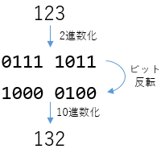
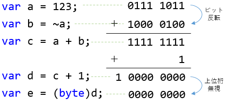

# 小ネタ 隠し演算子(？)

C#には隠しキーワードとして[`__makeref`などの見慣れないキーワードがある](../../../../study/csharp/interop/sp_makeref.md)という話はたまに話題に出てきますが、実は隠し演算子もあります。

演算子 | 同じ結果の式 | 意味合い
---- | ---- | ---
`-~x` | `x + 1` | `x`に向かって値が入っているイメージ
`~-x` | `x - 1` |  `x`から値が出ていくイメージ

副作用を起こさない(非変)インクリメント、デクリメント(non-modified increment/decrement)です。
実際、以下のようなコードを実行することができます。

```csharp {title="非変インクリメント・デクリメント"}
var a = 10;
Console.WriteLine(-~a); // 11
Console.WriteLine(~-a); // 9
```

[ideone](http://ideone.com/SSnP7U)とかでも実行できます。
ideoneは確かMonoで動いているはずで、MonoのC#コンパイラーもひそかに対応しているということですね。

こいつは、演算子の形状からtadpole (オタマジャクシ)とか言われたりもします。
(`?.` なんかもエルビス プレスリーの髪型っぽく見えるという話からelvis演算子とか呼ばれたりもします。それと同種の愛称です。)

`x + 1`でいいじゃないかと思うかもしれませんが、
単項演算子なので優先度が高いという利点があります。
`(x + 1) * (y - 1)`というような式が、`-~x*~-y'となります。

一方で、単項演算子の±1であれば、`++` (インクリメント)と`--` (デクリメント)もあります。
しかし、これらは副作用を伴っていて、`x`の値を書き換えてしまいます。

演算子 | 同じ結果の式
---- | ----
`++x` | `x += 1`
`--x` | `x -= 1`

副作用を伴う式というはあまり行儀がいいものではないので、その副作用なし版がこっそり用意されているというのが`-~`と`~-`です。

まあ、利点と言っても微々たるものですし、どっちがプラスでどっちがマイナスかわかりにくいですから、正式採用とはならず、仕様書等には載っていません。

<br/>
<br/>
<br/>
<br/>

## 種明かし

さて、まあ、嘘なわけですが。
実行できる嘘。

昔同じネタをちょっと取り上げたことはあるんで覚えてらっしゃる方もいらっしゃいますかね。

- [ピックアップRoslyn 5/27: Support the tadpole operators](../../../2015/5/pickuproslyn27/index.md)

要するに、

- [The Old New Thingの冗談](https://blogs.msdn.microsoft.com/oldnewthing/20150525-00/?p=45044/)を真に受ける人が結構いた
- [真に受けて「C# にも入れない？」とか言い出す人までいた](https://github.com/dotnet/roslyn/issues/3072)
- エイプリルフールにでもやれよ…

という話だったんですが…

真に受ける人が多いということは、ちゃんとした解説書かなきゃダメなのかなというのが、今回の本当の主題。

実際、つい最近も、2の補数表現の話とかを知らない人にこの話を説明したりしたんですよね。ピックアップRoslynのついででさらっと流すのはもったいなかったかなぁと。

### 本当は `-` と `~` の組み合わせ

これ、要するに、以下の意味です。

元 | 括弧で整理
---- | ----
`-~x` | `-(~x)`
`~-x` | `~(-x)`

単項演算子が2個並んでいるだけ。

たぶん、3つのはまりどころがあります。

- `~`演算子とかめったに使わない
- ビット反転とマイナスの関係を知らない人がそこそこいる
- 単項演算子をくっつけて書くのはどうなのよ

### ビット反転

真に受ける人が多かった理由の1つは、`~`演算子とかめったに使わないからでしょうね。
そもそも`~`がC++とかC#で有効な演算子なことを知らない/忘れている人がそれなりにいるんでしょう。
というか、ビット操作とか2進数での数値表現がまず苦手って人も見ますもんねぇ、ちらほら。

`~`はビット反転の意味です。以下の例のように、すべてのビットの0と1を逆にします。



### ビット反転とマイナスの関係

次に必要な説明は、ビット反転とマイナスの組み合わせでどうして±1になるのかです。
ビット反転`~`とマイナス`-`は、常に以下の式を満たします。

`~x + 1 == -x`

例えば、以下のようなコードを書くと、`throw`の行は通らずプログラムが正常終了します。

```csharp {title="~x + 1 == -x の確認"}
using System;

class Program
{
    static void Main()
    {
        for (int x = 0; x < 256; x++)
        {
            if (~x + 1 == -x) continue;

            throw new InvalidOperationException();
        }
    }
}
```

これは、以下の図のように考えれば説明が付きます。



1. 元の数字と、ビット反転した数字を足すと、全ての桁で 1 + 0 が起きるわけで、
結果は全桁1になります
1. これに1を足すと、桁上がりによって0が並びます
1. オーバーフロー(桁上がりしてしまった最上位桁)を無視すると、完全に0になります
1. すなわち、`x`と`~x + 1`を足すと0になります
1. `-x`というのは「`x`と足して0になる数」のことを指すわけで、`~x + 1`は`-x`と等しいはずです。

実際、符号付き(この例で言うと8 bitなので`sbyte`)の-123と、
符号なし(`byte`)の133 = 256 - 123は、ビット表現としては全く同じ`1000 0101`になります(123のビット反転は132です。132 + 1 = 133 = -123)。

この考え方は、コンピューターのハードウェアを作る上で非常に便利です。

1. 負の数を「ビット反転 + 1」で表すものとする
1. この場合、`a - b`は`a + ~b + 1`となる
1. つまり、加算回路をそのまま流用して減算回路を作れる

ということで、だいたいのハードウェアでこの「ビット反転 + 1」で負の数を表現する方式が採用されています。
この表現形式を「2の補数(two's complement)表現」と言います。
わざわざ「2の」とかいう名前が付いているのは、他の方式もあったからなんですが、まあ、現存していません。

### 単項演算子をくっつけて書く

あとは、演算子をくっつける書き方自体がどうなのか、という話はあります。

だって、識別子(変数名とか)の場合、`ab`と`a b`は違う意味になるじゃないですか。
前者は「ab」という名前の1つの識別子、後者「a」と「b」が並んでる。
なのに、`~-`と`~ -`は同じ意味で、`~`と`-`に分解される。

`~-`みたいな、複数文字で1つの演算子にできれば、演算子オーバーロードに幅ができて便利かもしれません。
実際、F#なんかはそれを認めています。

- [F# Operator Overloading](https://docs.microsoft.com/ja-jp/dotnet/articles/fsharp/language-reference/operator-overloading)

C#でも、`~-`みたいに書かれると、一瞬それを期待しちゃうのかもしれません。
でも、実際には、`~-`は2つに分解されて、複数文字1演算子はできません。

#### おまけ: くっつけて書けるとそれはそれでひどい

常に一貫して「演算子は1文字1文字全部区切る」ってルールならまだしも、いくつか例外が存在しているのがまた面倒です。
`++` (インクリメント)とか`>=` (大なりイコール)とか`=>` (ラムダ式の矢印)とかは2文字で1演算子。だったら、「`~-`で1演算子」も期待しかねない。

インクリメントなんて、`+`と`++`がそれぞれ別の意味になるもんだから本当にひどくて。
`a+++b`って式はC#などでは有効な式なんですが、どういう意味になるかぱっと見ではわからない。なんせ、以下の3つの式、どれも有効で、それぞれ違う結果になります。

- `a++ +b`
- `a+ ++b`
- `a+ + +b`

```csharp {title="a+++b"}
using static System.Console;

class Program
{
    static void Main()
    {
        int a, b;

        a = 1; b = 1;
        WriteLine($"{a++ +b}, {a}, {b}"); // 2, 2, 1: (a++) + b
        a = 1; b = 1;
        WriteLine($"{a+ ++b}, {a}, {b}"); // 3, 1, 2: a + (++b)
        a = 1; b = 1;
        WriteLine($"{a+ + +b}, {a}, {b}"); // 2, 1, 1: a + (+(+b))
        a = 1; b = 1;
        WriteLine($"{a+++b}, {a}, {b}"); // 2, 2, 1: つまり、a+++b は a++ +b 扱い
    }
}
```

Swiftなんかだと、単項演算子を隣接させるのを禁止してるみたいですね。
`-~x`はエラーになります。

かつ、単項演算子とオペランドの間は逆にスペースを挟むのを禁止しているようで。
`- ~x`という書き方もエラー。
括弧を使って`-(~x)`と書くのを義務付けているようです。

まあ、確かに括弧が付いている方が見やすくて人的ミスは起こしにくいでしょう。
一方で、関数適用は`f  (x)`とか書けるのに、単項演算子は`~ (x)`とは書けないっていうちょっと気持ち悪い状態ではあります。
