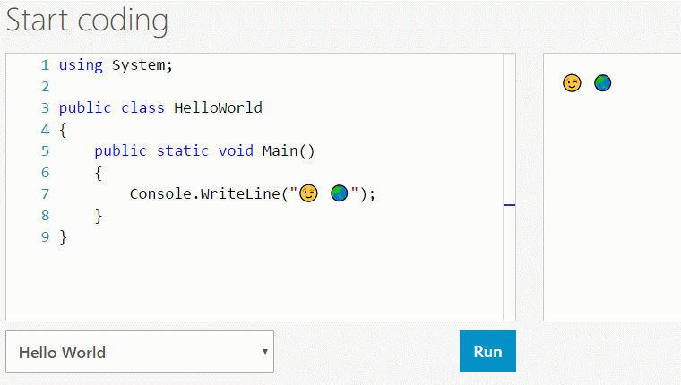
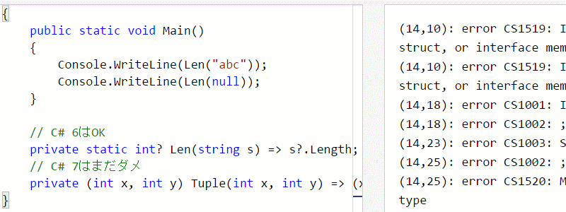
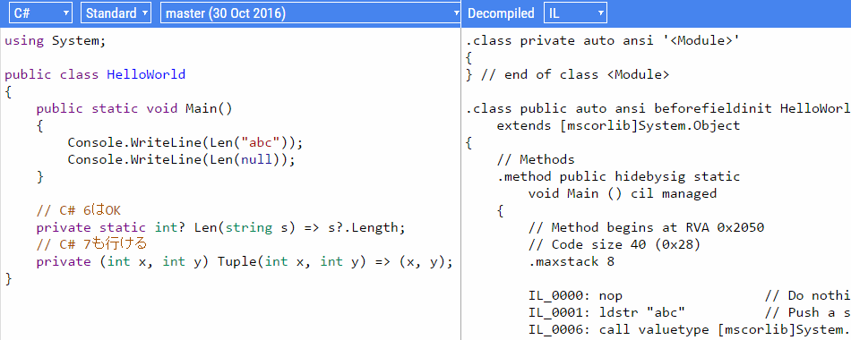

# C#小ネタ集: C#をWeb上で試す

## 小ネタ

ここのところ、twitterで脊髄反射的に飛びついたきり、gistとかに書き散らかして終わりにしちゃってるネタがちらほら溜まってきたので、ここらでブログかしようかなと思います。
C#小ネタ集とか銘打って。

C#小ネタ集と言いつつ、あんまりC#が関係ない物もありますが。
結構溜まってるんで、数日は連続で書くことになるかなと思われます。

## Web上で試したい

初日のネタは、C#をWeb上で触ってみようという話。

C#の入門記事とか書いてるとよく言われ続けていたのが、「Visual Studioをインストールするのがめんどくさい」って話です。
まあ、めんどくさいですよね。

そこで、今はC#にもWeb上でさらっと試すことができる場所があるので、今日はその紹介をします。

もちろん、じっくり腰を据えてコードを書くときにはもちろんVisual Studioを起動しといた方が楽なんですが。
(日々の仕事がC#とかだったりするとどうせ常時Visual Studioが起動してる状態にあるので別に立ち上げも大した面倒はありません。)
とはいえ、入門向けにいきなり「Visual Studioを入れてください」は、今時ちょっとないよなぁ。

こういうのは、もうVisual Studioなどの統合開発環境に馴れてる人は忘れてる感覚です。
でも、自分が普段使わないプログラミング言語をちょっと試してみたいときのことを想像してみてください。
実務で使うわけでもなし、本腰入れてがっつり勉強するでもなし、ほんのちょっとしたネタを確認したいだけ。
そのためにわざわざ環境構築をしたいですかと言われると、まあ僕だったら嫌です。
実際、[Go](https://golang.org/)とか[Swift](https://swiftlang.ng.bluemix.net/)とかの挙動を見たいときは、まずWeb上で試します。
コピペ程度のコードしか書けませんが、試してみるだけならそれで十分なことが多いです。

## C#をWeb上で

ということで、まずは公式サイト。

[前にも1度ブログで取り上げていますが](../../5/dotnet/index.md)、
今は、[公式サイト(dot.net！)](http://dot.net/)で、試しにその場でC#を書いて実行結果が見れる機能が付いています。

まあもちろん、[paiza.io](https://paiza.io/)とか[ideone](http://ideone.com/)みたいなコード共有サイトを使ってもいいんですけども。
やっぱり公式サイトでやってないと、今時不格好ですよね…
ということで、dot.netというドメイン取ったのと、その中でオンラインC#実行ができるようになってたことに気づいたときはうれしかったものです。

## コード共有しつつ、C#をWeb上で

[dot.net](http://dot.net/)のオンライン エディターは保存してURLで他の人と共有したりはできません。

最近だと、適当に書き捨てのつもりで書いたコードも、
[Gist](https://gist.github.com/)とかに置いておいて、twitterとかで垂れ流したりもします。
そういう用途では、さすがに公式サイトのオンライン エディターは使えません。

そこで、ちょうどこれをやってくれるサイトがあります。
要するに、Gistと連携して、Gistに保存したC#コードを編集、実行してくれるサイト。
そういうサイトも作ってくている方がいらっしゃいます。

- [Gistlyn](http://gistlyn.com/)
- [Gistlynのソースコード リポジトリ](https://github.com/ServiceStack/Gistlyn)

## 最新のC#をWeb上で

dot.net上にあるオンライン エディター中のC#は、「リリースされている最新版」です。
当然と言えば当然。
現時点ではC# 6ということになります。

[GitHubリポジトリ](https://github.com/dotnet/roslyn)で開発途中の最新版を試したければ、まあ、通常、ソースコードをcloneしてきて、ビルドして、実行してみたり、その[デイリー ビルド](https://dotnet.myget.org/gallery/roslyn)結果を取ってきて、Visual Studio拡張などをインストールしてみる必要があります。

ですがここで、これも前にもブログで触れましたが、オンラインで割と最近のバージョンのC#を試せるサイトを作ってくれている人がいます。

- [TryRoslyn](http://tryroslyn.azurewebsites.net/)

[RoslynのGitHubリポジトリ](https://github.com/dotnet/roslyn)からいろんなブランチを定期的に取ってきて、それぞれでどういう挙動をしているか確認できるサイトです。
実行結果というか、コンパイル結果のILとか、それを古いバージョンのC#で書くにはどうすればいいかという逆コンパイル結果を表示してくれます。

## GitHub上のC#コードを解析

Visual Studioが常時起動しているとしても、
GitHubで見かけたC#コードを、わざわざCloneしてきて手元で見ようとはなかなか思わないですよね。
そのままブラウザーで読みたいです。

その一方で、GitHub上でコードを読んでいると、
クラス名などのシンタックス ハイライトがいまいちだったり、
「定義に移動」したくなるけど、当然GitHub上でそんなことできるはずなくイラッとしたりします。

ブラウザー中で、正しくハイライトされ、「定義に移動」とか「すべての参照を検索」ができるページがほしいです。

マイクロソフトが公式に提供している参照コードがちょうどそんな感じです。

- [.NET 全体の参照ソースコード](https://referencesource.microsoft.com/)
- [Roslyn の参照ソースコード](http://source.roslyn.io/)

これらのサイト、Roslynを使ったWebページ生成ツールで作ってるそうです。
ツール自体もオープンソースになっていて、以下のリポジトリで見れます。

- [KirillOsenkov/SourceBrowser](https://github.com/KirillOsenkov/SourceBrowser)

で、要は、このツールを任意のGitHubリポジトリに対してかけてくれるサービスがあるとすごく幸せなわけですが…
これがまた、そういうサービスを作ってくれてる大変親切な方がいらっしゃいます。

- [Source Browser](http://sourcebrowser.io/)
- [Source Browserのソースコード リポジトリ](https://github.com/CodeConnect/SourceBrowser)
