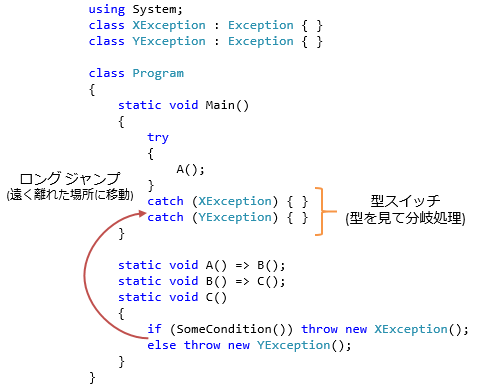
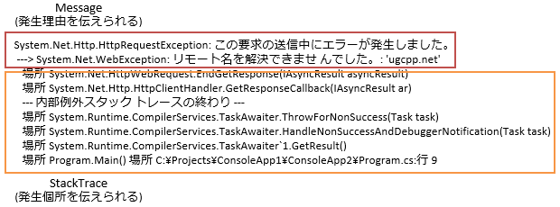

# 小ネタ チェック例外とUnion型

今日の話は、C# 7で入る[型スイッチ](../../../../study/csharp/datatype/typeswitch.md)や、さらにその先で予定されている、[パターン マッチング](https://github.com/dotnet/roslyn/blob/master/docs/features/patterns.md)や、[代数的データ型](https://github.com/dotnet/roslyn/blob/features/records/docs/features/records.md)(特に[Union型](https://github.com/dotnet/roslyn/issues/728))というもので、例外処理の仕方が変わるかも、という話です。

## 例外

例外にはいくつかの性質があります。
まず、挙動としては、以下の2点が特徴的でしょう。

- ロング ジャンプ: 複数のメソッドをまたいで、遠く離れた場所に移動する
- 型スイッチ: 例外の型を見て分岐処理を行う



例外に含められる情報としては、以下の2つが特に有用でしょう。

- メッセージ(`Message`プロパティ): 発生理由を、自由な文章で伝えられる
- スタック トレース(`StackTrace`プロパティ): 発生個所を、呼び出し階層すべて含めて伝えられる



これらは便利ではあるんですが、少々過剰気味ではあります。
特に、ロング ジャンプとスタック トレース取得はそこそこ負担が大きな処理で、
例外を`throw`してしまうと、正常動作と比べて2～3桁くらい動作が遅くなったりします。

この大きな負担が嫌で、例外を嫌う人も多いわけです。
少なくとも、準正常系に対して例外を使うのは過剰スペックじゃないかという話になります。

じゃあ、代わりに何が使えるかというと、最近注目されているのがUnion型とパターン マッチング。

## 例外の使い方

先に過剰スペックじゃないかという話の方を。

例外って言っても、以下の2つに分けられたりするわけです。

- 異常系: 完全に想定外の事態
- 純正常系: あんまり起きてほしくはないけども、想定の範囲内で、対処方法がわかってて処理を続けられる

### 異常系

異常系の「完全に想定外」っていうのは、まあ、「バグが残ってる」という類なので、理想を言えばテストの段階でなくしたいものです。

といっても、バグを100%取れれば苦労はしないわけで、実際には残ります。
バグが残っていた場合の対策も必要なわけで、たいてい、fail-fastでログだけ残して処理を止めます。

処理の止め方としては、まあ状況によっては[`FailFast`](https://msdn.microsoft.com/ja-jp/library/system.environment.failfast.aspx)メソッドとかで完全にプロセス停止させてもいいんですが、だいたいは今いるページのリロードとか、ログオフしてログイン画面に戻すとか、そういう対処になるんじゃないでしょうか。

こういう用途には、ロング ジャンプやスタック トレース情報は非常にありがたいです。

- 根っこの方で1か所`catch`を書くだけでいい
- どこで発生したかがわかって、その後、バグ修正がはかどる

ということで、こういう用途なら、例外は便利なものです。

### 準正常系

一方で、準正常系、要するに「嫌だけど、まあ避けれない」、「起きることは知ってる」、「対処もできる」みたいなものもあって、こちらにロング ジャンプやスタック トレースが要るかと言われると、かなり微妙。たいていは、呼び出し元のメソッドですぐにエラーを調べて対処するものなので、長距離移動はしないし、どこで発生したかもスタック トレースを見るまでもなくわかっています。

ということで、C#だと、あんまりこの用途で例外を使うことはないんじゃないかと思います。

一方で、[チェック例外](http://msugai.fc2web.com/java/throwstry.html)を持っているJavaだと、

- 異常系には実行時例外を使う
- 準正常系にはチェック例外を使う

みたいな例外の使い方をしたりもします。
チェック例外にはチェック例外のいいところがあって、それが準正常系の処理と相性が良かったという面があります。

## チェック例外

準正常系の例として、平方根を求める関数を考えてみましょう。
いろんな言語で、標準の平方根を求める`sqrt`関数は以下のような実装になっています。

- 浮動小数点数(C# だと`double`)を受け取って、浮動小数点数を返す
- 負の数が来るなど、計算できない値だった場合、戻り値はNaN (Not a Number)を返す

これを、諸事情あって、以下のような挙動に変える必要があったとします。

- 引数がそもそもNaNだったら`InvalidArgument`エラーとする
- それ以外で、戻り値がNaNになる(引数が負の数)場合、`InvalidResult`エラーとする
- それ以外は普通に標準ライブラリを使って平方根を計算して返す

チェック例外を持つJavaだと、以下のように書いたりします。

まず、エラーを表現するために、例外型を定義。

```java {title="(Java)例外型を定義"}
class InvalidArgumentException extends Exception { }
class InvalidResultException extends Exception { }
```

平方根を求める関数は、以下のような静的メソッドになります。

```java {title="(Java)正常値か、InvalidArgument, InvalidResultを返すメソッド"}
private static double sqrt(double value) throws InvalidResultException, InvalidArgumentException
{
    if (Double.isNaN(value)) throw new InvalidArgumentException();
    if (value < 0) throw new InvalidResultException();
    return Math.sqrt(value);
}
```

このメソッドを呼び出す側は例えば以下のようになるでしょう。

```java {title="(Java)メソッドを呼び出す側"}
try
{
    double y = sqrt(x);
    System.out.println(y);
}
catch(InvalidArgumentException b)
{
    System.out.println("引数の時点でおかしな値");
}
catch(InvalidResultException a)
{
    System.out.println("計算結果がおかしな値");
}
```

チェック例外のメリットは2つあります。

- 型の明示(denotation): メソッド定義側で、どういう例外が出るかを明示できる
- 完備検査(completeness check): 呼び出し側で、出る可能性のある例外を`catch`しなかったらコンパイル エラーにできる

この2つは非常に重要な観点なので確かに欲しい機能なんですが、
その一方で、以下の2点が不満という話になります。

- 戻り値と`throws`句の2カ所に分かれた書き方は本当にいいのか
- おまけでロング ジャンプやスタック トレース情報が付いてくるのは過剰ではないか

## Union型とパターン マッチ

ロング ジャンプやスタック トレース取得は要らない、
型の明示と完備検査はほしい…
となったときに、関数型言語の類だとちょうどそういう仕組みを持っていたりします。
Union型(直和型)とパターン マッチです。

例えばF#で先ほどと同様のsqrt関数を書こうと思うと、
まず、正常な値か、`InvalidArgument`エラー、`InvalidResult`エラーを表すUnionを作ります(F#の場合は[判別共用体](https://msdn.microsoft.com/ja-jp/library/dd233226(v=vs.110).aspx)(discriminated union types)と言います)。

```fsharp {title="(F#)値、InvalidArgument、InvalidResultのいずれかの値を取る型"}
type SqrtResult =
    | Value of Double
    | InvalidArgument
    | InvalidResult
```

これを使って、平方根を求める関数は以下のように書けます。

```fsharp {title="(F#)値、InvalidArgument, InvalidResultを返すメソッド"}
let sqrt x =
    if Double.IsNaN(x) then InvalidArgument
    elif x < 0.0 then InvalidResult
    else Value(Math.Sqrt(x))
```

呼び出す側は以下のとおり。

```fsharp {title="(F#)メソッドを呼び出す側"}
match sqrt(x) with
| Value y        -> Console.WriteLine(y)
| InvalidArgument -> Console.WriteLine("引数の時点でおかしな値")
| InvalidResult   -> Console.WriteLine("計算結果がおかしな値")
```

ちゃんと要件は満たしています。

- 型の明示: 判別共用体を使って、`InvalidArgument`、`InvalidResult`が返る可能性を明示できている
- 完備検査: 判別共用体に対する`match` (C#でいう`switch`)では、条件が足りていなかったら「Incomplete pattern matches」(パターンが不完全です)という警告が出る
- ロング ジャンプやスタック トレース取得は要らない

## 完備検査の課題

チェック例外にしても、Union型にしても、完備検査をするためにはちょっとした課題があったりします。
何かというと、後からのパターン追加がかなり厳しい。

エラーのパターンを増やしたとしましょう。例えば、この例で言うと、NaNだけじゃなくて∞もエラーにしたくなって、`InvalidArgument`とは別に`Infinite`エラーというのを返したくなったとします。

```java {title="(Java) throws句に例外を1つ追加"}
private static double sqrt(double value) throws InvalidResultException, InvalidArgumentException, InfiniteException
{
    if (Double.isInfinite(value)) throw new InfiniteException();
    if (Double.isNaN(value)) throw new InvalidArgumentException();
    if (value < 0) throw new InvalidResultException();
    return Math.sqrt(value);
}
```

```fsharp {title="(F#)判別共用体に1つcase追加"}
let sqrt x =
    if Double.IsInfinity(x) then Infinite
    elif Double.IsNaN(x) then InvalidArgument
    elif x < 0.0 then InvalidResult
    else Value(Math.Sqrt(x))
```

呼び出し側も修正しないと、Javaの場合はコンパイル エラー、F# の場合は警告になります。(ビルド設定で「警告もエラー扱いする」という項目もある以上、警告の追加も破壊的変更です。)

おかしな挙動をするくらいならコンパイル時にエラーや警告が出た方が傷は浅くて済むんですが、コードが大規模化してくると結構厄介な問題になります。

- 関数を作る人と使う人が全然違う。場合によっては組織をまたぐ
  - 使う人にとっては意図しない(例えば別件にかかりきりで修正できないような)タイミングでも、修正を強要される
- パッケージも分かれる
  - 使う側の再コンパイルなしでパッケージのバージョンを上げたいのに、再コンパイルしてみないと結局、完備検査が働かない

## C# で準正常系の処理

さて、やっとC#に関してなんですが、C#で準正常系の処理を書くとしたら、

- 現状: エラー コードを返すような昔ながらの処理に先祖返り
  - 型の明示はできてる
  - 完備検証はできてない
- 現在検討されていること:
  - C#にもUnion型の追加
  - `switch`ステートメントでの完備検証の追加

という感じになっています。

現状だと、どうしても以下のような感じに落ち着いたりします。

まず、エラーを示すための列挙型を作ります。

```csharp {title="現状のC#で同様のsqrt"}
using System;

enum ErrorType
{
    None,
    InvalidArgument,
    InvalidResult,
}

class Program
{
    static ErrorType TrySqrt(double x, out double y)
    {
        y = 0;
        if (double.IsNaN(x)) return ErrorType.InvalidArgument;
        if (x < 0) return ErrorType.InvalidResult;
        y = Math.Sqrt(x);
        return ErrorType.None;
    }

    static void Main()
    {
        var data = new[] { double.NaN, -1.0, 2.0 };

        foreach (var x in data)
        {
            Console.Write(x + " → ");
            double y;
            switch (TrySqrt(x, out y))
            {
                case ErrorType.None:
                    Console.WriteLine(y);
                    break;
                case ErrorType.InvalidArgument:
                    Console.WriteLine("引数の時点でおかしな値");
                    break;
                case ErrorType.InvalidResult:
                    Console.WriteLine("計算結果的におかしな値");
                    break;
            }
        }
    }
}
```

正直なところ、この先祖返り感は結構な残念さではあるんですが。
先祖返りが起こるってのは、現状(例外機構)に対して結構な不満があるという証でもあります。

将来的に、これがどうなってほしいかというと、以下のような感じでしょうか。


```csharp {title="(まだ見ぬ未来のC#)同様のsqrt"}
using System;

enum ErrorType
{
    InvalidArgument,
    InvalidResult,
}

class Program
{
    static double | ErrorType M(double x)
    {
        if (double.IsNaN(x)) return ErrorType.InvalidArgument;
        if (x < 0) return ErrorType.InvalidResult;
        return Math.Sqrt(x);
    }

    static void Main()
    {
        var data = new[] { double.NaN, -1.0, 2.0 };

        foreach (var x in data)
        {
            Console.Write($"{x} → ");
            Console.WriteLine(M(x) match
            {
                double y: y.ToString(),
                ErrorType.InvalidArgument: "引数の時点でおかしな値",
                ErrorType.InvalidResult: "計算結果的におかしな値",
            });
        }
    }
}
```

パーツごとに説明すると、以下のようなものから成り立ちます。

- Union型(確度 低)
  - `double | ErrorType`みたいな書き方でUnion型を定義
  - この書き方は TypeScript を習ったもの
  - C#でこの書き方ができるようになるかというと微妙。後述する「`abstract sealed`」なクラスならできるようになるかも
- 型による分岐([C# 7で入る](../../../../study/csharp/cheatsheet/ap_ver7.md#type-switch))
  - `switch`ステートメントの`case`や、`is`演算子で、型を見た分岐ができるようになる
- `match` 式(確度 高)
  - `switch`を式にしたもの
- Union型とEnum型の[完備検査](https://github.com/dotnet/roslyn/issues/188)(確度 高)

Union型は、要するに、`A | B` と書いた場合、`A`か`B`かのどちらかの値を持つ型です。
一応、これをC#で似たようなことしようと思うと、以下のように書くことになります。要するに、ただ単にクラスの継承階層を作るだけ。

```csharp {title="AかBかを表す型"}
abstract class AorB { }
class A : AorB { }
class B : AorB { }
```

ここで問題は、`AorB`を赤の他人が継承して使えることです。
「完備検査の課題」で説明した通り、完備検査をする場合、パターン追加が破壊的変更を起こします。
`AorB`を作った人が意図して破壊的変更を起こすならまだしも、
作った人でも使う人でもない第3者のせいでコンパイル エラーが起きるのはさすがに許容できないでしょう。

一応、第3者による継承を防止する手段はあって、以下のように書きます。

```csharp {title="AかBかを表し、かつ、それ以外はあり得ない型"}
// AorB 自体のインスタンスを作れないように abstract
abstract class AorB
{
    // クラスの外からの派生を禁止するためにコンストラクターを private に
    private AorB() { }

    public class A : AorB { }
    public class B : AorB { }
}
```

ですが、この書き方はネストするのがうざい。
ということで、以下のような書き方で、上記のネスト状態のコードに展開したいという案が出ています。

```csharp {title="(まだ見ぬ未来のC#)AかBかを表し、かつ、それ以外はあり得ない型"}
// 継承前提(abstract)なんだけど、意図しない継承はさせたくない(sealed)という意図で
// abstract sealed と付ける
abstract sealed class AorB { }
class A : AorB { }
class B : AorB { }
```

`abstract sealed`という、現在のC#的にいうと矛盾する2つの修飾子を組み合わせて、
継承して使う前提だけど、意図しない第3者には継承させないという型を作ることができます。
こういう構文で、Union型に類するものを提供しようという感じです。

ちなみに、F#の判別共用体は、内部実装的にはこれと同じようなコード(privateなコンストラクター ＋ ネストしたクラス)を生成しています。
