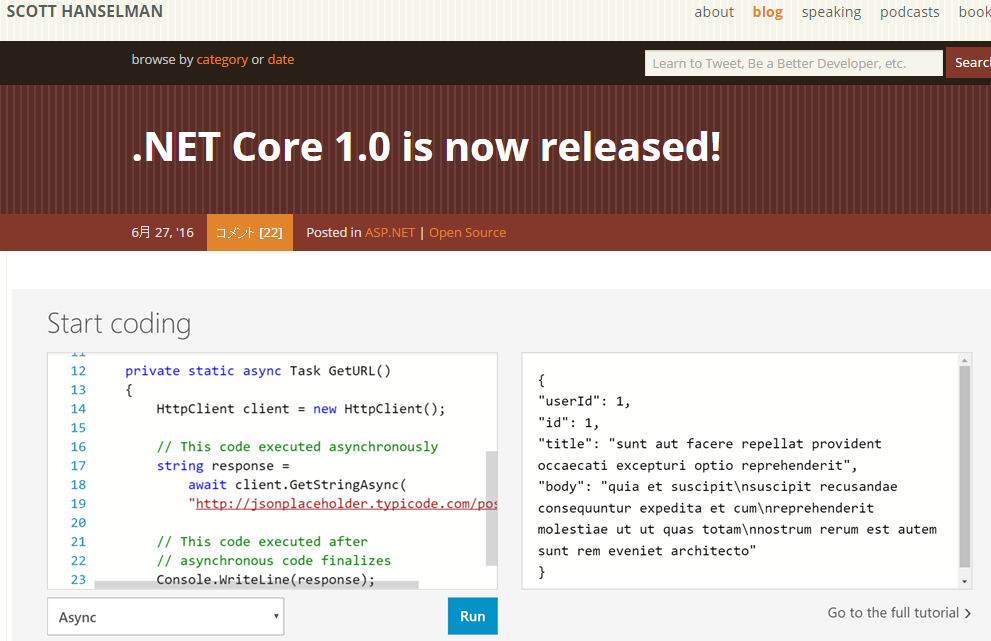
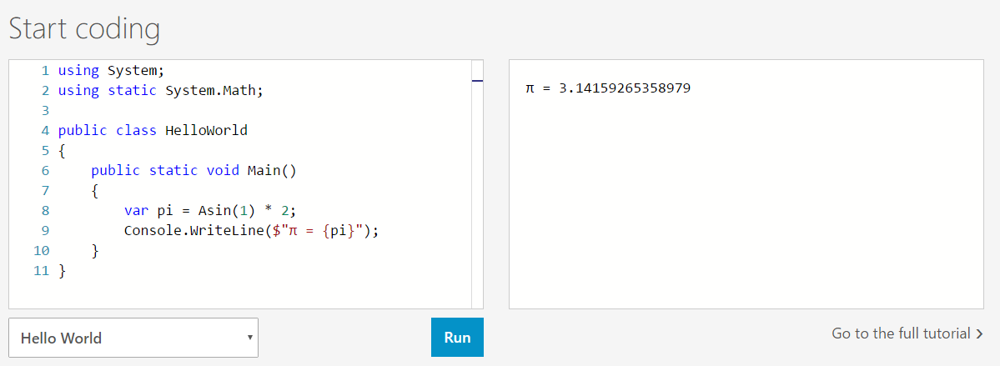
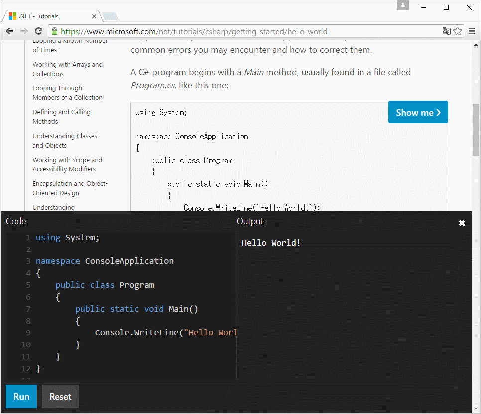

# dot.net にC#オンライン エディター

.NET Core、リリースされましたね。

まあ、その辺りの話は他の人に任せるとして。

- [.NET Core / ASP.NET Core 1.0 が RTM になりました](http://blog.shibayan.jp/entry/20160628/1467044271)
- [.NET Core 1.0 RTM / Visual Studio 2015 Update 3](https://buchizo.wordpress.com/2016/06/28/net-core-1-0-rtm-visual-studio-2015-update-3/)

自分が気になったのはこちら。

[Scott Hanselmanの.NET Coreリリースに関するブログ記事](http://www.hanselman.com/blog/NETCore10IsNowReleased.aspx)に気になる画像がありまして。画像にリンクが貼ってあって、リンク先は

- [http://dot.net](http://dot.net)

こちら。

ちょっと前に、「よくこのドメイン取れたな」、「マイクロソフトってURLにこだわってくれなくていつもダサいのに、これはほんとにうれしい」と話題になってたやつですね。
結局は[https://www.microsoft.com/net](https://www.microsoft.com/net)に転送されたりはするんですが、まあ、[http://dot.net](http://dot.net)がある、このURLでリンク貼れるってのが大事です。

で、このページをちょっと下にスクロールすると、こんなものが。

ウェブページ内でC#コード書いて試せる！
いつからありましたっけ？

まあ、中身的には「[Monaco](http://gihyo.jp/dev/serial/01/monaco/0001)」っぽいです。
Monacoを使って、チュートリアル コードをサイト内に埋め込んだり、「Run」ボタンを押して実行結果を出力したり。

これも、まあ、ずっとほしいほしい言い続けてたやつなわけですが。
[Go](http://golang-jp.org/)なんかは公式サイト開いた瞬間「Try Go」なわけで。
同じものがC#にもほしいって言ってたら、ちゃんとできてた。
しいて言うなら、こんなちょっとスクロールしないと見えない位置に置くのはやめてほしいなぁという感じはあります。
このページはたびたび見たことあるけど、大体「DOWNLOADS」か「DOCUMENTATION」リンクに直行でスクロールしませんし。

しかも、チュートリアル ページのサンプル コードも、実行できるものは1個1個、このMonacoベースのオンライン エディターを立ち上げて実行できるみたいです。

これは大変よさげ。
