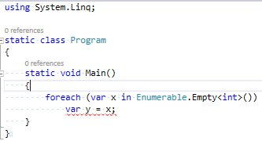

# ピックアップRoslyn 8/5

## Feature Status: Finishing

C# 7のステータスがいろいろ更新されたみたいですね。

- [Roslyn の開発進捗が更新されました](http://blog.xin9le.net/entry/2016/08/05/010144)

C# 7に入るもの、ほぼ確定したのかなぁ。
C# 7/VB 15には状況が「Finishing(最終作業中)」のものばっかり残して、他は+1(その次)行き。

この感じは、次に出るであろうVS "15" Preview 4が最後のプレビュー版ですかね。

### 最終作業

最終作業中ってのは、まあ、基本機能は実装済みで、後は実装してみて初めて分かった問題とかバグの修正、みたいな感覚ですかね。
僕が把握してる範囲だと、以下のような作業はしているはず。

- [Tuples](https://github.com/dotnet/roslyn/issues/347)
  - [式ツリーの中にタプルを書いた時の挙動が怪しい](https://github.com/dotnet/roslyn/issues/12897)みたいで、修正作業がたくさん
  - `var p = (x, y) = tuple;` みたいな、分解代入(`tuple`を`x`, `y`にばらす)をさらに別の変数`p`に代入するの、[認める予定](https://github.com/dotnet/roslyn/issues/12635)だけど今はエラーになる
- [Local Functions](https://github.com/dotnet/roslyn/blob/master/docs/features/local-functions.md)
  - [「確実に初期化されているか」検証のルールを変えたいとのこと](https://github.com/dotnet/roslyn/issues/10391)
  - ローカル関数でキャプチャしたローカル変数は、ローカル関数を初めて呼び出すまでに初期化して入ればいいことにしたいみたい
      - 今は、ローカル関数の宣言よりも前で初期化が必要
- [Out Var](https://github.com/dotnet/roslyn/blob/features/outvar/docs/features/outvar.md)と[Types Switch](https://github.com/dotnet/roslyn/blob/master/docs/features/patterns.md)で宣言する変数のスコープ
  - 後述。スコープを変えるみたい
      - 変えるというか、今まで未決定だったから過剰に厳しくしてたのを、ようやくちゃんと決めたっぽい

まあほんとにこういう細かい作業をする段階という感じです。

### 見送られた方

[じんぐるさんも書いてますけど](http://blog.xin9le.net/entry/2016/08/05/010144)、元々C# 7/VB 15の欄にいたのに、+1送りになったのもありまして。

まあ、動きがなかったのでうすうす感づいていたものの。以下の3つ。

- Async Main
- Source Generation
- Throw Expressions

#### Async Main

プログラムのエントリー ポイントとして`Task MainAsync(string[] args)`や`Task<int> MainAsync(string[] args)`を認めてほしいという話。

これ、最大の問題は同期コンテキストをどうするかなんですよねぇ。4年近く前にブログに書いたことあるんですけど、GUI (WPFでもUWPでもWinFormsでも)では問題ないのにコンソール アプリで実行すると競合起こす場合がありまして。

- 「[async/awaitと同時実行制御](https://ufcpp.wordpress.com/2012/11/12/asyncawait%E3%81%A8%E5%90%8C%E6%99%82%E5%AE%9F%E8%A1%8C%E5%88%B6%E5%BE%A1/)」の「コンソール アプリ」の辺り

これに関する解決案みたいな話が全く見かけなかったんで、今はまだ取り組んでないんだろうなぁと。

ちなみにもう1つの問題として、今、↓みたいな書き方してるコードが結構たくさんあるはずで、これの互換性を崩しかねないからって話もあります。

```csharp {title="MainからMainAsyncを呼ぶコード"}
class Program
{
    static void Main()
    {
        MainAsync().Wait();
    }

    static async Task MainAsync()
    {
        ...
    }
}
```

こちらはまあ、`void Main`の方を優先する、みたいなルールで回避はできるはず。

#### Source Generation

これは、いろんなところが関係するんで、それが先送りの理由かなぁと。要するに、

1. C# にコード生成を前提とした新文法を追加する: replace/original キーワードの追加
1. CodeAnalysis API に`SourceGenerator`みたいなクラスを追加して、コンパイラー プラグインとして自作のコード生成処理を挟めるようにする
1. Visual StudioやVS Codeに、ソースコード書き換え時や、ビルド時に`SourceGenerator`を掛ける仕組みを追加する

という3つが必要。

1はあったんですよね。一時期はmasterブランチにもマージされてました。問題もいくつか出てはいたですが:

- 複数のreplaceを書けない(複数のコード生成プラグインを掛けると競合する可能性がある)
- [ref returns と食い合わせが悪く、現状まだバグってる](https://github.com/dotnet/roslyn/issues/12516)

それよりは、2、3の作業が全然見えてこないなーという感じで。やっぱりC# 7には入れないんだ…

VS "15" Previewのリリース ノートでも、「VS "15"で新たに入る機能は`IOperation`です」としか書かれてなかったし。
(※`IOperation`は、C#とVBの両方に対して、単一のプラグインでコード解析・コード修正を掛けれる機能。)

特に今は、Visual Studio、Xamarin Studio、Visual Studio Codeの全部にこの手の仕組みを対応させたがってる節があって、この3者の間で調整してそうな予感が。C#チームの範疇を超えてますし、多少時間掛かりそう。

#### Throw Expressions

`void Method() => throw new NotSupportedException();`とか、`x ?? throw new ArgumentNullException(nameof(x))`とか、`int.TryParse(s, out var x) ? x : throw new InvalidOperationException();`とか書けるようにしたいって話。

これをやるんだったら、never 型([去年のブログ](../../../2015/08/pickuproslyn0829/index.md)とか[Build Insiderの記事](http://www.buildinsider.net/column/iwanaga-nobuyuki/002)参照)も入れたいとかあるんじゃないかなぁと。

あと、こいつが本格的に必要になるのはmatch式([パターン マッチングのドキュメント](https://github.com/dotnet/roslyn/blob/features/patterns/docs/features/patterns.md)のMatch Expressionのところを参照)が入ってからなので、これがC# 7から外れた以上、throw式だけを先に入れる動機付けは弱いはず。

## Design Notes 7/15

[C# Design Notes for Jul 15, 2016 #12939](https://github.com/dotnet/roslyn/issues/12939)

で、ちょうど、7/15のDesign Notesが公開されて、ここにOut Varで導入される変数のスコープについて書かれています。

これまで、C#の変数宣言は書ける場所を限定していたのもあって、「宣言しているブロック内がスコープ」というシンプルなルールになっていました。

ところが、C# 7では、

- Out Var: `int.TryParse(s, out var x) ? x : default(int?);` みたいに、out引数のところで変数宣言できるようになる
- Type Switch: `obj is int x ? x.ToString() : "unsupported";` みたいに、is演算子で変数宣言できるようになる

という2つの機能が入って、こいつらは、式を掛ける文脈ならどこでも変数宣言できてしまいます。
ここで導入される変数 `x` のスコープはどの範囲になるべきかという課題がありました。

現状、とりあえず相当厳しい方に倒して実装しています。すなわち、「`x`は、その式を含むステートメント内でだけ使える」というものです。要するに、以下のコードはコンパイル エラーに。

```csharp {title="2016/8/5時点での実装"}
static void X(string s)
{
    var value = int.TryParse(s, out var x) ? x : 0; // x はこのステートメント内でしか使えない
    Console.WriteLine(x); // もうスコープを外れてる。使えない。コンパイル エラーに
}
```

いろいろ検討した結果、これはさすがに実際にありそうな用途をカバーしきれないという結論で、制限緩和を考えてるみたいです。

パッと見、「この式を含んでいるブロック内で使える」というのが素直に思えるんですが、if とか for とかが絡むと多少めんどくさく。

例1: if の条件式内で宣言した変数は、else側には伸びてほしくない

```csharp
if (o is bool b) ...b...; // b はスコープ内
else if (o is byte b) ...b...; // bool の方の b はもうスコープ外。新しいbを作れる
...; // どちらのbもスコープ外
```

例2: 「含んでいるブロック内」で区切ると、forとかで変になる

```csharp
for (int i = foo(out int j); ;) ;
// iはスコープ外だけど、jはスコープ内になってしまうのはいい？
```

例3: ブロックがないifとかどうするの

```csharp
if (...)
    if (...)
        if (o is int i) ...i...
...; // ブロックを区切りにすると、i はここもスコープになる
     // その手前のifのせいで、iが初期化されている保証できないけどいい？
```

ってことで、ifとかforとかの場合は「embedded statements内にスコープを限定する」っていうルールにしたいそうです。
embedded statementsって、要するに、ifとかforとかの直後に書けるステートメントのこと。ifとかforとかの後ろには、ブロック、もしくは、何か1つステートメントを書けるわけですが、その部分のことを指すそうです。

### 余談: embedded statements

この話を見て、embedded statementsって何だっけ？って思って久々にC#の仕様書を眺めてみたんですが…

```text
statement:
    labeled-statement
    declaration-statement
    embedded-statement

embedded-statement:
    block
    empty-statement
    expression-statement
    selection-statement
    iteration-statement
    jump-statement
    try-statement
    checked-statement
    unchecked-statement
    lock-statement
    using-statement 
    yield-statement
```

つまり、embedded statement = ステートメントのうち、変数宣言とラベル付きステートメント以外。

ということは、こうなる: [https://twitter.com/ufcpp/status/761514377543462912](https://twitter.com/ufcpp/status/761514377543462912)



まあ、要するに、変数宣言とラベルって、それを囲っているブロックが重要な構文なので、ブロックを省略するとか認めないっていう。言われてみればそうですよねという感じ。

(逆に言うと、そうまでして変数宣言できる位置をちゃんと絞ってたのに、Out VarとType Switchのせいで面倒になったという話。)
