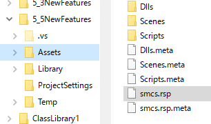
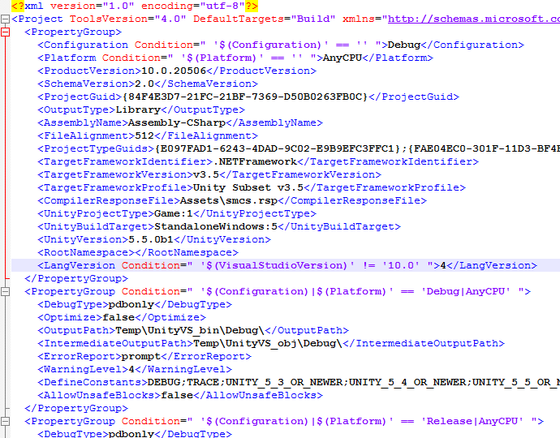

# Unity 5.5でasync/await使えた話

[Unity 5.5 ベータ](https://blogs.unity3d.com/jp/2016/08/30/get-the-unity-5-5-beta-now/)を入れてみたという話。

ブログ曰く、「Mono C# コンパイラー がMono4.4にアップグレードしました。」とのことなので、これ、C# 6使えるはずよね？と。

## 公式サポートはC# 4

[リリースノート](https://unity3d.com/jp/unity/beta)を見ると、「C# 4です」って書かれてるわけですが。
Mono 4.4のコンパイラーを使っててC# 6使えないとかお前は何を言っているんだ…

まあ、標準ライブラリの方が .NET Framework 3.5相当のままなので、`Task`クラスが使えない。
なので当然、普通にやるとasync/awaitが使えない。
その状況下で「C# 6対応」とか言っちゃったら、問い合わせ押し寄せてやばいでしょうから、公式には「C# 4」と言わざるを得ないのはわかります。

要するに、コンパイラー的にC# 6に対応している状況で、`langversion`オプションを指定してわざと4に絞ってる。

例えば、以下のようなコードを用意します。

<div>
<script src="https://gist.github.com/ufcpp/6c7d3f036189ecdf4fb87fe0d6ff50fd.js"></script>
</div>

async/await (C# 5)、expression-bodied method (C# 6)とか使ってます。
これをコンパイルしようとすると、
Unity 5.3だと以下のようなエラーに。

```console
Assets/Scripts/NewBehaviourScript.cs(30,13): error CS1519: Unexpected symbol `=>' in class, struct, or interface member declaration
Assets/Scripts/NewBehaviourScript.cs(37,28): error CS1519: Unexpected symbol `XAsync' in class, struct, or interface member declaration
```

これが、5.4は試してないんですけど、5.5だと以下のように。

```console
Assets/Scripts/NewBehaviourScript.cs(30,12): error CS1644: Feature `expression bodied members' cannot be used because it is not part of the C# 4.0 language specification
Assets/Scripts/NewBehaviourScript.cs(37,16): error CS1644: Feature `asynchronous functions' cannot be used because it is not part of the C# 4.0 language specification
```

5.3曰く「ちょっとその文法わからない」、5.5曰く「その機能はC# 4じゃないからダメ」。
5.5は解釈自体はできていると。

## -langversion:6

てことで、まあ、オプション変更。

プロジェクトの Assets 直下に `mcs.rsp` っていうファイルを作り、



以下の1行を書いて保存。

```text
-langversion:6
```

これで、C# 6なコードもビルドが通ります。

ただ、Unityが出力する csproj ファイルに余計な行が入るんで、こいつも消さないと、Visual Studio上でC# 6の機能が使えなくなります。



この行も削除が必要。
いったん手作業削除してるんですが、ちゃんとやるなら[Project File Generation](http://unityvs.com/documentation/api/project-file-generation/)でも使ってフックしてやればよさそう。

`Task`クラスが必要なasync/awaitはともかく、ライブラリ依存がほとんどない[C# 6の機能](../../../../study/csharp/cheatsheet/ap_ver6.md)とかなら問題なく使えると思います。

## async/awaitを使う

で、`Task`クラスさえ自前で用意すればasync/awaitも使えるっぽい。
うちは自力でバックポートしたライブラリを持ってるので、それを参照してみたら、あっさり動きました。
ライブラリは↓これ。

- [MinimumAsyncBridge](https://github.com/OrangeCube/MinimumAsyncBridge/)

実際動いてるプロジェクトがこんな感じ↓。

- [https://github.com/ufcpp/Unity20160901](https://github.com/ufcpp/Unity20160901)

まあ、Unity Editor上でしか試してないんで、IL2CPPとか実機で動くかはわからないんですが。
