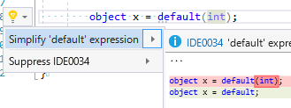

# ピックアップRoslyn 10/8: C# 7.1 の default 式のバグ

昨日の [.NET Conf 2017 Tokyo](https://csugjp.connpass.com/event/66004/)でちょこっと話したりしたんですが、C# 7.1のバグを踏み抜いたという話。
(正確には同僚が踏んじゃったバグを僕がバグ報告入れた)

割と手短に示せるバグで、以下のような例がわかりやすいんですが、nullable型な引数のデフォルト値として、[`default`式](../../../../study/csharp/cheatsheet/ap_ver7_1.md#default-expr)を使ったとき、値が `null` にならないとおかしいはずなのに 0 になるという問題。

```csharp {title="デフォルト値にデフォルト式"}
static void Main()
{
    int? x = default; // null
    int y = default; // 0

    Console.WriteLine(x); // null
    Console.WriteLine(y); // 0
    A(); // 0 !!
    A(default); // null !!
}

static void A(int? x = default) // 0 !!
{
    Console.WriteLine(x);
}
```

## バグ報告

結構わかりやすいバグだから既出かなぁとか思いつつも[バグ報告](https://github.com/dotnet/csharplang/issues/970)をいれてみたんですが。
案外初出だったらしく、かつ、さすがにまずそうなバグなので「破壊的変更になるけども直す」という感じですぐに修正作業が始まったみたいです。

一応、C# 7.1 (Visual Studio 15.3 (2017 Update 3))は、プレビュー版が出てからだと数か月経っていますし、正式リリース(8/14)からも2か月弱経ってるわけですが。気付かないもんですね、こういうバグ… まあ、デフォルト値が `null` の時には普通 `null` って書きますもんね、`default`を使わず。

ちなみに、類似のバグとして、`default`式はCode Fix の挙動も怪しかったりします。



`object x = default(int)` (0になるはず)を、`object x = default` (null になっちゃうので、意味が変わる)にリファクタリングしようとしてしまう問題。

こちらは、既出のバグで先月くらいにはバグ報告されています。かつ、IDE のリファクタリングの問題なので、コンパイル結果自体が怪しい先ほどのバグと比べると幾分かマシ。

## 初のマイナーリリースで自信なさげ？

C# 7.1は、実質的には初のマイナーリリースですし、半年という短いサイクルで新バージョンをリリースしたというのも、C# チーム的には初の試みです。

そのせいか、ちょっと自信なさげな感じもあるんですよね…

例えば、C# チームから「C# 7.1 がリリースされました」的なブログが出ていなかったりしますし。

例えば、Visuals Studio 15.3では規定動作では C# 7.1 を使えませんし([LangVersion latest オプションの指定が必要](../../8/visualstudio15_3/index.md))。

まあ、何事も初の試みは大変ってことですかね…

## `default` の型推論はそんなの大変なのか

ちなみに、パッと見の感覚で言うと、このバグは不思議に思えるというか、なんでそんなバグを起こしちゃうのか謎というか。
「`int? x = default` って書かれてたら、ローカル変数だろうと引数のデフォルト値だろうと`default(int?)`だろ」という感じなんですが。

まあたぶんなんですけど、nullable型とか、値型のデフォルト値とかは結構いろんな特殊対応が入っていて、
思ったほどコンパイラーのコードは単純じゃないのではないかと思われます。

例えば、値型のデフォルト値なんですが、以下のような感じになっています。

```csharp {title="値型のデフォルト値"}
// 以下の3つの X は全部同じ意味
static void X(DateTime d = default(DateTime)) { }
static void X(DateTime d = new DateTime()) { }

// これは現在の C# ではコンパイルできない
// C# 3.0 までデフォルト引数を認めていなかったので、VB との相互運用のために使っていた書き方
// 属性には定数しか含められず、かつ、構造体の規定値は .NET 的には「定数」ではない
// 代わりに null を入れてある
[DefaultParameterValue(null)]
static void X(DateTime d) { }
```

IL へのコンパイル結果としても以下のような感じ。

```cil {title="上記コードのコンパイル結果のIL"}
.method private hidebysig static
    void X(
        [opt] valuetype[mscorlib] System.DateTime d
    ) cil managed
{
    .param [1] = nullref // DateTime 構造体なのに null 扱い
    .maxstack 8
    IL_0000: ret
}
```

本来 `null` を代入できないはずの `DateTime` 構造体に対して、`null` でデフォルト値を代用している状態です。

nullable 型に対しても、以下のような感じで、null の扱いがちょっと特殊になっています。

```csharp {title="int? への null 代入"}
// 以下の2行は同じ意味
int? x = null;
int? x = new int?(); // null というより、(false, 0) みたいな値
```

なんかこの辺りが合わさった結果、`default`式の型推論に失敗したんじゃないかなぁと思います。

## 修正による破壊的変更

このバグを修正すると破壊的変更になります。
もしも、「0 になるものだ」という前提で `int? x = default` を書いている人がすでにいた場合、
そのコードの挙動が狂います。

C# は基本的には破壊的変更に対して非常に保守的な言語で、
「直したいけども破壊的変更になるから直せない」みたいな言語仕様も結構あります。
ただ、「明らかにバグ」というものに対してはさすがに破壊的変更が許容されることが結構多いです。

一応、マイクロソフト内に「compat council」(互換性協議会)みたいなグループがあって、そこでの審議をしているそうです。
そのcouncilで破壊的変更を許容するかどうかは、バグの深刻度と実際の影響範囲のバランス等を見て決めていると思われます。

今回の場合で言うと、

- `int? x = default` が 0 になるものだという前提でコードを書いているやつがどのくらいいるか？ → あんまりいなさそう
  - そもそも数か月の間誰にも気づかれなかったわけで
  - 普通は `int? x = null` か `int? x = 0` と書く(わざわざ `int? x = default(int?)` とか `int? x = default(int)` とか書かない)
  - LangVersion latest オプションが必要なため、そもそも C# 7.1 の利用率自体がまだそこまで上がっていないと思われる 
- いくらなんでも挙動がひどい
  - ローカル変数の `int? x = default;` だと `null` なのに、引数のデフォルト値の`(int? x = default)` だと 0
  - `X()` だと 0 なのに、`X(default)` だと `null`

という感じなので、
さすがにほぼノータイムでcompat councilを通過したみたい。
