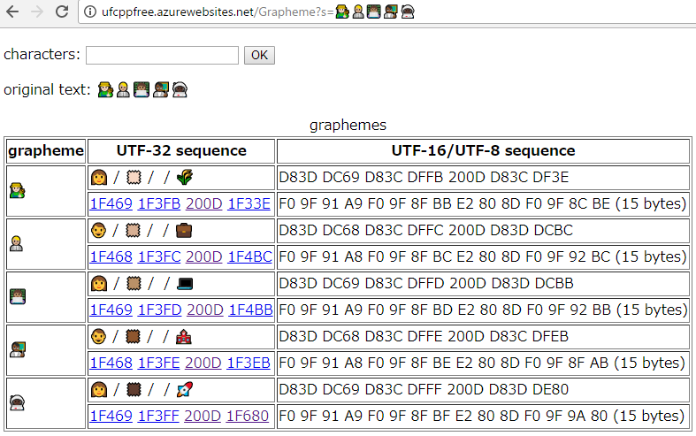

# GraphemeSplitter の副産物(絵文字調査ツールとRangeスイッチ)

[先週](../../10/graphemesplitter/index.md)書いた [GraphemeSplitter](https://github.com/ufcpp/GraphemeSplitter) の話からの派生で2点。

## 常設の Web サイト化

[GraphemeSplitter のサンプル](https://github.com/ufcpp/GraphemeSplitter/tree/master/RazorPageSample)のつもりで ASP.NET Razor Page なページを1個作ったんですけども。

その後。

- なんか気になる絵文字を見かけた
- 絵文字なのでそれの正確な意味わからないくて気になる
- しょうがないからその絵文字でググったり
- 文字コードを調べて U+1F680 でググったり(面倒)
- そうだ、こないだ作ったサンプル用のページでコード調べられる
- Visual Studio でわざわざデバッグ実行起動するのばかばかしくなってきた
- そうだ、[Azure の Free プランでホストしとこう](http://ufcppfree.azurewebsites.net/Grapheme)
- ついでだから便利機能(自分用)足しとこう(今ここ)



追加した機能は以下のようなもの。

- 入力用のフォームを設置
- 1コードポイントごとにばらした文字も表示
- 文字コードに対して、「[U+1F680](https://www.google.co.jp/search?q=U%2B1F680)」みたいなGoogle検索のURLのリンクを生成

書記素分割というか、単なる絵文字調査ツールになりました。
仕組み上、絵文字だけじゃなくて、ASCII顔文字の類も調べられます。

ソースコードは「自分用」と言わんばかりに [UfcppSample リポジトリの Tools フォルダー以下](https://github.com/ufcpp/UfcppSample/tree/master/Tools/UnicodeService)に置いてたり。

## Rangeベースのswitch-case

書記素分割のために、unicode.org 内の [GraphemeBreakProperty](http://www.unicode.org/Public/10.0.0/ucd/auxiliary/GraphemeBreakProperty.txt) ってデータを参照して、そこからコード生成で`switch`ステートメントを作ったわけですが。[2万行弱のクソコード](https://github.com/ufcpp/GraphemeSplitter/blob/master/GraphemeBreakPropertyCodeGeneratorTest/Benchmark.switch.cs)っぷりがひどく…

で、以下のような最適化を掛けてほしいというの、[とりあえず issue 立てとくことに](https://github.com/dotnet/roslyn/issues/22997)。

```csharp
// 1コード1 case に展開 (最適化が掛かって結構速いけど、クソコード。コンパイル時間もやたらと遅い)
switch (codePoint)
{
    case 1536:
    case 1537:
    case 1538:
    case 1539:
    case 1540:
    case 1541:
        // ...
}

// when 句を使って範囲を表現 (コードは綺麗になったけど、条件判定が線形探索になっちゃって O(n)。遅い)
// 二分探索するような最適化をしてほしい
switch (codePoint)
{
    case uint i0 when 1536 <= i0 && i0 <= 1541:
        // ...
}

// こういう文法ほしい(C# 8とか9とかくらいでは入るかなぁ、きっと)
// これなら、コードが綺麗、かつ、最適化しやすいのではないか
switch (codePoint)
{
    case 1536..1541:
        // ...
}
```

まあさすがに、実用途の説明と、ベンチマークを添えとくと反応よさげ。`case 1536..1541` みたいな書き方であれば範囲の重複チェック(同じ値の
 `case` が複数あったらエラーにする)のとか、二分探索化する最適化もしやすそうということで、興味を持ってもらえたっぽい。
