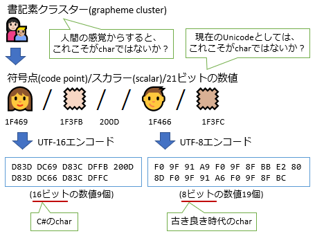

# Rune と fast Utf8String

今日はRoslynじゃなくてCoreFx方面の話だし、issueの投稿日時的には9月とかで割かし「今更」な話。

1. [Introducing System.Rune #24093](https://github.com/dotnet/corefx/issues/24093)
1. [New UTF8String APIs #1751](https://github.com/dotnet/corefxlab/issues/1751)

## Rune

1個目のやつ、要は「Unicode のコードポイントに相当するプリミティブ型が欲しい」的な話です。

### 文字とは…

プログラミングにおける「文字」に関するおさらい:



`char`って何なんだろうね… と路頭に迷った結果が、以下のような感じ。

| 言語 | UTF-8 | UTF-16 | 符号点 | 書記素 |
| --- | --- | --- | --- | --- |
| C# | (`byte`) | `char` | (`uint`) | (`string`) |
| Swift | (`UInt8`) | (`UInt16`) | `UnicodeScalar` | `Character` |
| Go | (`uint8`) | (`uint16`) | `rune` | (`string`) |
| Rust | (`u8`) | (`u16`) | `char` | (`String`) |

※ `()` 付きの物は文字としての型がないので「代わりに使うとしたら」

Java とか C# とか、`char` がUTF-16を指す言語は「前世代」感を隠せないとしても…
Unicode コンソーシアムもこういう用語をちゃんと定めないんもんだから場所によって符号点って呼ばれたりスカラーって呼ばれたり…
Rust は Unicode 符号点を指して `char` とか呼んでるけども、結合文字とか不可視文字とかあるからやっぱ「それが`char`か？」と言われると微妙だし…

そ　し　て　Go…

上記の issue を最近始めてちゃんと読んだんですけども、よく見たらこんなことが書いてあるわけですよ。

> "Code point" is a bit of a mouthful, so Go introduces a shorter term for the concept: rune. The term appears in the libraries and source code, and means exactly the same as "code point", with one interesting addition.

> 「コード ポイント」とかちょっと長くて言いにくい。なので、Go ではこの概念に対して短い用語、「ルーン」を導入する。この用語がライブラリ・ソース コード中に現れた場合、完全に「コード ポイント」と同じものを意味する。

(※ 最後の with one interesting additionは、次の段落に書いてある「`rune`型は`int32`のエイリアスで、『ルーン定数』も書けるよ」って話の事を指してると思う。)

確かに何というか、今のUnicodeの符号点って、呪術的、儀式的な感じしちゃってるんでルーン呼ばわりもわからなくもないものの…

ルーン文字って、それを文字として使ってた頃は神秘性・呪術性なかったらしいじゃないですか。
(「使わなくなった古代文字とかかっこよくね？」的な中二病で、後世になって神秘性帯びたもの。)
ただの文字ですぜ…

### Proposal: System.Rune

で、これに倣って、C# にも`System.Rune`型を足したら？と言い出したのが冒頭の1つ目のissue。

- [Introducing System.Rune #24093](https://github.com/dotnet/corefx/issues/24093)

言いたいことはわかるし、専用の型は確かに欲しいけども、Runeって名前はちょっと…

ちなみに、このissueは[Miguel](https://github.com/migueldeicaza)(Xamarin の偉い人)によるものなわけですけども、
この人は製品名に[NuGetizer 3000](https://github.com/NuGet/Home/wiki/NuGetizer-3000)とか[Embeddinator-4000](https://github.com/mono/Embeddinator-4000)とか付けようとする人なので…
ごめんなさい、Rune もこの人のネーミングセンスだと思って一瞬疑いました…
Go が犯人とは(ちなみに、Go より前から Rune という呼び名使う人はいたっぽい)、疑ってごめんなさい。

Rune。[ルーン文字](https://ja.wikipedia.org/wiki/%E3%83%AB%E3%83%BC%E3%83%B3%E6%96%87%E5%AD%97)のrune。
Unicode 内にも U+16A0(ᚠ) ～ U+16F0(ᛰ) の範囲で存在しているルーン文字の、rune。

これ、最悪、

```csharp {title="rune is rune"}
// ルーン(符号点のこと)がルーン(ルーン文字のこと)かどうか調べる
Rune.IsRune('ᚠ');
```

が生まれちゃうやつじゃないですか。

### 符号点を表す型

ちなみに、.NET でこの辺りの文字列処理の新ライブラリは、今ちょうど、[corefxlab](https://github.com/dotnet/corefxlab)で参考実装を作っているところです。
(corefx に移ってなくて corefxlab 内で日々変更が入ってるような状態なので、リリースまではまだもうちょっと掛かりそう。)

で、corefxlab 産の `Utf8String`、1年くらい前までは`CodePoint`構造体を持ってたんですよねぇ。
それが、今は[`uint`生利用](https://github.com/dotnet/corefxlab/blob/010238eb489ccfb04a47774cc606653afb82464a/src/System.Text.Utf8String/System/Text/Primitives/Utf8CodePointEnumerator.cs#L22)に変わっています。
わざわざ、専用の型を削除。

たぶんなんですけども、パフォーマンスのためですかねぇ。
プリミティブ型を構造体でくるんじゃうと、JIT 結果的に、レジスターを使った最適化が掛かりにくくなるみたいな話も見たことがあり。
(ちゃんと最適化が掛かるようにしたい的な issue だったはずなので、今なら最適化掛かるかも？)

## Fast Utf8String

そんなRuneの提案ですが、そのさらにきっかけになった別提案が、2つ目のissue。

- [New UTF8String APIs #1751](https://github.com/dotnet/corefxlab/issues/1751)

個人的にはむしろ、こっちの方にこそ面白そうな話が。

元々、`Utf8String`は以下のような型として提案されてました。

```csharp
ref struct Utf8String
{
    ReadOnlySpan<byte> _buffer;
}
```

で、これだと「ヒープ上に持っていけないのが不便」と言われ、以下のように変化。

```csharp {highlight-text="ヒープに置ける"}
// stack-only
ref struct Utf8Span
{
    ReadOnlySpan<byte> _buffer;
}

// ヒープに置ける
struct Utf8String
{
    byte[] _buffer;
}
```

さらに、「構造体嫌だ…」と言われます。
なんせ、[`ImmutableArray`](https://source.dot.net/#System.Collections.Immutable/System/Collections/Immutable/ImmutableArray.cs)とかでさんざん苦労しているそうで。
この手の「参照型を1個ラップするのに、アロケーションを減らしたくて構造体にした」みたいな型はいろいろと事故ります。
`object` とかインターフェイスに渡すときにボックス化でパフォーマンス落としたり、
`Interlocked.Exchange`がしづらかったり、
「参照型もどき」な癖にさらにそのnullableが作れてしまったり。

ということで、以下のように変化。

```csharp {highlight-ranges="sha256:a573b43ef520db6e75f153dd2d1528127a52d5019fbf40db13793369d8276c64;7:20-7:23,8:1-8:6"}
// stack-only
ref struct Utf8Span
{
    ReadOnlySpan<byte> _buffer;
}

// ヒープに置けるというか、最初から参照型
class Utf8String
{
    byte[] _buffer;
}
```

もちろん、これだと、クラスの中に配列があって、ヒープ確保・間接参照が2段階になります。
パフォーマンス的にはちょっと微妙。
(それでも、前述の構造体であることによる問題よりはマシな感じあり。)

なので、上記提案の中には、

- いつかはやっぱり `string` 並みのランタイムによる特殊実装入れたい
- `Utf8String` は可変長クラスにしたい

みたいな話も出ました。

現状、「可変長」が許されている型は`string`と配列だけで、この2つだけかなり特殊扱いされています。
ユーザー定義で可変長な型が許されていれば、`ImmutableArray`とか今回の`Utf8String`でこんなに悩む必要もなく、単にクラスで実装すれば済むわけです。
ユーザー定義は認めないまでも、`Utf8String`くらいは可変長クラスであることを認めろよ、という風な流れに。
(この場合、対応しているランタイムであればそういう「特殊実装で可変長」(fast `Utf8String`)、
していないランタイムであれば前述の「中身は単に配列」(slow `Utf8String`)な2つの実装を用意することになります。)

fast `Utf8String`、かなり欲しい…
(「後で最適化するのも考えるから、とりあえず今はクラスにするの認めろよ」的な方便でもあるんで、
実際この最適化版`Utf8String`がいつ実装されるかは未知ですが…)
