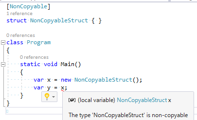

# コピー禁止(non-copyable)構造体アナライザー

書き換えられる(mutable)構造体を作ると事故る問題を解決するために[アナライザー](https://github.com/ufcpp/NonCopyableAnalyzer)作りました。

## mutable 構造体

一般論としては、[構造体を mutable に作ると事故ります](https://gist.github.com/ufcpp/08cb223b1b53a6cd0b13d953a0055156)。
要するに、「書き換えたつもりが、実は書き換えてたのはコピーであって元の値は書き換わってない」的なやつ。
なので、たいていの場合は「構造体は immutable(書き換え不能)に作れ」という指針になります。

その一方で、まれに、ヒープ確保を避けるために mutable な構造体を作りたい場合があります。
フィールドとしてクラスに埋め込んで使ったり、ローカル変数に確保して`ref`引数でメソッドに渡す想定で作ります。

例えば、corefxlab が作りかけてる[`ResizableArray`](https://github.com/dotnet/corefxlab/blob/master/src/System.Collections.Sequences/System/Collections/Sequences/ResizableArray.cs)とか、neueccさんが作ってるUtf8Json中の[`JsonWriter`](https://github.com/neuecc/Utf8Json/blob/master/src/Utf8Json/JsonWriter.cs)とか、
書き込み先の配列(満杯になったら確保しなおす)と現在の書き込み位置だけを持つ小さい型なんですが、
構造体で作られています。
自分が昔作ったのだと、[`Lazy`](https://docs.microsoft.com/ja-jp/dotnet/api/system.lazy-1?view=netstandard-1.1)型のためにアロケーションが発生するのがいやすぎて、これの構造体版を作ったこととか。

もちろん、コピーが発生したら事故ります。
「`JsonWriter`に`Write`したつもりが何も書き込まれていない(コピーに対して書き込んでた)」とかやらかしがちです。

## コピーの方を禁止する

mutable 構造体で問題が起きるのはコピーが発生するせいです。
なので、コピーの方を禁止すれば、構造体が mutable でも問題は起こしません。

ということで作ったのがこちら。

- [NonCopyableAnalyzer](https://github.com/ufcpp/NonCopyableAnalyzer)

本当はずっと昔から作ろうとは思ってたんですが。
「Analyzer with Code Fix のプロジェクト テンプレートが SDK-based csproj になったら本気出す」って思ってたらつい最近になってようやく…
[先週のブログ](../analyzerconvention/index.md)に書いた[Analyzer 用の自作プロジェクト テンプレート](https://github.com/ufcpp/AnalyzerConvention)を作った動機もこれ用。

どういうコードが禁止されるかは、[テスト用のコード](https://github.com/ufcpp/NonCopyableAnalyzer/tree/master/src/NonCopyable/NonCopyable.Test/DataSource/NonCopyable)を見てみてください。サブフォルダーの Source フォルダー以下にある csx の、❌ コメントを入れている行を禁止。
以下のような感じでコンパイル エラーが出ます。

### おまけ: 言語機能化の提案

コピー禁止って、必要となる場面がそんなに多くないわりに、解析するの結構大変なんですよね…
自分が作った NonCopyableAnalyzer も完璧なものではないです。
例えば、ジェネリクスが絡むと誤判定あり。

<pre class="source" title="non-copyable 誤判定">
<code>static void Main()
{
    var x = new NonCopyableStruct();
    var illegal = x; // ちゃんと禁止
    var misjudged = Copy(x); // 本来禁止すべき。でも現実装だと通っちゃう
}

public static T Copy&lt;T&gt;(in T x) =&gt; x;
</code></pre>

[「Non-cobyable 構造体」を言語機能として入れてほしい](https://github.com/dotnet/csharplang/issues/859)っていう要望とかも出てたりはするんですけども。
言語に組み込むには上記のような誤判定がつらいかなぁという感じ…

こういう、「コピー禁止」があると、[昔ブログに書いた非ガベコレな高効率メモリ管理](../../7/pickuproslyn0730/index.md)とかも実現できたりするんですが、
これは誤判定がちょっとでも残るとやばいやつなので、相当難しそう…
