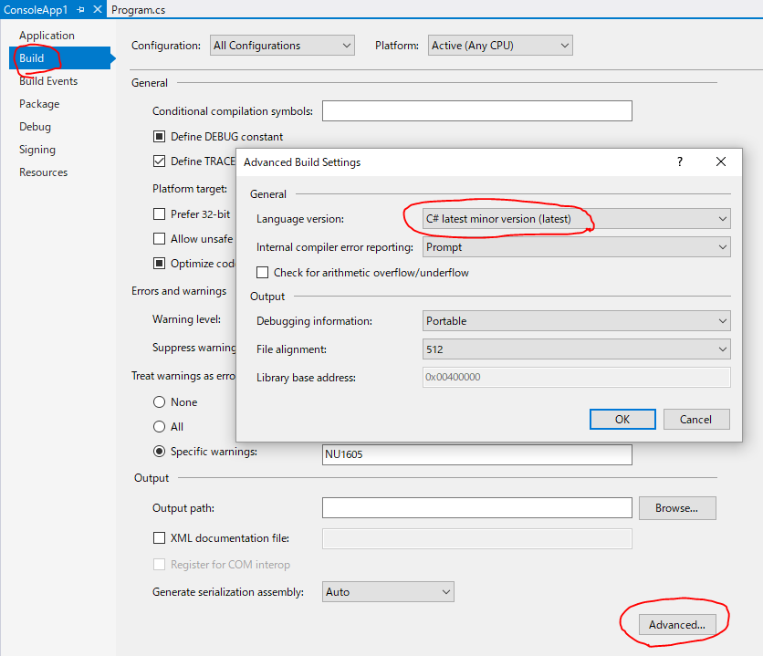

# Visual Studio 15.5 Release

正式リリース来ちゃった。

- [リリース ノート](https://www.visualstudio.com/en-us/news/releasenotes/vs2017-relnotes)
- [Visual Studio チームのブログ](https://blogs.msdn.microsoft.com/visualstudio/2017/12/04/visual-studio-2017-version-15-5-visual-studio-for-mac-released/)

ソリューションのロード時間が半分くらいになってるんで一刻も早く使いたいんですけども…

先日、↓の勉強会の最後の方(31ページ目～)でちょっと話した通り、Unity でちょっと問題が出ていて、職場のPCではアップデートしばらくできないかも…

<div>
<iframe src="//www.slideshare.net/slideshow/embed_code/key/E2LF7YT1rWRdKw" width="595" height="485" frameborder="0" marginwidth="0" marginheight="0" scrolling="no" style="border:1px solid #CCC; border-width:1px; margin-bottom:5px; max-width: 100%;" allowfullscreen> </iframe> <div style="margin-bottom:5px"> <strong> <a href="//www.slideshare.net/ufcpp/unity-c-60-net-46" title="Unityで使える C# 6.0～と .NET 4.6" target="_blank">Unityで使える C# 6.0～と .NET 4.6</a> </strong> from <strong><a href="https://www.slideshare.net/ufcpp" target="_blank">信之 岩永</a></strong> </div>
</div>

## C# 7.2 リリース

ということで、C# 7.2 もリリース。
C# 7.1 が8月だったので、4か月ほどでのバージョン アップ。

C# 7.1 の時と同様、7.2 を有効にするには `LangVersion` 指定が必要です。



```xml {highlight-text="latest"}
<Project Sdk="Microsoft.NET.Sdk">

  <PropertyGroup>
    <TargetFramework>netcoreapp2.0</TargetFramework>
    <LangVersion>latest</LangVersion>
  </PropertyGroup>

</Project>
```

うちのサイト、今回はもうちゃんと全機能網羅できているはず。

- [C# 7.2 の新機能](../../../../study/csharp/cheatsheet/ap_ver7_2.md)

あと、`ref` がらみの総まとめ的なページを足したいとかは思ってるんですけども、
まあ、機能それぞれ個別には全部書いているはずです。

C# 7.2 は、`ref`がらみの機能が多く、パフォーマンスに関するアップデートになります。
とりあえず C# コンパイラーとしての作業は今回のアップデートで完了という感じなんですが、
.NET 全体としては、

- `Span<T>` を安全に使うための C# 機能が入る(今ここ)
- `Span<T>` の正式リリース
- `I/O` がらみのライブラリが `Span<T>` に対応
- アプリが `Span<T>` 版のライブラリを使いだす

となって初めてパフォーマンス的な恩恵になるので、まだ1歩目を踏み出したところということで、今後に期待となります。

## C# のこの先の話

次は、7.X 系でもう1回小さいリリースをした後、8.0 でメジャー アップデートになりそうな感じでしょうか。
7.1 から 7.2 では4か月の短いリリース サイクルだったわけですけども、
その分やっぱり新機能は細かく分割された感じがあります。
[C# 7.3 候補](https://github.com/dotnet/csharplang/milestone/11)は、7.0 の頃から候補になっているものの優先度が低く設定されていたものや、7.2 の積み残しみたいなものが並んでいます。

一方で、大きい機能は[C# 8.0 候補](https://github.com/dotnet/csharplang/milestone/8)に並んでいます。
元々 8.0 に並んでいた[nullable reference types](https://github.com/dotnet/csharplang/issues/36)や[default interface method](https://github.com/dotnet/csharplang/issues/52)に加えて、
[パターン マッチングの完全版(再起パターン)](https://github.com/dotnet/csharplang/issues/45)も、今は8.0ということになっています。
