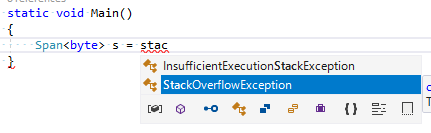
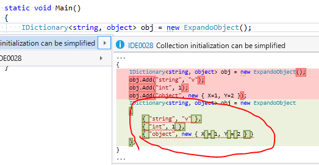

# バグ報告祭り

やっぱリリースするといろいろバグを見つけるよねと言う話
([Visual Studio 15.5がリリース](../vs15_5/index.md)されて以来バグ報告たくさん出してる)。

twitter で見かけたのを代理で報告出したり、
前々から気になってたのを改めて調べてみたらコンパイラーのバグだったり、
リリースまでに直るだろうとか高をくくってたやつがまだ直ってなかったり。

## safe stackalloc のインテリセンスが効かない問題

報告先: [#23584](https://github.com/dotnet/roslyn/issues/23584)

[`Span<T>`構造体で受け取れば、safe な文脈で `stackalloc`が使える](../../../../study/csharp/resource/span.md#safe-stackalloc)んですが、
これがコード補完に出てこないという問題。



インテリセンスのみの問題で、コンパイルは問題なく通ります。

まあ、`stackalloc`を必要とする人が少ない上に、
この機能を使うには[fast Span](../../../../study/csharp/resource/span.md#fast-span)が必須。
これが入ってるのは .NET Core 2.1 (まだプレビュー)ということで、
まず試してみてる人がかなり少なそう。

.NET Core 2.1 の正式リリースまでに直ってればいいって感じなのかなぁとか思いつつ一応報告してみたら、
報告した瞬間に修正してたのでやっぱ報告しないと行けなかった奴でした。

## 式形式(=>) get/set プロパティが、自動実装と誤認されてる問題

報告先: [#23668](https://github.com/dotnet/roslyn/issues/23668)

以下のようなコードで警告が出るという問題。

```csharp
// Warning CS0282
// この警告は、partial で複数の場所にフィールドを書くと出る。
// 自動実装プロパティも、自動でフィールドが作られるので partial を分けて書くと警告に。
partial struct X
{
    public int A { get; set; }
}

partial struct X
{
    // こいつは自動実装じゃないのでフィールド作られないはずなんだけど…
    // get =>/set => 型のプロパティは、自動実装プロパティと誤判定するらしい。
    int B { get => A; set => A = value; }
}
```

職場のコードでずっと前から消えない警告があって気になってたんですけども…

大々的にコード生成で作ってるところなので、実際はもっと複雑な partial の分かれ方になっていて、
何が原因かわからず。
時間が解決する(自分が報告しなくてもそのうち治る)かなぁ？とか思っていたものの、15.5でもまだ残っていたので本腰入れて調べたところ、やっと原因を特定したのがこれです。

結局、どうも、プロパティの[`get`/`set`を`=>`を使って書く](../../../../study/csharp/oop/oo_property.md#expression-bodied)と、[自動実装プロパティ](../../../../study/csharp/oop/oo_property.md#auto)と誤判定するみたいです。
確か、`{}`で書いてる時と`=>`で書いてる時、Roslynの抽象構文木が違うんですよねぇ。
それで誤判定してるんじゃないかと。

これも、報告入れた瞬間に修正入ってました。

## リファクタリング機能が明示的実装を考慮していない

報告先: [#23672](https://github.com/dotnet/roslyn/issues/23672)

明示的実装をしていて、インターフェイス越しにしかアクセスできないはずの`Add`に対して、
「コレクション初期化子を使う」リファクタリングが効いてしまって、
リファクタリング結果がコンパイル エラーになるという問題。



該当のQuick Actionを掛けない限り問題はないやつです。

[これはtwitterで見かけたの](https://twitter.com/taiga_takahari/status/939053041898070016)の代理報告。

類似の報告(コレクション初期化子じゃなくてオブジェクト初期化子のもの)は元々バグ報告が出てたみたいです。
Quick Action のID (IDE0028)で検索を掛けたので見つからず(コレクション初期化子のとオブジェクト初期化子のでIDが別)。
どうも、もうバグ修正のプルリクは出てたみたいです。

## in 引数がバグりまくり

報告先: [#23636](https://github.com/dotnet/roslyn/issues/23636)

本日の一番やばいやつ。

[`in`引数](../../../../study/csharp/resource/sp_ref.md#in)がかなりバグりまくり…

これも[twitterで見かけたの](https://twitter.com/Temarin_PITA/status/939732108326592512)の代理報告。
[ご本人のブログあり](https://qiita.com/Temarin/items/b21b2b8367d41c2bd34e)。

こいつは、実行時エラーを起こすやつなので、踏むと結構デバッグが面倒な奴です…

`in`引数には、`ref`と違って

- 呼び出し側には `in` を付けるのが必須じゃない
- リテラルを渡せる
- 既定値を与えられる

とかいう特徴があるわけですが、この辺りがちょうどバグりまくり。

具体的には、参照で渡さないといけないのに、呼び出し側の命令が「値を読む命令」になってて、
ただの値をポインターとして使ってしまって`NullReference`やら`AccessViolation`やら`ExecutionEngine`やらの例外が出まくり。

起こる条件も複数あって、以下のようなものなどなど。

- [値渡しなデリゲートに対して、`in`引数なメソッドを渡す](https://github.com/dotnet/roslyn/issues/23636#issuecomment-350258948)(本来この時点でエラーになるべきが、渡せてしまう)
- [オプション引数](../../../../study/csharp/structured/sp4_optional.md#optional)をいくつか持ったメソッドに対して、[一部分だけ引数を明示的に渡す](https://github.com/dotnet/roslyn/issues/23636#issuecomment-350268710)(後ろの方だけ既定値を使う)
- `in`引数に対して[参照型の`this`を渡す](https://github.com/dotnet/roslyn/issues/23636#issuecomment-350268710)

この2日くらいで別パターンが出るわ出るわ…

まあ、`in`引数周りの仕様、
つい最近までどこにもドキュメントがなかったんですよねぇ。
[最新の仕様に合わせてドキュメントを修正](https://github.com/dotnet/csharplang/pull/1165)し始めたのが9日前。
マージされたのが3日前…

[うちのサイト](../../../../study/csharp/cheatsheet/ap_ver7_2.md)は一通りちゃんと網羅してるものの、
「確かプルリク出てたからもう実装されているはず」みたいな調べ方して書いてるものだったり。
普通はドキュメントにないもの試さないですよねぇ。
試されないものはそりゃバグが残る…

## バグ報告祭りしてみて

その後の経過など:

- 分かりやすい再現コードを付けて報告を出したら一瞬で修正入る。
- 報告 issue に書いたコードが[そのままテスト コードに入る](https://github.com/dotnet/roslyn/pull/23680/files/2d739d1d5266234a258103f90160066090d567d2..c59b4da22686f130ce7e18be18d0c5a5f32453a0)。
- リリース直前2週間程度で見つかったバグは普通にバグったままリリースされてる
- たぶん、15.6プレビューの次のやつでいろいろ直ってるはず
