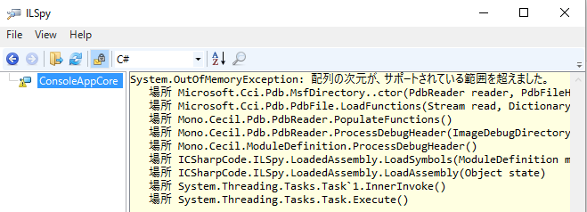

# ピックアップ Roslyn 2/10

Visual Studio 2017 のリリース日、決まったみたいですね。

- [「Visual Studio 2017」のリリースは3月7日](http://forest.watch.impress.co.jp/docs/news/1043543.html)

リリース記念勉強会を開く(リリースされてなかったら「リリース直前勉強会」にする)つもりで3/11(土)に会場を押さえてあるんですが、割かしいいタイミングだったみたいで。
そろそろ1か月前ですし、告知・募集ページを近々作る予定です。

で、Visual Studioがリリースできる段階に来てるということは、C#チーム的にはもう C# 7 向け作業を終えて、その先の作業に入っているような状態。

## proposals

先日の、[ディスカッションの場がメーリングリストになりそうで炎上](../pickuproslyn0203/index.md)って話は、
とりあえず「事前にコミュニティに相談しなかったのは悪かったと思っているので改めて投票の場を作った」って感じで進んでいます。
確か、投票の締め切りが今日。

それはそれとして、[csharplangリポジトリ](https://github.com/dotnet/csharplang)内に、すでに取り組むことが決まっている範囲で、
提案ドキュメントがアップロードされ始めました。

- [Readonly references](https://github.com/dotnet/csharplang/blob/master/proposals/readonly-ref.md)
- [Operators should be exposed for System.IntPtr and System.UIntPtr](https://github.com/dotnet/csharplang/blob/master/proposals/intptr-operators.md)
- [Nullable reference types in C#](https://github.com/dotnet/csharplang/blob/master/proposals/nullable-reference-types.md)
- [records](https://github.com/dotnet/csharplang/blob/master/proposals/records.md)
- [private protected](https://github.com/dotnet/csharplang/blob/master/proposals/private-protected.md)
- [null coalescing assignment](https://github.com/dotnet/csharplang/blob/master/proposals/null-coalecing-assignment.md)
- [null-conditional await](https://github.com/dotnet/csharplang/blob/master/proposals/null-conditional-await.md)
- [improved common type](https://github.com/dotnet/csharplang/blob/master/proposals/improved-common-type.md)
- [expression variables in initializers](https://github.com/dotnet/csharplang/blob/master/proposals/expression-variables-in-initializers.md)
- [pattern matching](https://github.com/dotnet/csharplang/blob/master/proposals/patterns.md)
- [Auto-Implemented Property Field-Targeted Attributes](https://github.com/dotnet/csharplang/blob/master/proposals/auto-prop-field-attrs.md)
- [covariant return types](https://github.com/dotnet/csharplang/blob/master/proposals/covariant-returns.md)
- [default interface methods](https://github.com/dotnet/csharplang/blob/master/proposals/default-interface-methods.md)

とりあえず[Roslyn](https://github.com/dotnet/roslyn)側から持ってきただけという感じで新しい話は特にないんですが。
早々にここに並んだってことで、今ここに並んでいるものは割と実現性の高いものなんじゃないかと思います。

## deterministic ビルドオプション

そういえば、こんな話が。

> [My personal favorite feature of the new dotnet SDK / MSBuild format: deterministic builds on by default.](https://twitter.com/jaredpar/status/829838775308005376)

(C# チームの中の人の発言)

これの詳細:

- [Deterministic builds in Roslyn](http://blog.paranoidcoding.com/2016/04/05/deterministic-builds-in-roslyn.html)

去年の春くらいから、C# コンパイラーには `/deterministic` っていうビルドオプションが実装されています。
これは要するに、同じ入力を与えたら必ず同じ出力になるというもの。決定論的ビルド。
(これまでだと、そこら中にタイムスタンプが入ったり、partial class内のメンバーの順序決定に仕様がなかったりで、
同じ内容のコードをビルドしても毎度exeやdllのバイナリに変化が出ていました。)
決定論的になったことで、ビルド結果のキャッシュが聞きやすくなって、テスト実行とかが大幅に高速になったとか。

で、最近の dotnet SDK を使ってビルドすると、デフォルト動作が `/deterministic` モードになるみたいです。
ちょっと触ってみている感じだと、たぶん、Visual Studio 2017だと、 .NET Standard 向けライブラリ、もしくは、 .NET Core 向けアプリでだけこのモードになるんじゃないかと思われます。

どおりで…
Visual Studio 2017 RCに先月のアップデートをかけて以来、[ILSpy](http://ilspy.net/)で.NET Core/.NET Standardなアセンブリの中身が見れなくなってると思ったら…

ILSpyが`/deterministic`でビルドされたpdbファイルに対応していないみたいです。
ちなみに、読めないのはpdbファイルだけ。
pbdファイルを消してからexe/dllを開きなおせば読めました。
