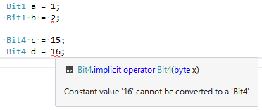
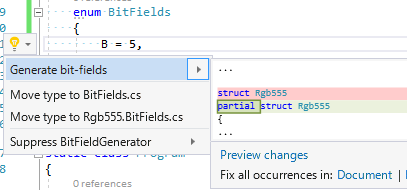

# C# でビットフィールド

[csharplang](https://github.com/dotnet/csharplang/)に、

- [C++のビットフィールドみたいなの、C# にもほしい](https://github.com/dotnet/csharplang/issues/465)
- [(任意のビット数を表す)bit 型が欲しい](https://github.com/dotnet/csharplang/issues/457)

みたいなのが投稿されていまして。

「それ、ライブラリとアナライザー、ちょっとしたソースコード生成でできるよ。」という話。

## BitFields ライブラリ

ということで実装してみたのがこちら。

- [BitFields ライブラリのソースコード](https://github.com/ufcpp/BitFields)
- [利用例(double/floatの内部ビット操作とか、RGB555形式とか)](https://github.com/ufcpp/UfcppSample/blob/master/Demo/2017/BitFieldsSample/Program.cs)
- [他に、昔実際に仕事で書いたビットフィールドの例](https://gist.github.com/ufcpp/f1fd6a5acd7717565e4fddfa9431e9fa)

昔、ビットフィールド的なものを手作業実装してた時に、「これはコード生成でやりたい…」とか思ってて、
できる宛まではついてたんですが。
なんだかんだ言って[アナライザーを書くの](http://www.buildinsider.net/enterprise/roslynextension/03)は結構めんどくさいんで、放置してすでに数年。

まあ、いい機会だから久々に重い腰を上げてアナライザー書いてみるかと思って作ったのが上記の[BitFields](https://github.com/ufcpp/BitFields)です。

## できること

### Nビット整数

Nビットまでの整数を受け付ける`BitN`(`N`は1～64)型と、それに対するアナライザーがあります。

ちゃんと、ビット数を超える値(例えば`Bit1`に2)を代入しようとするとコンパイル エラーになります。

### ビットフィールドコード生成

例えば、[RGB555](http://www.webtech.co.jp/blog/optpix_labs/format/942/)とか、半端なビット数で色情報を扱う形式があります。
32bitカラーが当たり前な今時だと珍しいですけど、昔はこういう形式も割と使われていました。

で、それを、こう書く。

<pre class="source" title="Rgb555構造体定義">
<code><reserved>struct Rgb555
{
    enum BitFields
    {
        B = 5,
        G = 5,
        R = 5,
    }
}
</code></pre>

コード生成都合で、「構造体の中に`BitFields`という名前のenumを定義、値としてビット数を与える」みたいな規約ベースの型情報を書きます。
このenumはあくまでメタデータ(型情報)であって、実行時には一切使いません。

で、以下のように、クイック アクション(電球アイコン)が出るので、生成メニュー(Generate bit-fields)を選択。

以下のようなコードが生成されます。

<pre class="source" title="Rgb555の生成結果">
<code><reserved>using BitFields;

partial struct Rgb555
{
    public ushort Value;

    private const int BShift = 0;
    private const ushort BMask = unchecked((ushort)((1U &lt;&lt; 5) - (1U &lt;&lt; 0)));
    public Bit5 B
    {
        get =&gt; (Bit5)((Value &amp; BMask) &gt;&gt; BShift);
        set =&gt; Value = unchecked((ushort)((Value &amp; ~BMask) | ((((ushort)value) &lt;&lt; BShift) &amp; BMask)));
    }
    private const int GShift = 5;
    private const ushort GMask = unchecked((ushort)((1U &lt;&lt; 10) - (1U &lt;&lt; 5)));
    public Bit5 G
    {
        get =&gt; (Bit5)((Value &amp; GMask) &gt;&gt; GShift);
        set =&gt; Value = unchecked((ushort)((Value &amp; ~GMask) | ((((ushort)value) &lt;&lt; GShift) &amp; GMask)));
    }
    private const int RShift = 10;
    private const ushort RMask = unchecked((ushort)((1U &lt;&lt; 15) - (1U &lt;&lt; 10)));
    public Bit5 R
    {
        get =&gt; (Bit5)((Value &amp; RMask) &gt;&gt; RShift);
        set =&gt; Value = unchecked((ushort)((Value &amp; ~RMask) | ((((ushort)value) &lt;&lt; RShift) &amp; RMask)));
    }
}
</code></pre>

現状だと1度は手作業で「クイック アクションの選択」が必要なので、使い勝手はいまいちなんですが。
そのうち、[正式にコード生成機能がC#に入るはず](https://github.com/dotnet/csharplang/issues/107)で、その暁ににはもう少し利便性がよくなります。

## ライブラリだけでできることはライブラリで

まあ、一般論として、ライブラリだけでできるならライブラリ提供でいいわけで。
ライブラリを作ってみた結果として、本当にライブラリだけだと不便ということになれば、そこで初めて言語文法の提案をすればいい。

実際、ライブラリありきで出ている提案もあったりします。

- [Midori](https://ja.wikipedia.org/wiki/Midori_(%E3%82%AA%E3%83%9A%E3%83%AC%E3%83%BC%E3%83%86%E3%82%A3%E3%83%B3%E3%82%B0%E3%82%B7%E3%82%B9%E3%83%86%E3%83%A0))の成果の1つとして、[Slice.NET](https://github.com/joeduffy/slice.net)ってのが作られる
- Slice.NETを標準ライブラリに取り入れるべく、[corefxlab](https://github.com/dotnet/corefxlab/blob/master/docs/specs/span.md)で検討される
- 現在、実際に[System.Memory](https://github.com/dotnet/corefx/tree/master/src/System.Memory)というパッケージ名で標準ライブラリ化してる
  - [dailyビルドなプレビュー版で良ければ、NuGetパッケージあり](https://dotnet.myget.org/feed/dotnet-core/package/nuget/System.Memory)
  - プレビューが外れるのはたぶん、「[C# 7.2](https://github.com/dotnet/csharplang/milestone/6)」のタイミング
- これが標準ライブラリに入るのであれば、C#としても検討していい文法がある: [slicing](https://github.com/dotnet/csharplang/issues/185)

特に、今回やったビットフィールド生成みたいなものは、ちょっと「コンパイラーの仕事」にするにはいまいちかなぁと思います。

- シフトやマスク演算のコードが見えている方が理解がしやすい
- エンディアンの問題とかあって、汎用化するには怖い
  - 個人でライブラリを作る限りには「ビッグ エンディアン？知らない子ですね。現存するエンディアンじゃないですよ？」とか敵を作りそうな発言もできるものの、標準に取り込む際にそれを言えるかというと無理
- 人によって求めるものが違う
  - immutable版が欲しい
  - `Value`フィールドがpublicなのは嫌
  - コンストラクター、デコンストラクターもほしい
  - `BitN`、コンパイル時チェックだけじゃなくて実行時チェックもほしい(あるいは逆に、そんな実行時コストは絶対避けたい)

しかも今のC#だと、アナライザーを書けば「`Bit1`なら0と1だけ代入で来てほしい。2以上はビット数オーバーでコンパイル時エラー」みたいなこともできます。
ライブラリだけでできちゃうことも増えているので、コンパイラーのバージョンアップとか待ってないでライブラリ作っちゃえば良かったりします。
