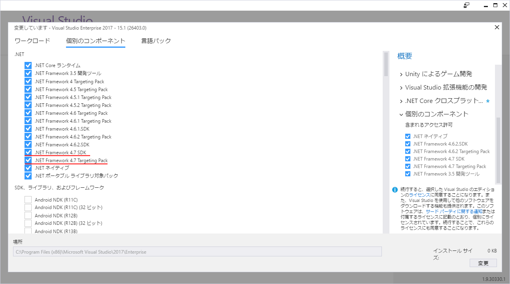

# .NET Framework 4.7

.NET Framework 4.7がリリースされたみたいですね。

- [Announcing the .NET Framework 4.7](https://blogs.msdn.microsoft.com/dotnet/2017/04/05/announcing-the-net-framework-4-7/)

## 更新内容

.NET Framework 自体よりも、ドキュメントとかのシステム更新の方が目立つかも。

- [API ドキュメントが docs に移行](https://docs.microsoft.com/en-us/dotnet/api/)
- [API の更新履歴が GitHub 上に](https://github.com/Microsoft/dotnet/blob/master/releases/net47/dotnet47-api-changes.md)

自分が直接関係しそうなのは、`ValueTuple`構造体の追加くらいかなぁ。

## ValueTuple

[C# 7.0のタプル](../../../../study/csharp/datatype/tuples.md)を使うには、`ValueTuple`構造体が必要なわけですが。

.NET Framework 4.7は、標準で`ValueTuple`構造体を含む初のバージョンになりました。
(.NET Framework 4.7以外では[`System.ValueTuple`パッケージ](https://www.nuget.org/packages/System.ValueTuple/)の参照が必要。)
後述の通り、今日のリリースだとWindows 10にしか.NET Framework 4.7が来ていないので、あまりまだ選べる選択肢ではなさそうな気もします。
まあそれに、PCLとかNetStandardなライブラリ、.NET Coreでもまだ[`System.ValueTuple`パッケージ](https://www.nuget.org/packages/System.ValueTuple/)が必要です。

## Windows 10 Creators Update

というか、単体インストーラーはなくて、Windows 10の[Creators Update](http://internet.watch.impress.co.jp/docs/news/1051787.html)とともにアナウンス。

Visual Studio 2017も同時に更新されましたけども、.NET Framework 4.7をターゲットにするためには、現状だと、

- Windows 自体にCreators Updateを掛ける
- Visual Studio 2017を更新する
- 更新の際に、[変更] → [コンポーネント] → .NET Framework 4.7 SDK、.NET Framework 4.7 Targeting Pack にチェックを入れる

ってやらないとダメみたい。

## リリース順

リリース順、これまでだと、

1. .NET Framework の更新/単体インストーラー配布
1. Visual Studio/C# のリリース = Windows のリリース

みたいな順が多かったんですけどね。今回、

1. Visual Studio/C# のリリース
1. Windows のリリース/.NET Framework の更新
1. .NET Framework 単体インストーラー配布(まだない)

っぽい。
「C# 7.0がリリースされたのに、`ValueTuple`を標準で含んだバージョンの.NET Frameworkはまだ出ないんだ」とか、
これまでのリリース順からすると不思議な感じでしたけども、Windowsのリリース スケジュールのせいでしたか。
(てっきり、.NET Core辺りのリリース遅れが犯人かと思ってました。)

## .NETランタイム更新

.NETランタイムの配布方法を、以下のようにしていきたいのかなぁとか思ったり。

- スマホ: AOT(Ahead of Time: 事前コンパイル)でアプリ単一バイナリにコンパイル
- サーバー: .NET CoreでNuGetベースの更新
- デスクトップ: Windowsの自動アップデートに同梱

C# にもそろそろ、ランタイムへの機能追加が必要な構文を追加したいみたいな動き出てきてますしね。

- [Places where runtime bugs interfere with compiler or language evolution #251](https://github.com/dotnet/csharplang/issues/251)
- [A Tour of Default Interface Methods for C# ("traits") #288](https://github.com/dotnet/csharplang/issues/288)

古いランタイムが残りにくい仕組みにしたがっていそう。
