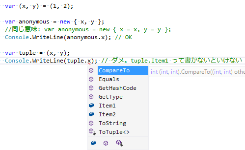

# ピックアップRoslyn 4/16

結構久々のSprint進捗報告。

- [Sprint 116 Summary #18719](https://github.com/dotnet/roslyn/issues/18719)

Visual Studio 2017リリース前後の作業が「バグ修正してた」しかなかったので、割かしほんとに久々。
C# 7.1/7.2作業が始まっています。
いくつか紹介。
(ここに並んでいるのが7.1/7.2に入る全てでもないし、優先度の変更もあり得るものです。あくまで、最近作業したもので、現状の予定としてこのバージョンで出したいというもの。)

## C# 7.1

### default 式

左辺から型推論が効くなら、`default(T)`の`(T)`の部分を省略可能にするという話。

[割と前から](../../../2016/9/pickuproslyn0906/index.md)実装を初めていて、masterにmerge済み。

### async main

やっと、`Main` メソッドを非同期にできるようになるみたい。実装的には、

- `Main`の戻り値に`Task`と`Task<int>`を許す
- その場合、`async`修飾子を付けるの必須
- コード生成で、`Main().GetAwaiter().GetResult()`を呼ぶだけの繋ぎ用メソッドを生成する

という感じみたい。

### Tuple names

タプルでも、匿名型みたいに要素名を自動で付けたいっていう話。
↓みたいに、変数`x`, `y`があるとき、`(x, y)`と書けば、タプル要素名を自動的に`x`にしてほしいという。

## C# 7.2

一部ビルドできるようにして、[CoreFX Labs](https://github.com/dotnet/corefxlab/)で使ってもらい始めたみたい。

確かに、時々、Visual Studio 2017付属の普通のC# 7.0コンパイラーではビルドできないコードがあるんですよねぇ、corefxlab。

### Span Safety

[`System.Memory`](https://dotnet.myget.org/feed/dotnet-core/package/nuget/System.Memory)パッケージ中に入ってる`Span<T>`構造体がらみで、ちょっとコンパイラーによる制限を掛けたいっていう話。

`Span<T>`型は、内部的にスタック上の参照を握っちゃったりするんで、`ref`と同種のコード フロー解析をしないとまずいということみたい。今は妥協的な実装をしているものの、将来的には[`ByReference<T>`型](https://github.com/dotnet/coreclr/blob/d4fd78eb013de26639b3327f45072807858d0dde/src/mscorlib/src/System/ByReference.cs)とかいう、ほんとに「フィールドとして参照を持てる型」を作って使いたいみたいで、そうなると、`Span<T>`に対するフロー解析をちゃんとやらないといよいよまずい。

要するに、

- `ref T`と同種の扱いをしないといけない型を`ref-like`タイプと呼ぶ
- 条件としては、
    - 参照(`ref T`)や、一定範囲のメモリ(`(ref T data, int length)`)を握っている構造体
    - あるいは、それを入れ子で握っている構造体
- 掛かる制限としては、`ref T`と同じく、
    - 普通の型のフィールドにできない
        - `ref-like`型のフィールドにはできる
    - [引数として受け取ったものとか、一部のものしか戻り値として返せない](../../../../study/csharp/resource/sp_ref.md#ref-returns)

という型。

#### 補足: TypedReference

これ、実のところ、現在のC#でも`TypedReference`っていう「`ref T`と同じ扱いしないとまずい型」があったりします。
まあ、[隠し(ドキュメント化されていない)機能](../../../../study/csharp/interop/sp_makeref.md)を使わないと扱えない型なので問題にはなっていませんが。

現状の`TypedReference`は特殊な制約が掛かっていて、やっぱり普通の型のフィールドにできなくなっています。
C# 7.0で参照戻り値が書けるようになったのに対して、`TypedReference`はいまだに戻り値にも使えません。
これも、参照戻り値と同ラインまでは制限を緩めて大丈夫なはずで、`ref-like`型の一例です。

### ref readonly

[2月に紹介した](../../2/pickuproslyn0213/index.md)やつ。C++でいう`const&`。
構造体のコピーを避けるための参照渡しであって、書き換えは認めたくないっていうやつ。
一部、プロトタイプ実装を始めたみたいです。

## その先

ちょうど最近[Build Insiderの記事書きました](http://www.buildinsider.net/column/iwanaga-nobuyuki/013)けども、インターフェイスのデフォルト メソッドの実装作業、もう始まっていたりします。
まあ、それなりに時間が掛かる作業なので、今実装が始まっているって言っても、実際のリリースはだいぶ先。

同様に、非null参照がらみもちらほら作業を進めてるみたいです。
(書かれてる作業内容的には、前々から作業してたやつがしばらく塩漬けで、それを久々にmasterブランチと同期したっぽい？)
