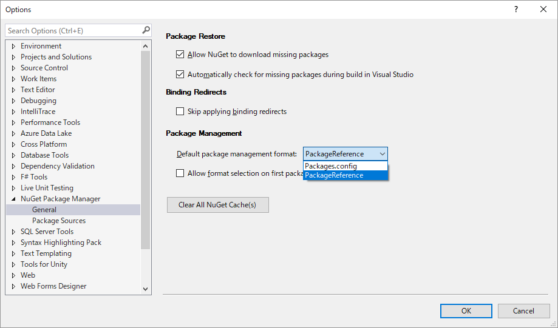

# 新しい csproj 形式

Visual Studio 2017で、csproj 形式が新しくなりました。

背景としては、

- 一時期、脱msbuildをしようとしてた
-脱msbuildのついでに、csprojを辞めて、project.json 形式にプロジェクト設定全部入れようとしてた時期があった
- 結局、msbuildに戻ったけども、既存のcsprojをもっとシンプルにしたいという要件だけが残った

というものです。過渡期に関しては昔書いたブログ参照:

- [.csproj + project.json](../../../2015/12/csprojprojectjson/index.md)
- [「project.json辞めます」の意味](../../../2016/6/project-json/index.md)

最近、やっと新形式のcsprojの扱いに慣れてきたのでブログに書き残しておきます。

サンプル: [https://github.com/ufcpp/UfcppSample/tree/master/Demo/2017/NewCsproj](https://github.com/ufcpp/UfcppSample/tree/master/Demo/2017/NewCsproj)

## 新形式

これまで、Visual StudioでC#プロジェクトを新規作成すると、以下のような感じのcsprojファイルが作られていました。
(この例は、ConsoleAppNet35という名前で、 .NET Framework 3.5 向けのコンソールアプリを作ったものです。)

- [ConsoleAppNet35.csproj](https://github.com/ufcpp/UfcppSample/blob/master/Demo/2017/NewCsproj/OldCsproj/ConsoleAppNet35/ConsoleAppNet35.csproj)

一方で、Visual Studio 2017で、「.NET Standard向けライブラリ」もしくは「.NET Core向けアプリ」を作ると以下のようなcsprojが作られます。

[.NET Standard 1.4向けライブラリの例](https://github.com/ufcpp/UfcppSample/tree/master/Demo/2017/NewCsproj/NewCsproj/ClassLibraryStd14):

```xml
<Project Sdk="Microsoft.NET.Sdk">

  <PropertyGroup>
    <TargetFramework>netstandard1.4</TargetFramework>
  </PropertyGroup>

</Project>
```

[.NET Core 1.1向けコンソール アプリの例](https://github.com/ufcpp/UfcppSample/tree/master/Demo/2017/NewCsproj/NewCsproj/ConsoleAppCore11):

```xml
<Project Sdk="Microsoft.NET.Sdk">

  <PropertyGroup>
    <OutputType>Exe</OutputType>
    <TargetFramework>netcoreapp1.1</TargetFramework>
  </PropertyGroup>

</Project>
```

要するに、「どうせ初期設定のまま大して変更しない設定が多いんだから、全部消す。設定した値だけを入れる」という変更。

`Project`タグに`Sdk="Microsoft.NET.Sdk"`という属性を入れることで、新形式とみなされ、この「要るものだけ残して全部消す」動作が有効になります。

## .NET Standard/Core 以外にも使える

Visual Studio 2017でも、「.NET Framework向けライブラリ」もしくは「.NET Framework向けアプリ」のプロジェクト テンプレートは古いままです。
旧型式のcsprojファイルを生成します。

でも、.NET Framework向けライブラリ/アプリでも、手作業で良ければ新csproj形式を使えます。
必要な作業は、

- .NET Standard向けライブラリか、.NET Core向けライブラリを選んでプロジェクトを新規作成する
- 作られたcsprojファイルを開いて、`TargetFramework`タグの中身を書き換える

これだけです。
.NET Framework 2.0とか3.5とか、古いフレームワークもちゃんとターゲットにできます。
また、旧型式のcsprojから、新形式のcsprojも「プロジェクト参照」できます。

この仕組みで作ったサンプル プロジェクトが以下の通り。

- [.NET 3.5向けライブラリ](https://github.com/ufcpp/UfcppSample/tree/master/Demo/2017/NewCsproj/NewCsproj/ClassLibraryNet35)
- [.NET 3.5向けコンソール アプリ](https://github.com/ufcpp/UfcppSample/tree/master/Demo/2017/NewCsproj/NewCsproj/ConsoleAppNet35)

## 複数ターゲット

新形式のcsprojでは、ターゲット フレームワークを複数指定できます。

- `TargetFramework`タグを消して、`TargetFrameworks`(複数形)に置き換えます。
- ターゲットを `;` で区切って複数並べます。

例えば、[以下のような感じ](https://github.com/ufcpp/UfcppSample/tree/master/Demo/2017/NewCsproj/NewCsproj/ClassLibraryMultiTarget)。

```xml
<Project Sdk="Microsoft.NET.Sdk">

  <PropertyGroup>
    <TargetFrameworks>net35;netstandard1.0</TargetFrameworks>
  </PropertyGroup>

</Project>
```

この状態で、自動的に`NET35`、`NETSTANDARD1_0`みたいなシンボルが`#define`された状態になるので、
C#コードも以下のような条件コンパイルができます。

```csharp
    public class Class1
    {
#if NET35
        public static string Name => ".NET Framework 3.5";
#elif NETSTANDARD1_0
        public static string Name => ".NET Standard 1.0";
#endif
    }
```

## 新形式でだけ有効になる Visual Studio 2017 新機能

msbuild/Visual Studioは、ビルドがらみのいくつかの新機能のオン/オフ切り替えを、ファイル形式を見て分岐しています。

機能としては実装されているものの、下手に既存のプロジェクトに新機能を適用すると互換性を壊しかねないので、新しいプロジェクトにだけ適用したいという意図です。

確かに既存プロジェクトの挙動が変わると迷惑なので仕方がないんですが、
待望の新機能を使うためにはプロジェクトの移行作業が必要になるので面倒ではあります…

csprojでも、新形式でだけ働きだす機能がいくつかあります。

### ワイルドカード

ソースコードのバージョン管理をしていて、
C#ファイルを追加するたびにcsprojが衝突してうっとおしいという経験をした方は多いと思います。
ソースコード1つ1つに対して、以下のようなタグが書き出されるせいです。

```xml
  <ItemGroup>
    <Compile Include="Class1.cs" />
    <Compile Include="Properties\AssemblyInfo.cs" />
  </ItemGroup>
```

これに対して、Visual Studio 2017では、ワイルドカード指定ができるようになっています。
以下のように、`**/*.cs`でソースコード指定すれば、フォルダー下のすべてのC#ファイルがコンパイルの対象になります。

```xml
  <ItemGroup>
    <Compile Include="**/*.cs" />
  </ItemGroup>
```

これは、実のところ、Visual Studio 2017を使えば旧形式csprojでも使えはするんですが…

- もちろん手書きで csproj ファイルを書き換えないと、Visual Studioはワイルドカードを書き込んでくれない
- それどころか、その後、Visual Studio上でC#ファイルの追加をしてしまうと、ファイル名指定の`Compile`タグが追加される
- `**/*.cs`指定のタグがある状況下で、上記操作でファイル名指定のタグが出来てしまうと「ファイルが2重に読み込まれています」警告が出まくる

という状態になります。

一方で、新形式csprojでは、何も書かなくてもデフォルトで`<Compile Include="**/*.cs" />`が入っているという扱いを受けます。

### 推移的パッケージ参照

NuGetパッケージの「依存先の依存先」を遷移的に(transitive)解決してくれます。

これは、Visual Studio 2017での初出の機能ではなく、2015の頃からのものですが、
csproj形式の新旧によってNuGetパッケージ参照の仕方が変わります。

昔、「[.csproj + project.json](../../../2015/12/csprojprojectjson/index.md)」で書きましたが、「NuGet 3」移行の機能です。

NuGetパッケージの依存管理を packages.config でやっていると古い挙動になります。
一方で、Visual Studio 2015, 2017では、以下の方法で依存管理出来て、この場合は新しい挙動になります

- (Visual Studio 2015の頃) project.json を使う
- (Visual Studio 2017) PackageReference を使う

PackageReference は、新形式csprojを使うのであれば無条件にこの形式が使われます。
旧csprojの場合でも、以下のオプションを設定することでこちらを使うことができます。



挙動の違いは以下のようなものです。

- 古い挙動: 依存先が芋づる式に全部 packages.config に書き出される
- 新しい挙動: 直接参照したパッケージだけが書き出される

### 推移的プロジェクト参照

Visual Studio 2017では、プロジェクト参照でも「依存先の依存先」を遷移的に(transitive)解決してくれます。

これは、新形式csprojを使っている場合にだけ有効です。
注意点として、依存階層全部が新形式csprojでないと、この仕組みが正しく動作しません。
新形式csprojからであっても、依存先が旧型式だった場合、「依存先の依存先」を全部律儀にプロジェクト参照していく必要があります。

### 決定論的ビルド/Portable PDB

新形式csprojを使うと、どうも、アセンブリ(exeやdll)やPDB(デバッグ情報ファイル)の形式がちょっと変化するみたいです。

C#コンパイラーが割かし最近実装した2つの機能があります。

- 決定論的ビルド
  - ドキュメント: [Deterministic Inputs](https://github.com/dotnet/roslyn/blob/master/docs/compilers/Deterministic%20Inputs.md)
  - コンパイラーに `/deterministic` オプションを付けると有効になる
  - 入力が同じなら、バイナリレベルで完全に同じ出力が常に得られるという機能
  - ビルド結果のキャッシュが効きやすくなって、テスト実行とかが大幅に速くなる
- Portable PDB
  - ドキュメント: [Portable PDB v1.0: Format Specification](https://github.com/dotnet/corefx/blob/master/src/System.Reflection.Metadata/specs/PortablePdb-Metadata.md)
  - `/debug:portable`オプションを付けるとこの形式でPDBを出力する
  - 仕様がオープンになっていなくて実質的にWindows専用だったPDB形式を、クロスプラットフォーム向けに一新した

で、新形式csprojを使うと、デフォルトでこれらのオプションが使われるようになります。

出力されるexe, dll, pdbのファイル形式が変わるので、当然、古いアプリを使っている場合に問題を起こす場合があります。
例えば、[ILSpy](http://ilspy.net/)で逆コンパイルできなくなったりします
(まあ、[dnSpy](https://github.com/0xd4d/dnSpy)なら読めるんで、移行してしまえばいいんですが)。

これで困った場合は、以下のように`DebugType`タグ設定を入れて、旧PDBを出力するようにすれば解決します。

```xml
<Project Sdk="Microsoft.NET.Sdk">

  <PropertyGroup>
    <TargetFramework>net35</TargetFramework>
    <DebugType Condition="'$(Configuration)'=='DEBUG'">full</DebugType>
  </PropertyGroup>

</Project>
```

## 共有プロジェクト的なこと

共有プロジェクト(shproj)は、要するに、1つのファイルを複数のプロジェクトから参照して使う仕組みです。

shprojを新形式に変換(前節で説明したような新機能への対応)するのは結局できませんでした。

が、まあ、かつて共有プロジェクトでやっていたようなことは、新形式csprojなら別にSharedプロジェクトなしでできます。
要するに、共有したいC#ファイルが入っているフォルダーをワイルドカードで指定してやるだけ。

以下のような`Compile`タグを書けば、「1段上のフォルダーの、別プロジェクトのフォルダー以下のすべてのC#ファイルをコンパイルの対象にする」ということができます。

```xml
<Project Sdk="Microsoft.NET.Sdk">

  <PropertyGroup>
    <TargetFramework>netstandard1.4</TargetFramework>
  </PropertyGroup>

  <ItemGroup>
    <Compile Include="..\ClassLibraryNet35\**\*.cs" Exclude="..\ClassLibraryNet35\obj\**\*.cs" />
  </ItemGroup>

</Project>
```

## WPF/UWP

まあ、「.NET Standard向け」もしくは「.NET Core向け」だけテンプレートだけが新形式csprojになっていることからお察しの通り、
`OutputType`が`Library`か`Exe`でないとちょっと苦労します。

WPFやWindows Formsのアプリは`WinExe`、UWPは`AppContainerExe`なんですが、この辺りのプロジェクトはデバッグ実行できなくなります。

ちなみに、WPFでビルドするところまではできることを確認済み。
以下のような設定が、WPFアプリをビルドするのに必要な最低限のものです。
(ビルドはできるんですが、デバッグ実行しようとすると「Unable to run your project」というエラーが出ます。)

```xml
<Project Sdk="Microsoft.NET.Sdk">

  <PropertyGroup>
    <OutputType>WinExe</OutputType>
    <TargetFramework>net47</TargetFramework>
    <LanguageTargets>$(MSBuildExtensionsPath)\$(VisualStudioVersion)\Bin\Microsoft.CSharp.targets</LanguageTargets>
  </PropertyGroup>

  <ItemGroup>
    <ApplicationDefinition Include="App.xaml" SubType="Designer" Generator="MSBuild:Compile" />
    <Page Include="**\*.xaml" Exclude="App.xaml" SubType="Designer" Generator="MSBuild:Compile" />
    <Compile Update="**\*.xaml.cs" SubType="Designer" DependentUpon="%(Filename)" />
  </ItemGroup>

  <ItemGroup>
    <Reference Include="System.Xaml" />
    <Reference Include="PresentationCore" />
    <Reference Include="PresentationFramework" />
    <Reference Include="WindowsBase" />
  </ItemGroup>

</Project>
```

実行できないのでアプリのプロジェクトに使うには苦しいんですが、例えば、「WPF向けコントロールやリソース ディクショナリ(XAML)を含むライブラリ」を作りたい場合であれば、新形式csprojを十分実用できます。
