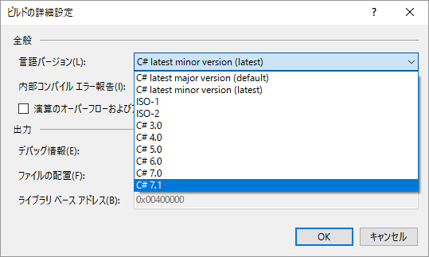
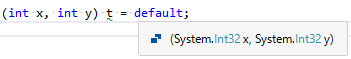
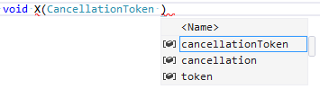
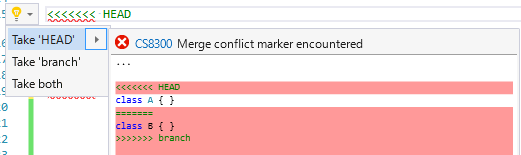
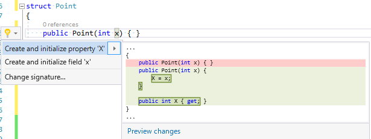

# Visual Studio 2017 Update 3 (15.3) Preview

[Build 2017](https://channel9.msdn.com/Events/Build/2017/)で、Visual Studio 2017 Update 3の Preview 版が公開されました。
(ちなみに、Preview のつかない安定板 Visual Studio とは side by side の別フォルダーへのインストールになります。)

当初、.NET Core 2.0/.NET Standard 2.0 Preview がらみの更新かと思ったら、案外C#がらみも更新かかっていたことに今更気づいたり。
「[The future of C#](https://channel9.msdn.com/Events/Build/2017/B8104)」とか「[The future of Visual Studio](https://channel9.msdn.com/Events/Build/2017/B8083)」とかを見ていると、「C# 7.1」の文字が。

確かに、今見てみたら「C# 7.1」を使えるオプションがありました。



## 現時点で実装されている C# 7.1 機能

資料を見てると、以下の2つがリストに並んではいるんですが。

- [default expressions](https://github.com/dotnet/csharplang/issues/102)
- [async main](https://github.com/dotnet/csharplang/issues/97)

試してみてる感じ、default expressions の方しか動いてなさげ。

### default 式 (default expressions)

`default(T)`と書かなくても、左辺から型推論できる限りには`default`だけで既定値を与えられるという機能。
ちゃんと型推論なので、以下のように、マウス オーバーで型が出たりします。



名前が長い型のデフォルト引数とか作る場合にありがたそう。

```csharp
void X(
    (int x, int y) t = default,
    KeyValuePair<string, int?> p = default,
    CancellationToken ct = default)
{
    ...
}
```

### async Mainメソッド

`Main`メソッドの戻り値が、`Task`、`Task<int>`でもよくなったという話。
もちろん、`await` を使うための仕様。

なんですが、なんか現状の Update 3 Preview (15.3 26510.0-Preview)ではダメでした。
普通に「`Main`のシグネチャが不正」って言ってコンパイル エラーになりました。

何か他に条件いるのか、次の更新で来るのか…

## その他、新しい IDE 機能

なんか、いくつか便利そうなQuick Actionが追加されてました。

### 引数生成

メソッドの引数を書くとき、型名まで打てば、それと同名の引数を作ってくれるCode-Fixが入ったみたいです。

確かに、型名と引数名が一致すること多いですもんね。



今、仕事で書いてるライブラリ、大体`CancellationToken`な引数の名前が`ct`だわ…
こういう略語はあんまりよくないと思いつつ、cancellationTokenって文字列が長すぎて心折れてて。
この機能を紹介するデモでまさに`CancellationToken`を使っていて、みんな考えることは同じなのかとか思いました。

### git 衝突解決

git の衝突解決するためのQuick Actionが入ってました。

確かに、`git gui`とかで衝突の解決しようとすると、「どっちがremoteだっけ… この操作であってるかな…」とか常に間違い、
結局 Visual Studio 上で手作業解決してたりしますし。

例えば、こんな衝突したとして。

```csharp
<<<<<<< HEAD
class A { }
=======
class B { }
>>>>>>> branch
```

なるほど、こういうQuick Action出れば間違えないわ。



### コンストラクター引数からのプロパティ生成

コンストラクターだけ書けば、対応するプロパティと、プロパティへの代入を生成してくれます。



[RecordConstructorGenerator](https://www.nuget.org/packages/RecordConstructorGenerator/)もやっと退役かなぁ。
