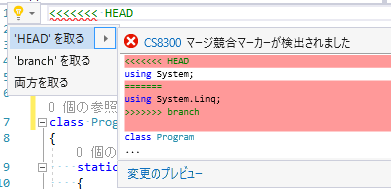

# Visual Studio 2017 Update 3正式リリース

[Visual Studio 2017 Update 3の正式リリース](https://blogs.msdn.microsoft.com/visualstudio/2017/08/14/visual-studio-2017-version-15-3-released/)が来てるみたいですね。
普通にVisual Studio 2017上の「通知」や「拡張機能と更新」辺りからや、Visual Studio Installerから更新できます。

先週くらいから、中の人のブログとかtwitter周りで「リリース近い」的な言葉がちらほら出てきてた中、
一昨日、[Preview 7.1](https://twitter.com/ufcpp/status/896725639494901762)とか出されたときにはちょっとひやひやしましたが
(細かいリリース挟まないといけないような緊急のバグでも見つけてしまったの？と)。

なんかしかし、最近アップデートのたびに言ってますけども、2017 Update 3 Preview 7.1とか、某[ZERO3↑↑](https://www.amazon.co.jp/dp/B000BYUIPC)とか[ハイパーIIアニバーサリースペシャル](https://www.amazon.co.jp/dp/B0000E5SEP/)とかが可愛く見えるバージョン名はどうにかならないですかね…

## いろいろ正式リリース

Visual Studio に伴って、

- C# 7.1
- [.NET Core 2.0](https://blogs.msdn.microsoft.com/dotnet/2017/08/14/announcing-net-core-2-0/)
- [.NET Standard 2.0](https://blogs.msdn.microsoft.com/dotnet/2017/08/14/announcing-net-standard-2-0/)
- [ASP.NET Core 2.0](https://blogs.msdn.microsoft.com/webdev/2017/08/14/announcing-asp-net-core-2-0/)
- [Entity Framework Core 2.0](https://blogs.msdn.microsoft.com/dotnet/2017/08/14/announcing-entity-framework-core-2-0/)

とかも正式リリースみたいです。

あと、Visual Studio for Mac version 7.1も同時に利用可能とのこと。

C# 7.1の機能自体は、[6月のPreview 2の時点](../../6/vs2017u3p2/index.md)でfixしてたみたいで、その後全く変わっていません。
うちの「[C# によるプログラミング入門](../../../../study/csharp/index.md)」的にはだいぶ前から[対応済み](../../../../study/csharp/cheatsheet/ap_ver7_1.md)。
これくらい機能のふらつきが少ないと、記事書き的にはものっっすごい楽です。

### C# 7.1を使う設定(プロパティ→ビルド→ビルドの詳細設定)

ただ、デフォルトで使われるC#のバージョンはC# 7.0で、7.1を使うには設定が必要みたいです。
この辺り、[Previewの頃](../../5/vs15_3preview/index.md)のまま。

プロジェクトのプロパティを開いて、ビルド→ビルドの詳細設定で変更可能。

- 既定(default) オプションだと「最新のメジャー バージョン」= C# 7.0
- 最新(latest)オプションだと「最新のマイナー バージョン」 = C# 7.1

になるみたいです。csproj に以下の行を無差別に追加してしまいたい。

```xml
  <PropertyGroup>
    <LangVersion>latest</LangVersion>
  </PropertyGroup>
```

## .NET IDE の機能強化

今回、C# エディター上でのクイック アクションの類が結構いい感じに強化されてるんですが。
リリースノート上は

- Resolve merge conflicts
- Add null checks
- Add parameter

くらいしか書かれてないんですよね…
他は「many more」扱い。

追記: [https://docs.microsoft.com/ja-jp/visualstudio/ide/quick-actions](https://docs.microsoft.com/ja-jp/visualstudio/ide/quick-actions)この辺りにある程度は一覧があるっぽい。ただ、全部ではなさそうだし、Update 3での差分はわからなさそう。

個人的には他のクイック アクションの方がよく使ってるんで、ちょっとちゃんと調べて改めてまとめた方がいいかも。
(最近、C# の新機能以外は大体スルーしてたけど、久々に、IDE周りも真面目に。)

## リリース ノート

そういえば、リリース ノートがちゃんと日本語でも即日来てますね。

- [https://www.visualstudio.com/ja-jp/news/releasenotes/vs2017-relnotes](https://www.visualstudio.com/ja-jp/news/releasenotes/vs2017-relnotes)

最近、ドキュメントのページはあんまり翻訳を期待してなかったんですが、さすがに正式リリースくらいはちゃんとしますか…

それも割かし、機械翻訳っぽくないちゃんとした文面。

「Resolve merge conflicts」が「結合の競合の解決」になってたりとか、人手による翻訳でもやらかしそうなやつはきっちりやらかしてますが。
(ちなみに、Visual Studio上ではちゃんと「マージ競合」って翻訳されてました。↓みたいな機能。)


