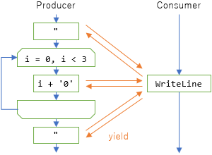

# await って言う単語

C# 5.0で[非同期メソッド](../../../../study/csharp/cheatsheet/ap_ver5.md#async)が導入されてから、
正式リリースを基準にしても5年以上、
最初の発表からだと7年以上経っています。

で、5年経っても、「なんて読むの」「asyncのaとawaitのaは違う」などなどが「定番ネタ」として定期的に出てくるわけですが。
特に、[ECMAScript 2017](https://developer.mozilla.org/ja/docs/Web/JavaScript/Reference/Operators/await)がasync/awaitを導入したり、
[Unity 2017](https://blogs.unity3d.com/jp/2017/07/11/introducing-unity-2017/)がやっとC#のバージョンを6.0に上げれる感じになってきたり、
5年の断絶を経て去年からasync/awaitに触れる人が増えているようです。

5年も離れたら、世代断絶も起こりますよね…
そりゃ、「定番ネタ」が改めて増えもしますよね…

ということで、5年くらい前に同じようなことをどこかで書いてるはずなんですけど、改めて。

## 英単語

### えいしんく

まず読み方。

- async: エイシンク
- await : アウェイト

ってやつ。async の方が「アシンク」と読まれがち。
ごくまれに await の方を「エイウェイト」って間違う人もいるみたいですけども…

なんていうか、接頭辞の a を「エイ」って読む英単語は珍しいんでよく間違われます。
普通、aをエイと読むのはアクセントのあるところだけなわけですけども、asynchronous のアクセントは syn のところ。
英語のアクセントって「接頭辞を除いて一番前」なことが多く、接頭辞である a にはアクセントが来ない。

これ、たぶん、冠詞の a との弁別のためにこうなっちゃったのかなぁという感じはあります。
a synchronous ~ と、asynchronicity で a の発音同じだと困るだろうと。
日本語で言うと工学と光学、市立と私立みたいなもので。
「ひかりがく」「いちりつ」「わたくしりつ」とか、読み方としてはきもいけど弁別のためにはこう読まざるを得ないことがあるというような類です。

逆にいうと、冠詞を必要としていない日本語にカタカナ語として輸入するなら「アシンク」でも何も問題はなかったりはしますが…
元々がギリシャ語の ασύγχρονη なのでこれの読みだとアシーンクロニーですし。

ちなみに、後述するように async の a と await の a は別由来の別接頭辞なんですけども、
由来が違うから読み方が違うわけじゃないです。
async と同系統の a だと、例えば atom とかがそうですけども、これは英語でもアトムですし。

## a- 接頭辞

asynchronous も await も、a + synchronous、a + wait という形の単語なわけですが…

- a + sync: a(否定) sync(同時)
- a + wait: a(向かう) wait(待つ)

になります。

async はギリシャ語系で、a は否定接頭辞。同じような構成の単語だと、

- atom: a(否定) tom(切る) → 「切れない」 → 原子
- atopy: a(否定) topy(場所、由来) → 「由来がない」 → 特定されていない、奇妙な

とかがあります。
ギリシャ語だから変。英語化するときに un とかに振り替えとけよ…という感じ。

await の方は、古フランス語(フランク語)の agaiter が由来でそれの a はラテン語の ad- 接頭辞から来てるっぽく、
現代英語だと to (~へ向かう)的な意味っぽい。
近いのはたぶん、

- amaze: a(向かう) maze(迷路、当惑) → 驚く

とか。
類似の ad- まで広げると、

- adjust: ad(向かう) just(ちょうど) → 「ちょうどよくする」 → 調整する
- adventure: ad(向かう) venture(投機、大胆) → 「大胆に向かう」 → 冒険

とか。

同じスペルで全然意味が違うわけですが…
a- 接頭辞は特にひどいみたいでして、まとめると以下のようなものがあるっぽいです。

- ギリシャ語の a- 由来 → not。否定
- ラテン語の ab- 由来 → from, out。「~から離れる」
- ラテン語の ad- 由来 → to。「~に向かう」
- フランス語の à 由来 → さらにたどるとラテン語の ad- 由来。on とか at 的な意味も
- 古英語の ar-, or- 由来 → on, up

由来違いが混ざったのと、
本来あった差が消失しているせいでひどいみたいです。

日本語で言うと、
不遍・普遍、不通・普通とか、
読む/呼ぶ → 読んだ/呼んだ みたいな感じですかね。
不と普は元の中国語だと区別がつくはずが、日本語は発音が少ないので区別できなくなり。
む・ぶは古代日本語だと区別していたはずが、音便変化で同じになってしまったり。

### wait と await

wait 自体に動詞用法がある現在、別途 await があるのはちょっと奇妙なものの、
フランク語の時点で gaiter と agaiter 両方あるみたいです。

await の方は古英語っぽく感じるらしく、古臭い・フォーマルな印象になるそうです。
まあこの辺り、「待つ」って大和言葉があるのに「待機」って漢語由来の単語があって、
待機の方がフォーマルな印象になるのと同じ。

a- (向かう)が付くことでニュアンスも変わるらしく、類語辞書を引くと、

- wait → interval, downtime, halt, hold
- await → anticipate, hope, ready for, look for

とかが並んでいます。要するに、

- wait → 待機。止まって待つ(他の事せず待ってる印象あり)
- await → 待望。気持ち的には待ってる(他のことをしてる印象あり)

という区別になります。

あと、「await は wait 単体じゃなくて、wait for と類語」とか言われたりします。
「A wait B」だと「A が B を待たせる」的な感じで、「A await B」「A wait for B」だと「AがBの到来を待つ」。

### Q. これだから英語は

A. 「不遍・普遍」「市立・私立」「読んだ・呼んだ」で困ったことのない人だけが石を投げなさい。

「これだから自然言語は」という感じはするので、みんな形式言語で会話すればいいんじゃないでしょうか。

### async + wait?

で、なんか、「[await って、もしかして asynchronously wait の略で await なの？](https://github.com/dotnet/csharplang/issues/1237)」とかいう都市伝説が発生しているらしく…

ちなみに、質問に関する回答は「it's [serendipity](https://ja.wikipedia.org/wiki/%E3%82%BB%E3%83%AC%E3%83%B3%E3%83%87%E3%82%A3%E3%83%94%E3%83%86%E3%82%A3)」。

どうも、C# の仕様書に「await: asynchronously wait for the tasks completion」と書かれているからというのが理由みたいなんですけども。
言われてみれば、非ネイティブにはつらい文面。

英語の、前置詞によってニュアンスが変わるのは本当に難しい…
とはいえ、接頭辞のカオスっぷりに比べると幾分かマシなので、
時代とともに「基本的な動詞 + 副詞/前置詞」で表現の幅を増やす用法が増えているという話もあります。

## C# が await キーワードを採用

C# が非同期メソッドを導入する際には、文法をどうするか、特に await に相当する単語をどうするかはかなり悩んだみたいです。

Eric Lippert (当時の中の人)のブログ:

- [Asynchronous Programming in C# 5.0 part two: Whence await?](https://blogs.msdn.microsoft.com/ericlippert/2010/10/29/asynchronous-programming-in-c-5-0-part-two-whence-await/)

### yield 案

元々、2010年のPDCでの最初の発表の時点では yield でした。

<pre class="source" title="初出の時の非同期メソッド">
<code>Task M()
{
    yield Task.Delay(1);
    var text = yield File.ReadAllTextAsync("a.txt");
}
</code></pre>

yield と言えば、C# だと[イテレーター構文](../../../../study/csharp/data/sp2_iterator.md)があります。

<pre class="source" title="イテレーター構文">
<code>IEnumerable&lt;char&gt; Producer()
{
    yield return '"';
    for (int i = 0; i &lt; 3; i++)
    {
        yield return (char)(i + '0');
    }
    yield return '"';
}

void Consumer()
{
    foreach (var c in Producer())
    {
        Console.WriteLine(c);
    }
}
</code></pre>

これで以下のような感じの挙動になります。

Producer 側で値を1つ作るたびに、その値を Consumer 側に渡すような動作。

yield は yield で日本人には何か難しい単語で、以下のような意味があります。

- (車線などを)譲る・明け渡す・降伏する
- 産み出す・収穫/利益が出る

語源的には「支払う」という意味らしく、後者の意味も「大地から恵みを支払ってもらう」「農作業の結果の支払いを受ける」みたいな感じでしょうか。

それか、win が「勝つ」の意味と「獲得する」の意味があるのと同じような感じですかね。
何かを得るために戦う。なので戦いに勝ったら何かもらえるのは当然、みたいな感じで。
「譲る」と言うからには「産出」を伴うのが当然というか。
略奪文化怖い…

で、「A yield B to C」と書くと、「A は B を(産み出して) C に譲る」になるみたいです。

イテレーターの yield return だと、「制御/スレッド/CPU の利用権を他のメソッドに譲る」みたいな感じで yield という単語が使われます。
でも、「A yield B to C」の用法があるので、
Producer yield return values of ", 0, 1, 2, " to Consumerで
「Producer が戻り値 ", 0, 1, 2, " を産み出して、Consumer に譲り渡す」みたいなニュアンスもたぶんあります。

さて、非同期メソッドの「yield 案」に話を戻しますが、
「制御/スレッド リソース/CPU の利用権を他のメソッドに譲る」という意味では、
非同期メソッドがやっていることはまさにこれです。
実のところ、イテレーターと非同期メソッドは、動作原理/C# コンパイラーのコード生成的な所は全く同じものです。
イテレーターの、非同期処理への応用結果が非同期メソッド。

しかしここで問題になるのが、「何かを産み出しつつ譲る」というニュアンスの方。
`await Task.Delay(1)`で、Producer は Consumer に `Task` を支払っているのかというと、そんなことはなく。
イテレーターの場合には譲り渡す相手が明確にいましたが、
非同期メソッドの場合は「スレッド リソースをOSに返還する」みたいな見えない部分での譲渡になるのがわかりにくいです。

それでも、イテレーターよりも先に非同期メソッドがあったのなら、もしかしたら yield 採用の芽もあったかもしれません。
とはいえ、似て非なるものに同じキーワードを使うのも怖いですし。
将来的には「[非同期ストリーム](https://github.com/dotnet/csharplang/issues/43)」という、非同期メソッドとイテレーターを混ぜれる機能も入る予定なので、混ざる前提でキーワードを決める必要があります。

上記ブログには「yield return との区別が必要なら、yield with, yield for, yield while, yield until はどうか？」というコメントも結構多いくらいです。
ただ、ECMAScript 2017とかではむしろ、単に `yield` で generator (C# のイテレーター相当の機能)を表すことになっていますし、
yield return みたいな複合キーワード(2単語で初めてキーワード扱い)は総じて受けが悪いです。

### 他の案

他だと、Eric Lippert の挙げているのが

- wait for
- while away
- hearken unto
- for sooth Romeo wherefore art thou

コメントに挙がってるのが

- after
- continue with, continue after

とか。

wait for は、それとほぼ同義を1単語で表す await があるわけで。

while とか continue は[ループで使うやつ](../../../../study/csharp/structured/st_loop.md)と被るから駄目でしょうね。

after はどうだったんだろう。そもそも候補に挙げている人も少ないので、あんまりしっくりこないのかも。

hearken とか、wherefore art thou とかは完全にネタです。
await 自体が「古めかしい印象」の単語なので、
もっと古典な hearken unto (listen to) とか wherefore art thou (why are you: ロミオとジュリエットの「どうしてあなたは」)とかをシャレで挙げています。
まあ、「await は気持ち悪い？俺もそう思う。けど難しかったんだ」くらいの主張だと思われます。

### await 案

ということで、最終的には await になりました。
前述の通り、await には「待望」(待ちつつも他の事やってる感じ)のニュアンスがちょっとあります。

<pre class="source" title="wait と await">
<code>async Task M()
{
    // wait = 待機
    // 止まって待つ
    // Thread.Sleep してるのと同じで、スレッド リソースを確保したままスレッドが止まる
    Task.Delay(1).Wait();

    // await = 待望
    // 気持ち待ってるけど作業は止めない
    // スレッド リソースを明け渡すので、OS はそのリソースを他に使える
    await Task.Delay(1);
}
</code></pre>

とはいえ、await も割かしぎりぎり採用された感じです。
「なんか wait の古めかしい言い方」、「wait forと同じ意味」くらいにも思われる単語ですんで。
wait と await で内部的に起きる現象が違うというのはだいぶ危うい感じ。

とはいえ、メソッド `M` にとっては `Task` はやっぱり「完了を待ちたいもの」になります。
「待ちたいんだけど単純に待機しちゃダメ」と言うのが非同期メソッドの難しいところなので…

結局、去年リリースされた [ECMAScript のやつ](https://developer.mozilla.org/ja/docs/Web/JavaScript/Reference/Operators/await)も await になりましたし、
[C++ に出てる提案](http://www.open-std.org/jtc1/sc22/wg21/docs/papers/2013/n3722.pdf)が await なのは提案者が Microsoft なので当然として、
[Python](https://www.python.org/dev/peps/pep-0492/) とか [Swift](https://gist.github.com/lattner/31ed37682ef1576b16bca1432ea9f782) で出ている提案も await を使う雰囲気になっていますし、
「わざわざ変えなきゃいけないほどは悪くない」程度には受け入れられている感じはします。
