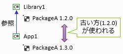

# Directory.Build.*

なんか、Gist に書き捨ててそのまま放置なものが結構増えてきたので、
しばらくそれを元にブログに起こしていこうかという気分に。

ここ2年くらい、.NET Core や C# のテーマの1つがパフォーマンス改善だったせいもあって、だいぶ Unsafe でだいぶきわどい最適化の話が多めになるとは思います…

(ちなみに、今日のは全然その系統ではなく、きわどさもない話。)

## Directory.Build.*

Visual Studio 2017 の頃から、所定のフォルダー以下にあるすべての `csproj` に対して掛かる共通設定を記述できるようになりました。以下の名前のファイルを置くことで、その内容が自動的に`csproj`にインポートされます。
(`dotnet`コマンドでのビルドにも有効です。)

- `Directory.Build.props` … `csproj`の先頭にインポートされる
- `Directory.Build.targets` … `csproj` の末尾(NuGetパッケージに含まれている targets ファイルよりも後)にインポートされる

そういえばあんまり紹介していなかったで、今日はこれの話でも。

## 全フォルダーに影響

このファイルを置くと、本当にありとあらゆる`csproj`に影響を及ぼします。
ビルド エラーを起こすようなミスを書いてしまうと、全プロジェクトがきっちり全滅します。
(そういうヤバさもあるので、これまでこの手の一括設定系の機能はあんまり提供されてこなかったんですけども。ここ数年、Visual Studio チームもだいぶ軟化しています。)

そんな、「全てに一律にかかってほしい設定」ってのがどれくらいあるかという話ではあります。

### Deterministic

公式ドキュメントでは、「Deterministic オプション」を例に挙げています。

<pre class="xsource" title="Deterministic">
<code>&lt;Project&gt;
  &lt;PropertyGroup&gt;
    &lt;Deterministic&gt;true&lt;/Deterministic&gt;
  &lt;/PropertyGroup&gt;
&lt;/Project&gt;
</code></pre>

これも Visual Studio 2017 (C# 7.0) の辺りで入った C# コンパイラーの機能なんですが、ソースコードを変更しない限り生成される DLL/EXE が常に同じバイナリになるというオプションです。

当たり前っぽく聞こえる話ですが、これまで、タイムスタンプが含まれてしまったり、
[partial 定義](../../../../study/csharp/oop/oo_class.md#partial)している型を並列処理したとき順序保証が緩かったりで、ビルドのたびに生成物が変化していました。
そのせいで、CI ツールの類で毎度処理が走ってしまい、CI が当たり前な今の時代、だいぶ負担になっていたみたいです。

ただ、いきなり挙動を変えてしまうと既存の CI を壊す可能性があったので、オプションで切り替え可能に作ってあります。
今は、 .NET Core なプロジェクトであれば既定で Deterministic オプションが true になりますが、.NET Framework なプロジェクトの場合は既定が false だそうです。レガシーな .NET Framework は既定動作を変えなかったという話です。

ということで、.NET Framework でも常に true にしたいときに使うのが上記の設定。

### LangVersion latest

僕が常用しているのはこれ。「LangVersion オプション」を常に latest に。

<pre class="xsource" title="LangVersion">
<code>&lt;Project&gt;
 &lt;PropertyGroup&gt;
   &lt;LangVersion&gt;latest&lt;/LangVersion&gt;
 &lt;/PropertyGroup&gt;
&lt;/Project&gt;
</code></pre>

C# 7.0 以降、7.1、7.2、7.3 と、マイナー アップデートをしてきました。
細かく頻繁なリリースなので追いかけれない人というのを懸念してか、

- default … 最新のメジャー バージョンを使う(今だと、C# 7.0)
- latest … 最新のマイナー バージョンを使う(今だと、C# 7.3)

というような設定になります。
名前通り、規定値は default。つまり、何もしないと C# 7.0 までしか使えない。

うるせー、俺は常に最新の C# しか使わん。
と言う人にお勧めなのが、`Directory.Build.props` に`<LangVersion>latest</LangVersion>`オプションを入れてしまう方法。
本当におすすめ。是非。

### パッケージ バージョン

NuGet パッケージの面倒なところに、「バージョンの衝突があったとき、一番古い奴が使われる」という挙動があります。

まあ、バージョン違いのものを参照している時点でいろいろ問題は起こしがちなので、
できれば全部のプロジェクトでバージョンをそろえたいです。
が、それはそれですごくめんどくさい。
Visual Studio にはソリューション全体の NuGet パッケージをまとめて管理する機能もありますが、ソリューションが分かれたりすると大変面倒です。
また、まとめてバージョン アップできても、Git の差分が多くて嫌になったりします。

そこで、`Directory.Build.targets`が使えます。
例として、`Google.Apis`パッケージでも参照してみましょう。
`Directory.Build.targets` (`props`だとダメ。最後に読まれる`targets`の方)に、以下のように`Update`属性指定でタグを書きます。

<pre class="xsource" title="PackageReference (targets 中は Update で Version 指定)">
<code>&lt;Project&gt;
  &lt;ItemGroup&gt;
    &lt;PackageReference Update="Google.Apis" Version="1.36.1" /&gt;
  &lt;/ItemGroup&gt;
&lt;/Project&gt;
</code></pre>

配下にある `csproj` では、`Version` を指定せず、`Include` だけ指定します。

<pre class="xsource" title="PackageReference (csproj 中は Version 未指定)">
<code>&lt;Project Sdk="Microsoft.NET.Sdk"&gt;

  &lt;PropertyGroup&gt;
    &lt;OutputType&gt;Exe&lt;/OutputType&gt;
    &lt;TargetFramework&gt;netcoreapp2.1&lt;/TargetFramework&gt;
  &lt;/PropertyGroup&gt;

  &lt;ItemGroup&gt;
    &lt;PackageReference Include="Google.Apis" /&gt;
  &lt;/ItemGroup&gt;

&lt;/Project&gt;
</code></pre>

これで、`Directory.Build.targets` 側に書かれた設定で「上書き」されて、
バージョンが 1.36.1 にそろいます。

`Directory.Build.targets` 側に `Include` を書かないのは、無条件にパッケージ参照されないようにです。`Update`はすでに同じキーの`Include`がある場合にだけ働きます。

### C# 8.0 の null 許容参照型

C# 8.0 で、null 許容参照型(単に `T` と書くと非 null で、参照型でも `T?` と書いて初めて null 許容になるフロー解析機能)が入りますが、
`T` の意味を変えてしまう手前、opt-in (明示的にオプション指定しないとこの機能が有効にならない)になります。

ソースコード中に `#nullable` ディレクティブを書くことでその行以下の opt-in/opt-out ができますが、それに加えて、プロジェクト全体で opt-in するための csproj プロパティも用意されています。
今のところ、`NullableReferenceTypes`というタグ名になりそう※。

※ 追記: その後、正式リリースまでの間に `Nullable` タグに変更になりました。

<pre class="xsource" style="text-decoration: line-through" title="2018/12当時の仕様">
<code>&lt;PropertyGroup&gt;
  &lt;NullableReferenceTypes&gt;True&lt;/NullableReferenceTypes&gt;
&lt;/PropertyGroup&gt;
</code></pre>

<pre class="xsource" title="正式版での仕様">
<code>&lt;PropertyGroup&gt;
  &lt;Nullable&gt;enable&lt;/Nullable&gt;
&lt;/PropertyGroup&gt;
</code></pre>

既存のプロジェクトに対していきなりこのオプションを指定するのはちょっと勇気が要ります(相当数の警告が出ます)が、
新規に作り始めるプロジェクトであれば、この設定を入れてしまった方がいいでしょう。
