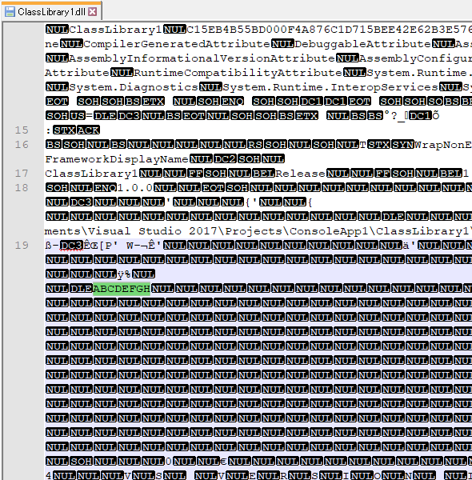

# 静的なデータの ReadOnlySpan 最適化

今日は C# コンパイラーのレベルの最適化(割と最近の追加)。

静的な byte データ列をプログラム中で使いたいとき、どう書くのが効率良いかといいかという話になります。

## 静的な byte データ

例えば、以下のようなコードを考えます。

```csharp
using System;
 
public class Program
{
    static void Main()
    {
        var data = new byte[] { 65, 66, 67, 68, 69, 70, 71, 72 };
 
        foreach (var x in data)
            Console.WriteLine(x);
    }
}
```

`data` の中身は全て定数です。
なので、コンパイルすると、定数として DLL 中に埋め込まれます。
コンパイル結果の DLL を適当にエディターででも開いてみると、以下のような文字列が見つかると思います。
(65～72 は `'A'`～`'H'` の文字コードです。)



## 無駄な配列生成

そして、配列自体も書き換えているわけではなく、その定数を読みだしているだけです。
にもかかわらず、このコードは配列のインスタンスが作られます(ヒープを使っちゃう)。
`data` を初期化する行は、概ね以下のような命令列になります。

```cil
IL_0000: ldc.i4.8
IL_0001: newarr [mscorlib]System.Byte
IL_0007: ldtoken field int64 フィールド名割愛
IL_000c: call void 中略::InitializeArray(略)
```

上から順に、

- 配列長の8をロード
- 配列を作成
- 読み込みたいデータ(65～72) が書かれた場所のアドレスをロード
- 配列の中身をその65～72で上書き

という感じ。

書き換えもしないのに配列を new した上にコピーが走るのはもったいないです。

## ReadOnlySpan 最適化

これに対して、割と最近(Visual Studio 15.7、C# 7.3 世代で)実装された最適化があります。
先ほどのコードを、以下のように書き換えてみましょう。

```csharp
using System;
 
public class Program
{
    static void Main()
    {
        ReadOnlySpan data = new byte[] { 65, 66, 67, 68, 69, 70, 71, 72 };
 
        foreach (var x in data)
            Console.WriteLine(x);
    }
}
```

`data`の型を`ReadOnlySpan<byte>`に変えただけです。
しかしこれで、`data`の中身を書き換えないという保証ができたので、
最適化が掛かります。
C# 7.3 以降でコンパイルすると、結果は以下のようになります。

```cil
IL_0000: ldsflda int64 フィールド名割愛
IL_0005: ldc.i4.8
IL_0006: newobj instance void valuetype 中略.ReadOnlySpan`1<uint8>::.ctor(void*, int32)
```

上から順に、

- 読み込みたいデータ(65～72) が書かれた場所のアドレスをロード
- 配列長の8をロード
- `ReadOnlySpan<byte>` のコンストラクター呼び出し

です。`ReadOnlySpan<byte>`は構造体なので、ヒープは使いません。
直接、DLL 中に埋め込まれた ABCDEFGH のところを参照します。

ちなみに、この最適化が効くのは`ReadOnlySpan<byte>`と`ReadOnlySpan<sbyte>`だけみたいです。
`byte`と`sbyte`以外の値はダメですし、書き換え可能な`Span<T>`を使ってもダメです。

## 実用例

つい最近なんですが、coreclr で、この最適化を適用する Pull Request が出ていたりします。

- [Use C# compiler's static data support in Encoding.Preamble](https://github.com/dotnet/coreclr/pull/20768)

preamble ってのはいわゆる BOM (Byte Order Mark)です。
Unicode テキストが Big Endian か Little Endian かを判定するための文字ですが、
それを流用して文字コードの判定自体に使われてしまうあれ。
テキストの先頭に以下のような byte 列(code point U+FEFF をエンコードしたもの)を入れるやつ。

- UTF-8 → EF, BB, BF
- Big Endian UTF-16 → FE, FF
- Little Endian UTF-16 → FF, FE
- Big Endian UTF-32 → 00, 00, FE, FF
- Little Endian UTF-32 → FF, FE, 00, 00

この静的な byte 列に対して、上記の `ReadOnlySpan<byte>` 最適化を適用しています。
