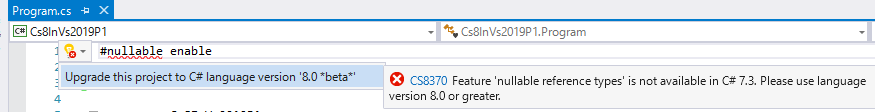
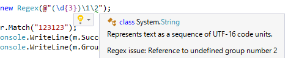

# Visual Studio 2019 Preview 1

[Connect](https://channel9.msdn.com/Events/Connect/Microsoft-Connect--2018) やってましたね。

とりあえず、関連ブログ:

- [Making every developer more productive with Visual Studio 2019](https://blogs.msdn.microsoft.com/visualstudio/2018/12/04/making-every-developer-more-productive-with-visual-studio-2019/)
  - [Visual Studio 2019 Preview](https://visualstudio.microsoft.com/ja/vs/preview/)
- [Announcing .NET Core 2.2](https://blogs.msdn.microsoft.com/dotnet/2018/12/04/announcing-net-core-2-2/)
  - [.NET Core 2.2 downloads](https://dotnet.microsoft.com/download/dotnet-core/2.2)
- [Announcing .NET Core 3 Preview 1 and Open Sourcing Windows Desktop Frameworks](https://blogs.msdn.microsoft.com/dotnet/2018/12/04/announcing-net-core-3-preview-1-and-open-sourcing-windows-desktop-frameworks/)
- [Announcing Open Source of WPF, Windows Forms, and WinUI at Microsoft Connect(); 2018](https://blogs.windows.com/buildingapps/2018/12/04/announcing-open-source-of-wpf-windows-forms-and-winui-at-microsoft-connect-2018/)
- [Announcing WPF, WinForms, and WinUI are going Open Source](https://www.hanselman.com/blog/AnnouncingWPFWinFormsAndWinUIAreGoingOpenSource.aspx)
  - [.NET Core 3.0 Preview](https://dotnet.microsoft.com/download/dotnet-core/3.0)
  - [github WPF](https://github.com/dotnet/wpf)
  - [github WinForms](https://github.com/dotnet/winforms)
  - [github Windows UI Library](https://github.com/Microsoft/microsoft-ui-xaml)
- [Announcing ASP.NET Core 2.2, available today!](https://blogs.msdn.microsoft.com/webdev/2018/12/04/asp-net-core-2-2-available-today/)
- [Announcing Entity Framework Core 2.2](https://blogs.msdn.microsoft.com/dotnet/2018/12/04/announcing-entity-framework-core-2-2/)

とりあえず、.NET Core 2.2 正式リリース ＆ .NET Core 3.0 プレビュー提供開始。
Visual Studio 2019も preview 1 がダウンロードできるようになりました。

あと、WPF、WinForms 等がオープンソースになったみたいです。
(重ね重ねの注意になりますが、.NET Core 3.0 で動く/オープンソースになったといっても、Windows 限定です。)

## C# 8.0

大してアナウンスされていませんが、Visual Studio 2019 Preview 1 でひそかにちょこっとだけ C# 8.0 を試せるようになっていたり。

ただ、

- LangVersion default は C# 7.0 だし、latest は 7.3 のまま
  - C# 8.0 を試してみたければ LangVersion 8.0 を明示的に指定
  - LangVersion beta とか experimental みたいなモニカーもなさそう
- 実装されている機能は 「[Language Feature Status](https://github.com/dotnet/roslyn/blob/master/docs/Language%20Feature%20Status.md)」参照。現時点では以下のものだけっぽい
  - Nullable reference type
  - Ranges
  - Null-coalescing Assignment
  - Alternative interpolated verbatim strings
  - (※追記) Async streams
- どうも、C# 8.0 の正式サポート開始は Visual Studio 2019 の最初のリリースではやらず、その後、 .NET Core 3.0 が出るタイミングからにしたいらしい

### 今使える機能

[Language Feature Status](https://github.com/dotnet/roslyn/blob/master/docs/Language%20Feature%20Status.md) の C# 8.0 のところに並んでいる15個のうち、「Merged to dev16 preview1」になっている4個だけが今試せるっぽいです。

(※追記: もう1個、Async streams も実装されてるっぽい。
ただ、バグっててちゃんとコンパイルできず。)

ちなみに、ちゃんと、C# 8.0 の機能を使おうとすると、「プロジェクトを C# 8.0 にアップグレードしますか？」と聞かれます。



むっちゃ beta を強調されてますが。

以下、軽くサンプルを。([github にも上げてあります](https://github.com/ufcpp/UfcppSample/tree/master/Demo/2018/Cs8InVs2019P1))

#### Nullable reference type

```csharp {warning-ranges="17:31-17:32"}
// 有効にするには #nullable ディレクティブが必要。
#nullable enable

using System;

class Program
{
    static void Main()
    {
        Console.WriteLine(LengthSum("abc", "xyz"));
        Console.WriteLine(LengthSum("abc", null));
    }

    static int LengthSum(string a, string? b)
    {
        // こう書いてしまうと b のところで警告。
        var len0 = a.Length + b.Length;

        // これなら OK。b?. なので、b の null チェック済み。
        var len1 = a.Length + b?.Length ?? 0;

        // こんな感じで if で null チェックしても OK。
        // チェック済みな個所では b. で大丈夫。
        var len = a.Length;
        if(b != null) len += b.Length;

        return len;
    }
}
```

#### Ranges

```csharp
using System;

class Program
{
    static void Main()
    {
        var data = new[] { 0, 1, 2, 3, 4, 5 };

        // 1～2要素目。2 は exclusive。なので、表示されるのは 1 だけ。
        Write(Slice(data, 1..2));

        // 先頭から1～末尾から1。表示されるのは 1, 2, 3, 4
        Write(Slice(data, 1..^1));

        // 先頭～末尾から1。表示されるのは 0, 1, 2, 3, 4
        Write(Slice(data, ..^1));

        // 先頭から1～末尾。表示されるのは 1, 2, 3, 4, 5
        Write(Slice(data, 1..));
    }

    // 最終的に、.NET Core 3.0 には Span<int> に Range 型を受け取るインデクサーが入るはず。
    // 今はその実装がないので自前で同じ機能を作る。
    static Span<int> Slice(Span<int> data, Range range)
    {
        int getIndex(int length, Index i) => i.FromEnd ? length - i.Value : i.Value;
        var s = getIndex(data.Length, range.Start);
        var e = getIndex(data.Length, range.End);
        return data.Slice(s, e - s);
    }

    // 表示確認用。Span の中身を , 区切り表示。
    static void Write<T>(Span<T> items)
    {
        var first = true;
        foreach (var x in items)
        {
            if (first) first = false;
            else Console.Write(", ");
            Console.Write(x);
        }
        Console.WriteLine();
    }
}
```

#### Null-coalescing Assignment

`x ??= y` で、`if (x == null) x = y;` の意味に。

```csharp
using System;

class Program
{
    static void Main()
    {
        NullCoalescingAssignment("abc"); // "abc" が表示される
        NullCoalescingAssignment(null);  // "default string" が表示される
    }

    static void NullCoalescingAssignment(string s)
    {
        s ??= "default string";
        Console.WriteLine(s);
    }
}
```

#### Alternative interpolated verbatim strings

`$@` の順序しか受け付けなかったやつが、`@$` も認めるという話。

```csharp
// こっちは C# 6.0 からあるやつ。
var s1 = $@"\\\ {x}";

// これまでは $ と @ の順番逆にできなかった。
// C# 8.0 から @$ でも OK。
var s2 = @$"\\\ {x}";
```

### サポートに関して

[Mads (C# チームの PM)の動画](https://channel9.msdn.com/Events/Connect/Microsoft-Connect--2018/D140)の説明欄には「included in Visual Studio 2019」とか書いてあるんですが…

C# チームの中の人が gitter で[以下のようなことを言っており](https://gitter.im/dotnet/csharplang?at=5c0599bd1c439034af12ba30):

> The C# 8 language support will not RTM with initial VS2019 release. The features and the language version will be there but as "beta", meaning some breaking language changes may still occur.
> C# 8 will RTM in an update of VS2019, aligned with .NET Core 3.

VS2019 リリースの時点ではRTMにはならない。ベータ扱いで、まだ破壊的変更の可能性残る。
C# 8のRTMはVS2019のアップデートで、.NET Core 3.0とそろえてやる。

とのこと。

「機能としては乗ってるけどまだベータ」とか、混乱されそうでちょっと怖いですが。
「default」が 8.0 に切り替わらない限りには大丈夫なのかな…

## おまけ: Regexパーサー

[今年の初めに紹介した Regex パーサー](../../1/pickuproslyn0103/index.md)が Visual Studio 2019 に組み込まれたみたいです。



構文ハイライトが付くのと、不正な正規表現の検出、訂正をある程度やってくれるます。
