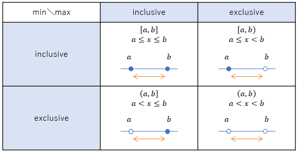

# ピックアップRoslyn 3/24: Ranges

[こないだのDesign Notesアップロード祭り](../pickuproslyn0321/index.md)、1月辺りの議題としては割と「Ranges」の話が多かったみたいです。今日はこれの話。

## Ranges

レンジ、要するに「どこからどこまで」みたいな値の範囲のことです。そこそこいろんなプログラミング言語にありますけども、例えば `1..3`みたいな書き方で1～3の範囲を表そうという構文。

.NET Core 2.1で、配列などの連続したメモリ領域の一定区間を指し示す[`Span<T>`構造体](../../../../study/csharp/resource/span.md)っていう型が入りました。これに伴い、以下のように、配列の一部分を抜き出すような構文が欲しいという話になっています。

```csharp {title="Range を使った区間の切り出し"}
int[] array = new[] { 1, 2, 3, 4, 5, 6, 7 };
Span<int> span = array[1..3];
```

ちなみに、現状、この機能は C# 8.0 での実現を目指しています。

## indexing/slicing 用途

C# チームとしては、前節のような書き方、つまり、`[]` の中身として使って(= indexing)、配列の一部分を切り出す(= slicing)のを当面の目標に据えたいそうです。

例えば他の用途として、「Range パターン」、要するに、パターン マッチングのパターンの種類として以下のような書き方を認めたいという話もありますが、これはindexingの「次の段階」として考えたい様子。

```csharp {title="Range パターン"}
switch (n)
{
    case 1..3:
    case 5..8:
        // ...
}
```

「次の段階」としては、おそらく「ユーザー定義の Range 演算子」を認めて、任意の型に対して `..` なりなんなりの Range を作れるようにすることになると思います。
しかし、まずは indexing を中心として構文を検討していきたいとのこと。

## inclusive/exclusive

先ほど「`1..3`で1～3の範囲を表す」と言いましたが、1点不明瞭なまま説明を端折った点があります。
両端の数字、この例の場合だと1と3は範囲に含むのか(inclusive)、含まないのか(exclusive)です。

数学だとこれらを明確に区別する記法があったりします。(a, b)みたいに丸括弧を使うとexclusive、[a, b]みたいに四角括弧を使うとinclusive。
組み合わせもあって、(a, b]ならaは含まずbは含む、[a, b)ならaは含んでbは含まない、となります。



整数だけだと、「1～3 (3は含まない)」と「1～2 (2を含む)」みたいに、±1すれば同じ意味のRangeを作れます。
しかし、将来、ユーザー定義 Range を認めたいわけで、浮動小数点数とかのことも考えないといけません。
浮動小数点数だと「1～3 (3は含まない)」と「1～2 (2を含む)」の意味が全然違うものになります。

他のプログラミング言語だと、`..<`なら含まない、`..=`なら含む、見たいに、何らかの弁別のための記号を用意していたりします。
毎度`..<`とか書くのも面倒なので、「よく使う方」と思うものを単に`..`と書いて、そうでないものに`..=`みたいな3文字の記号を割り当てたりもします。

あと、気を付けないといけないのが、言語構文的にinclusive/exclusiveの両方を用意したとして、内部表現はどうすべきか。
例えば、「どちらの構文で書くにしても、内部的には最小値をinclusive、最大値をexclusiveで持つ」と決めたとしましょう。

```csharp
struct Range
{
    public int MinInclusive;
    public int MaxExclusive;

    public Range(int minInclusive, int maxExclusive)
    {
        MinInclusive = minInclusive;
        MaxExclusive = maxExclusive;
    }
}
```

```csharp
構文は仮。C#がこれを採用するとは限らない
var inclusive = 1..=3; // new Range(1, 3) の意味
var exclusive = 1..<3; // new Range(1, 2) の意味
```

このとき、じゃあ、「0～`int`の最大値(inclusive)」は表せなくなります。

```csharp
var inclusive = 1..=int.MaxValue;
// new Range(1, int.MaxValue + 1) の意味
// = オーバーフローして new Range(1, int.MinValue) になる
```

Swift ではこの問題の対処として、inclusiveなRangesとexclusiveなRangesを別の型にしたんでしたっけ。それも後からの、破壊的変更で。

### indexing 用途に絞って

何にしても、とりあえず、用途は広く考えるほどはまりどころは増えます。
C# チームが「まずは indexing 用途に絞って検討したい」としているのもそのためです。
では、その indexing 用途だとどうか。

まあ、この用途だと大半は「最小値がinclusive、最大値がexclusive」です。

```csharp
// 配列の列挙でよく書くのは < Length
// 要するに最大値は exclusive
// inclusive だと Length - 1 になってちょっと面倒
for (int i = 0; i < array.Length; i++)
{
}

var r = new Random();
r.Next(0, 100); // こう書いた場合 100 は含まない

// この 100 も exclusive
Parallel.For(0, 100, i =>
{
});
```

なので、おそらく、C# で単に`a..b`と書くと、「a～b ただしaは含んでbは含まない」になると思われます。
最大値もinclusiveな方は、例えば`..:`とか`.:`が使えるかもしれません。

ちなみに、indexing 用途であれば、「負のインデックス」は考えないでいいかもしれません。
そうなると、例えば先ほど言った「inclusiveかexclusiveかを型を変えるなどして弁別できないといけない」とか、
後述する unbounded や starting/length などの表現も、1つの型で、負数の領域をフラグ的に使って弁別するとかできるかもしれません
(別途フラグ用のフィールドを持たないでいいので、構造体がコンパクトになるというメリットあり)。

### : (コロン)の利用

`.:` みたいなのを使う上で、`.`も`:`も別の文法と混ざりやすくて、コンパイラーが区別できる構文が限られたりします。

- `.` → `.1` みたいな書き方で `0.1` を表せる
- `:` → 条件演算子 `?:`、名前付き引数 `引数名: 値`、[文字列補完](../../../../study/csharp/start/st_string.md#multi-line)の書式 `{値:書式}`

例えば `flag ? 1:.2:.3`とかは、`flag ? (1:.2) : (.3)` と `flag ? (1) : (.2:.3)` で不明瞭になったりします。
`.:` の 方は行けそうなんですが、`:.` がダメそうという。
同様の理由で、`.<`は行けても `>.` はダメそう。

この辺り、Swift の「単項演算子は `+x` みたいに演算子と変数が密着してないとダメ」「2項演算子は `x + y` みたいに演算子と変数の間にスペースが必須」みたいな文法は結構良い割り切りだったかもしれないです。

他に、C# は`::`っていう記号も既存の文法で使っちゃってるんですが、[外部エイリアス](../../../../study/csharp/structured/sp_namespace.md#extern)っていうめったに使わない機能です。
これの両辺は今のところ名前空間しか出てこないはずなので、Rangesとはセマンティック的に弁別できそうとのこと。

## starting/length

配列などの一部分を切り出すとき、両端を指定して切り出す他に、「a番目の要素(starting index)からb要素(length)切り出す」という方法も考えられます。

```csharp
var sub = "abcdefghijklmn".Substring(2, 4); // 2番目から4文字 = cdef

byte[] buffer = new byte[10];
Stream s = File.OpenRead("a.txt");
s.Read(buffer, 2, 4); // buffer の2番目から4バイトに書き込み
```

ということで、min/max 版の Range の他に、starting/length 版の Range も欲しいという話になります。
C# チームが例に挙げたのだと以下のような構文がありました。

```csharp
var r1 = 2..4; // min/max (exlusive) = 2, 3 の意味
var r2 = 2..+4; // stating/length = 2, 3, 4, 5 の意味
```

これだと、ユーザー定義の`..`演算子を認めたときに、「`2`と`4`に対する`..`」と「`2`と`+4`に対する`..`」で意味が違うってことになるのでかなり気持ち悪い構文になりますが…
まあ、何にしても、何らかの構文は求められています。

## 空 Range

長さ0の Range の扱いはどうあるべきかという話も。

例えば、Range と似たような話で、LINQ の `.Skip(a).Take(b)` を考えてみます。
「a 番目から長さ b」という意味では前節の starting/length 版の Range と似たようなものになります。
これで、長さ0のシーケンスを2つ比較すると、常に一致扱いになります。

```csharp
var array = new[] { 1, 2, 3, 4, 5 }; // 値は何でも

// 開始地点は違うけども、長さ 0 のシーケンスを作る
// それを比較すると、開始地点によらず常に一致扱い
var e = Enumerable.SequenceEqual(
    array.Skip(1).Take(0),
    array.Skip(2).Take(0));
```

であれば、`1..+0`と`2..+0`は同じと思うべきなのかどうか。
これに対しては、一応以下のように、開始インデックスの範囲チェックは掛かるべきなので、別扱いすべきだろうとのことです。

```csharp
var array = new[] { 1, 2, 3, 4, 5 }; // 値は何でも

var r1 = array[1..0]; // OK
var r2 = array[10..0]; // OutOfRange
```

## bounded/unbounded

indexing 用途を考えた場合、具体的な数値を伴った`a..b`以外に、以下のようなものが欲しくなったりします。

- `..a` → 最初から a 番目まで
- `a..` → a 番目から最後まで
- `..` → 最初から最後まで

端の値が決まっている(bounded: 有界)か、決まっていない(unbounded)か。
例えば、行列とかテンソルとかのデータ構造から「1次元目は全て、2次元目は1～3行目を切り出したい」というとき、
`matrix[.., 1..3]` というような書き方が考えられます。

## 末尾から n 番目

indexing用途で他によくあるのが、「末尾から n 番目」、「配列長 - n 個」の類です。これに対しても、仮に、以下のような構文を挙げています。

- 案1: `-n`みたいにマイナスを付けて「末尾から n 番目」を表す
- 案2: `^n`みたいに、インデックス専用の新演算子を用意して「末尾から n 番目」を表す
- `+^n` みたいに、さらに `+` を付けると「配列長 - n 個」の意味

例えば、「最初と最後の1要素ずつ削る」みたいなことをしたければ`array[1..-1]`でどうか、と言うことになります。

## Index 型

前節で`^n`みたいな「インデックス用演算子」を考えたわけですが、であれば、Range 型(両端を持つ)だけじゃなくて、いっそ Index 型(1要素だけを指すためのインデックス)もあってもいいのではないかという話になります。

例えば、`array[^1]`で、末尾から1番目、すなわち`array[array.Length - 1]`を表そうということです。
そして、ここまで話してきた「indexing 用途の Range 型」はあくまで、「Index 型の2つの値に対して `..` 演算子を適用したもの」ということになります。

## natural type

`1..3`とか書いた時、これの「自然な型」は考えるべきかどうか。

例えば、C#にはいくつか、「左辺の型によって意味が変わる構文」というものがいくつかあります。

```csharp
// ラムダ式: デリゲートと式ツリー
Func<int, bool> f = x => x > 0;
Predicate<int> p = x => x > 0;  // シグネチャが同じでも Func とは別の型
Expression<Func<int, bool>> ex = x => x > 0;

// 文字列補完: string と FormattableString
int a = 1, b = 2;
string s = $"a: {a}, b: {b}";
FormattableString fs = $"a: {a}, b: {b}";
```

前節で言ったように、indexing用途の Range の場合は、Index 型の組み合わせだと考えた方がいいかもしれません。
とはいえ、`(Index)1..(Index)3`みたいな書き方はしたくないでしょう。
ラムダ式のように、左辺から決定するのもありかもしれません。

```csharp
Range indexingRange = 1..3; // indexing用
IntRange intRange = 1..3; // 「末尾から」とかみたいな妙な仕組みを持ってない単なる整数の範囲
```

とはいえ、ラムダ式に対してよくある不満として、`var`やジェネリクスでの型推論が効かないという問題もあります。

```csharp
// エラー。ラムダ式は左辺の型がないと型が決まらない
var f = x => x > 0;

// こっちはOK。特に指定がない場合、自動的に string 扱い
var s = $"a: {a}, b: {b}";

// Range はどうあるべき？暗黙的に indexing 用の Range 型？
var r = 1..3;
```

ということで、Range はどうあるべきでしょう。
ラムダ式の例を見ての通り、自動的に特定の「`Range` 型」に推論される(`1..3` にとって自然な型は`Range`型であるとする)方が使い勝手はいいです。
一方、それをやってしまうと、その特定の `Range`型に C# が依存してしまうことになります。

## まとめ

「a～bまでの範囲」みたいなのを表すRange型は、結構いろんな言語にあります。
なのでそんなに迷うものでもないかと思ったら、案外検討事項がたくさん出ています。

- inclusive/exclusive 問題
- unbound な Range
- max/min 版と starting/length 版
- 空 Range の扱い
- 「末尾から」
- Index 型
- 演算子を何にするか(特に inclusive/exclusive の弁別のために複数の記号が必要)
- ある特定の `Range`型を「自然な型」として採用すべきか

今のところは indexing 用途に絞って、`a..b` と書いて「a要素目(inclusive)からb要素目(exclusive)まで」の意味で使うというような構文になる可能性がたかいです。
将来的には任意の用途・任意の型に対するユーザー定義 Range が提供される予定です。

現状、C# 8.0での実装を目標にしているみたいですが、
検討が始まったの割と最近ですし、この通りの検討項目の多さなので、もしかするともっと時間が掛かるかもしれません。
