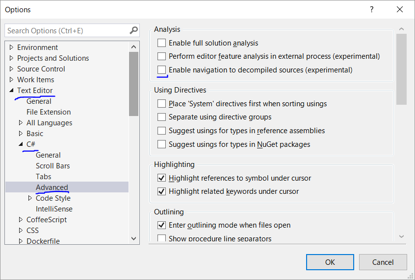

# Visual Studio 15.6 リリース

なんかVisual Studioの更新に 15.6.0 の正式版が配信されてますね。

[ブログ](https://blogs.msdn.microsoft.com/visualstudio/)とかのアナウンスはまだなさそう。[グロサミ](https://mvp.microsoft.com/ja-jp/Summit)に来たMVPからのフィードバック欲しくてとりあえずリリースだけしちゃったとかですかね。ホテル・会場のWi-Fi負荷が…

それか、[preview 4の時の告知](https://blogs.msdn.microsoft.com/visualstudio/2018/02/08/visual-studio-2017-version-15-6-preview-4/)から内容変わってないから書くことないか？

## navigation to decompiled sources

[navigation to decompiled source](https://docs.microsoft.com/en-us/visualstudio/releasenotes/vs2017-preview-relnotes#productivity-1)とか便利そうではあります。まだ「experimental」がついていますけども。

今まで、DLL で参照しているものは、F12で「定義へ移動」しても、シグネチャ(どのクラスにどういうメソッドが、どういう引数であるか)しかわかりませんでしたけども。
それが、逆コンパイル処理をした C# コードを見れるようになるというもの。

設定は以下の場所から。

まあ、experimental なせいか、根本的に難しいのか、いまいちなコードが出てきたりはしますが。
あと、この機能を ON にしちゃうと、今までの F12 の結果と違って[アセンブリ名とパスが出なくなる](https://github.com/dotnet/roslyn/issues/25252)のが不満だったりしますが。

## C# 7.2 fix

C# 的には、今回のリリースでは C# 7.2 のままです。新文法の追加はなし、ということになっています。

が、[以前書いた](../../1/pickuproslyn0103/index.md)通り、バグ修正が結構入っています。`in`引数(`ref readonly`)がらみの[やべーやつ](../../../2017/12/バグ報告祭り/index.md)が一通り治っているのに加えて、
以下の2つも「バグ修正」扱いで追加されていたりします。

- 参照引数な拡張メソッドが、`ref this`の語順でも`this ref`の語順でもよくなった
  - 以前は`ref this`しか受け付けなかった
- `M(T x)`と`M(in T x)`というように、`in`違いのオーバーロードがあるとき、`M(x)`だけだと前者を呼ぶようになった
  - 以前はオーバーロードが解決できない扱いでコンパイル エラー
  - 後者を呼びたければ`M(in x)`と書く

ちなみに、「`ref partial struct`と`partial ref struct`の語順も緩めよう」という話もあったんですが、これは今回のリリースには入らなかったみたいです。
