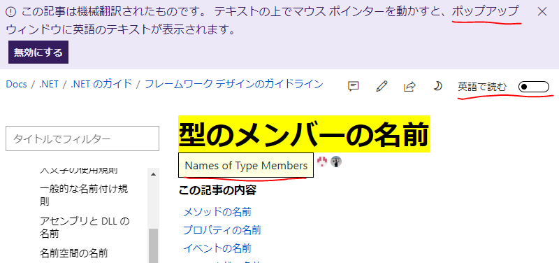

# ✓DO、X DO NOT の誤訳事案

だいぶ炎上してる例のあれ

- [doの意味が全体的に逆になっています。 #118](https://github.com/dotnet/docs.ja-jp/issues/118)

対応ミスってるとはいえさすがにかわいそうなレベルでいいがかり付けられてる感じもするのでちょっと補足を。

## 元々の問題

マイクロソフトの機械翻訳がよくやらかすのはいつものことなんですが。
今回は何をやらかしたかというと、よくある

- ✓DO: 〇〇してください
- X DO NOT: 〇〇はしないでください

みたいなやつを、DOもDO NOTもどっちも「しないで」と訳してしまっているという問題。
「しないで」も不自然だし、ましてDOの方は真逆の意味になっているという誤訳。

どうしてこうなる… みたいな気持ちはもちろんあるものの、こういう「普通の文章」になっていない部分の単語ってのは、機械翻訳では一番ミスを起こしがちな部分です。
たぶん、原文の時点で何らかのアノテーションでも付けておくとかしないと、今後も同様の誤訳は起こりまくるんじゃないかなぁと思います。

## フィードバック内容

ということで、「間違ってますよ」とフィードバックが入っているわけですけども。
どう見ても正しく伝わっていない。

おそらく、対応している側も機械翻訳で見ているか、少なくとも日本語ネイティブの人ではなくて、英語ネイティブで日本語を読める人がトリアージュしていそうな感じ。

そこに、

- フィードバックが「doが"しないで"と翻訳されています。」という短文
  - かつ、「翻訳されています」自体が問題と取れなくもない
- [その下](https://github.com/dotnet/docs.ja-jp/issues/118)に英語で、オフトピック的に、「DOはDOのままにしてくれ。変に翻訳しても伝わらない」という別フィードバックが混ざっちゃってる

というフィードバックが入ったものだから、あちらの対応としては、後者のオフトピックの方だけを拾って、

- マイクロソフトでのガイドラインとしては、こういう「DO」みたいなやつも何らかの現地語に翻訳することになっている

と返した(返せてるつもりになってる)という状態。

## 炎上

これに対して、炎上の仕方はまた違う勘違いが入っているようで。
要するに、「マイクロソフトのガイドラインでは DO は『しないで』と訳すことになっている」と勘違いした日本人が騒がいでいる状況。

で、その状況で結構RTされちゃったわけですけども、
よくある「RTが増えてくるとクソリプがわいてくる」状態(twitterに限った話じゃない)でして、
「どうして Google 翻訳を使わないんだ？」みたいなコメントを付けるやつまで出てきている状態。

さすがにこれは担当者がかわいそうすぎる…

## フィードバックの入れ方

ja-jp ページのあまりのひどさになれてしまっている日本人からすると「1行説明でも、このひどさは見りゃわかるだろ」と思うかもしれませんけども。
大体通じません。
というか、英語ネイティブ同士の英語でのやり取りでも、「1行説明」の類は結構通じてない。

逆に、経験上は、[こんな感じでスクショぽとぺた](https://github.com/dotnet/docs.ja-jp/issues/118#issuecomment-407252836)してやれば、大体すぐに対応してもらえます。

## 正しく状況を理解したうえでも、それどうなの？

まあ、こういう背景を理解したうえでもどうかと思う部分はあると思います。

### そもそも機械翻訳いやだ

今もう、人力翻訳予算とか付かないので…

予算を割きたくなるくらい日本が景気良かったのはもう遠い昔の話でして。

### 機械翻訳の品質が…

今回みたいなのはちょっと特殊なケースだと思います。
前述のとおり、文章になっていなくて記号的に使われている DO みたいな単語は、機械翻訳的にはかなり難しい用法かと思われます。

### 日本語訳はあてにしていないので英語の原文見せて

見れるで。

これも、MSDN時代からずっといろいろあったんですよね…

大まかにいうと、「英語が表示されると怖い。出さないで」派と「英語がないと読めない。出して」派のどっちもうるさくて困るそうで。

やっと、

- 「英語で読む」ボタンが付いた
- ポップアップのオンオフちゃんと切り替えれるようになった

ってのが実現したんですよ…
活用しましょう。

### DO を訳すなよ

これは本当にその通りで、ありとあらゆる方面から何度も何度も刺されているはずなんですけども。

1個本当にひどい話をすると、昔、Xbox インディーゲームズの審査を出そうと思うと、ゲーム画面中に「Game Over」とか「Start」とかの文字すら残してはいけない、1文字でもアルファベットが残っていると「翻訳できてないから許可しない」とか言われたことがあります。

その後、たたかれまくった結果Xboxでは「Game Over」が残ってても大丈夫になったそうです。
で、ほとぼり冷めた頃に今度は Windows ストアアプリの審査で全く同じことが起きました。
「News」とかが残ってると「翻訳できてない」と思われて審査に落ちるという。

要するに、日本人が「文字の混在」に慣れてて、簡単な英単語は読めるというか、日本社会には英字がデザインの一部として溶け込んでる、変に訳されたりカタカナになっているとむしろ日本語的に不自然という文化的背景なんて、日本人にしかわからないということです。

何回言っても伝わらないというか、その日本人の機微に対応しようと思うコストがかかりすぎるというか。マイクロソフトは断固として「現地語」にこだわり続けています。

まあ本当にひどいんですけども、それはそれで、別 issue です。
今回は混ざっちゃったことで勘違いによる炎上が起きたわけでして。
