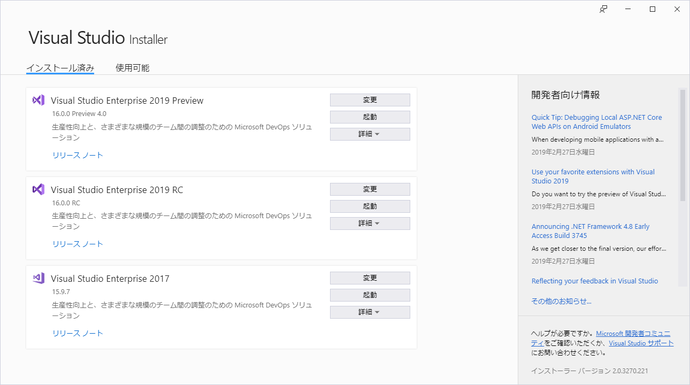
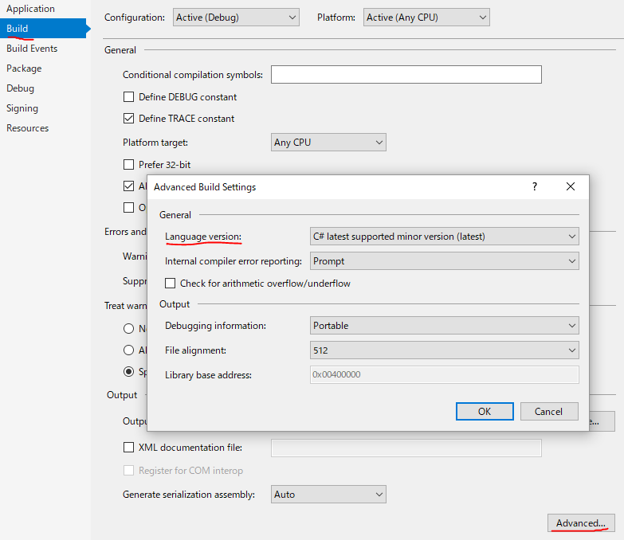
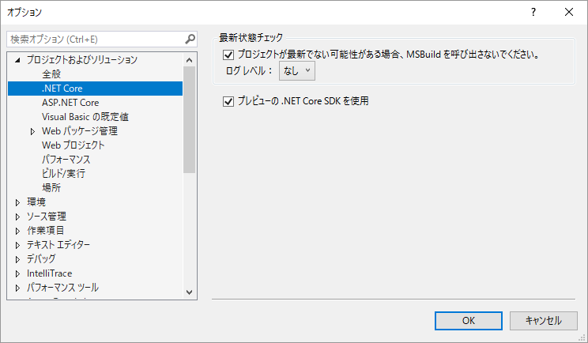

# Visual Studio 2019 RC と Preview 4

Visual Studio 2019 がリリース候補版(RC) になりました。

- [Visual Studio 2019 Release Candidate (RC) now available](https://devblogs.microsoft.com/visualstudio/visual-studio-2019-release-candidate-rc-now-available/)

※ [3月1日、ちょっと追記しました](#add0301)

## リリース チャネルとプレビュー チャネル

同時に、Visual Studio 2019 Preview 4 も出ています。
これまで Preview 版を使っていた人は単にアップデートを掛ければ Preview 4 になります。
一方で、RC の方は、その後正式リリース版にそのままアップデートできます。

出た時期的に、RC と Preview 4 は内容的には大差ないと思います。
(といいつつ、なんか RC の方だと C# 8.0 がちゃんと使えなかったり、.NET Core 3.0 を参照できなかったりしてるんですが… 自分の手元だけなのか、.NET Core 3.0 の更新が来れば治るのか、本格的にバグなのかは不明…)

この2つは、単に配信チャネルの差。
要するに、

- RC は、正式リリースが出た際にはそのまま正式リリース版にアップデートできる
  - その後も、正式リリースなものだけがアップデートとして流れてくる
  - これが「リリース チャネル」
- Preview 4 は、Visual Studio 2019 (16.0)正式リリース後も、16.1 Preview 1 みたいなやつが流れてくる
  - これが「プレビュー チャネル」

という状態。
もちろん、Visual Studio 2017 との共存もできるので、インストーラーが以下のような状態になります。

## C# がらみ

基本的には [Preview 2](../../1/vs2019p2/index.md)の頃から機能としては変わっていません。
その辺りは [Preview 3](../vs2019p3/index.md)の時と同じ。

RC になったわけですから、Visual Studio 2019のリリース版でも、使える機能は今あるものまでとなります。

### C# 8.0 Preview

これまでにも書いていますが、Visual Studio 2019 リリース時点では、C# 8.0 の扱いは「プレビュー版」です。
言語バージョンに `8.0` か、後述する `preview` を明示的に指定しないと使えません。

まだ実装すらされていない機能もたくさんありますし、 .NET Core 3.0 依存な機能はこれから変化する可能性もまだかなり高いです。

(1) 例えば、割かし需要がありそうな機能でまだ実装がないものは

- [インターフェイスのデフォルト実装](https://www.buildinsider.net/column/iwanaga-nobuyuki/013)
- [readonly インスタンス メンバー](https://github.com/dotnet/csharplang/issues/1710)

(2) 実装はあるものの、 .NET Core 3.0 依存なので今使うのはちょっと怖いかもしれないものは

- [非同期ストリーム](../../../2018/12/cs8asyncstreams/index.md)
- [Ranges](../../../2018/12/cs8ranges/index.md)

(3) 実装があって .NET Core 3.0 依存もないものは

- [null 許容参照型](../../../2018/12/cs8nrt/index.md)
- [再帰パターン](../../../2018/12/cs8patterns/index.md)
- [switch 式](../../../2018/12/cs8switchexpr/index.md)
- [静的ローカル関数](../../1/vs2019p2/index.md)
- [文字列リテラルの `$` と `@` の順序緩和](../../../2018/12/cs8misc/index.md)
- [`??=` 演算子](../../../2018/12/cs8misc/index.md)
- [pattern-based な `using`/`foreach`](../../../2018/12/cs8notyet/index.md)

という感じ。

私見ですが、(3) のやつはプレビュー版であってもそんなにリスクなく使えると思います。

null 許容参照型はまだまだいろいろ作業が残っている節があるので、
「後からどんどん警告が増える」というのは覚悟して使う必要があるかもしれません。
その他は、これからそこまでいきなり大きく仕様変更があるとは思えないので、割かし使っても平気かと思います。

### .NET Core 3.0

まあ、とりあえず、C# 8.0 を試したいなら .NET Core 3.0 の更新も待った方がいいかも…

今また、Visual Studio だけリリースして、それに対応する .NET Core 3.0 がまだ出ていないので、[Ranges](../../../2018/12/cs8ranges/index.md) がコンパイル エラーを起こしたりします。
(僕が気づいた範囲ではその Ranges の問題だけですが。)

### バグはだいぶ取れてる

前に書いた、

- [デリゲートに対する null 検証がおかしくて即落ち](../../../2018/12/pickuproslyn1221/index.md)
- [switch 式で IntelliSense が狂う・フリーズする](../vs2019p3/index.md)
- [`foreach` の色がおかしい](https://github.com/dotnet/roslyn/issues/33039)

とかのバグは治っていました。

まあ、RC ということは、特に問題が出なければそのままリリース版になるものですからね。
Visual Studio 2019 リリース版の時点でもまだ「C# 8.0 はプレビュー版」という扱いであっても、さすがにフリーズとかクラッシュとかの問題は残さないようです。

### 言語バージョン

言語バージョンの仕様がちょっと変わっているので注意が必要です。

補足: ↓これのこと。csproj を直接編集するなら `LangVersion` タグになっているやつです。

これまでの挙動は

- 無指定(あるいは `default` を指定): 「最新のメジャー バージョン」になる
  - 要するに、ずっと C# 7.0 だった
- `latest` 指定: 「最新のバージョン(マイナー バージョン含む)」になる

今後の挙動は

- 無指定(あるいは `default` を指定): 「最新のバージョン(マイナー バージョン含む)」になる
- `latest` 指定: 「最新のバージョン(マイナー バージョン含む)」になる
  - これは今まで通り
  - プレビューなものにはならない
- `latestMajor` 指定: 「最新のメジャー バージョン」になる
  - 今までの `default` の挙動が欲しければこれを使う
- `preview` 指定: 「プレビューを含めて最新」になる
  - C# 8.0 を今試したければ、`8.0` の直接指定に加えて、これを指定してもいい

となります。

これまで無指定でやってきた人は、いきなり C# 7.3 になるのでご注意を。
破壊的変更はほぼないはずなので、それで問題は起こさないと思いますが、一応。

## <a id="add0301">追記 3月1日</a>

いくつか追記を。

### ダウンロード ページ

よく考えたら昨日のうちに書いておくべきだったんですけども…
相変わらず、翻訳システムが大変まずい状態でして、以下のようになっています。

[https://twitter.com/ufcpp/status/1101018021047332864](https://twitter.com/ufcpp/status/1101018021047332864)

要するに、

- ダウンロード ページへのリンクは [https://visualstudio.microsoft.com/downloads/](https://visualstudio.microsoft.com/downloads/) になっている
- ただ、日本語ロケールで上記リンクを踏むと、[https://visualstudio.microsoft.com/ja/downloads/](https://visualstudio.microsoft.com/ja/downloads/?rr=https%3A%2F%2Fdevblogs.microsoft.com%2Fvisualstudio%2Fvisual-studio-2019-release-candidate-rc-now-available%2F) に転送される(ja が挟まる)
- で、その ja なページには RC のダウンロード リンクがまだない

というやつ。ページの左下にある言語選択メニュー(↓みたいなやつ)から、言語を英語に変えないと RC のインストーラーがダウンロードできないのでご注意ください。

### Roslyn 自体が C# 8.0 化

Roslyn の master に、LangVersion を 8.0 にするプルリクが出ていてマージされたみたいです。

- [Enable C# 8.0 in the code base #33742](https://github.com/dotnet/roslyn/pull/33742)

で、そのプルリク コメントに、使っていい機能に関する補足が。

- `switch` expressions
- recursive pattern matching
- `using` declarations
- `static` local functions
- local / parameter shadowing in local functions / lambdas
- `null` coalescing assignment
- `async` streams: keep this out of our public API surface for now as we don't want to block unification with netcoreapp in the future.

昨日僕が「使ってもまあ大丈夫かなぁ」と書いたのから null 許容参照型を引いた感じ。
あと、非同期ストリームは「使ってもいいけど public なところに書くのは避けて」という感じ。

null 許容参照型に関してはそれのドッグフーディング用のブランチ([features/NullableDogfood](https://github.com/dotnet/roslyn/tree/features/NullableDogfood))があるからそっちで試してとのこと。

### RC 版で .NET Core 3.0

昨日、「なんか RC の方だと C# 8.0 がちゃんと使えなかったり、.NET Core 3.0 を参照できなかったり」って書きましたが、解決方法見つかりました。
というか、[バグ？と思って報告したら解決方法が速攻で返って来ました](https://github.com/dotnet/roslyn/issues/33756)。

どうも、「プレビューの .NET Core SDK を使用」というオプションがあるみたいです。
これにチェックを入れておかないと、プレビューは使わない → .NET Core 2.2 を選ぶ という流れになってしまってエラーになる模様。

それはわかる… わかるんだけど、それとわかるエラー メッセージになってないのはきつい…

ということで、Preview 4 の方ではなくて RC で C# 8.0 や .NET Core 3.0 を試したい方はこのオプションをオンにしましょう。
