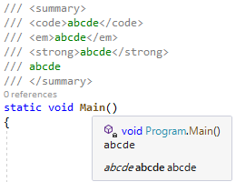

# Visual Studio 16.2.2 ＆ 16.3 Preview 2

Visual Studio 2019 16.2.2 と 16.3 Preview 2 と、あと、 .NET Core 3.0 Preview 8 が出てますね。

- [Visual Studio 2019 version 16.2.2](https://docs.microsoft.com/ja-jp/visualstudio/releases/2019/release-notes#16.2.2)
- [Visual Studio 2019 version 16.3 Preview 2](https://docs.microsoft.com/ja-jp/visualstudio/releases/2019/release-notes-preview#16.3.0-pre.2.0)
- [Announcing .NET Core 3.0 Preview 8](https://devblogs.microsoft.com/dotnet/announcing-net-core-3-0-preview-8/)

16.2.2 は脆弱性の修正だけっぽいですかね、リリース ノートを見るに。
.NET Core 3.0 Preview 8 も「最終リリースに向けて磨いてるとこ」みたいなことを言っているので大きな変更はないはず。

16.3 Preview 2 はこまごまと結構追加が。

## 16.3 Preview 2

僕的に気になるのはまあ .NET/C# がらみくらいなわけですが、
それも今回はそこそこ差分あり。

### IDE 機能

「[.NET Productivity](https://docs.microsoft.com/ja-jp/visualstudio/releases/2019/release-notes-preview#net-productivity-163P2)」に書かれてる通り、

- 1行内に大量にメソッドチェーンでつないでる奴を複数行にばらす整形
- 先に `new DateTime` みたいなインスタンス生成を書いてから IDE 機能でローカル変数を導入

とかがあるみたいです。

あと、これは IDE 機能なのか C# 機能なのかどっちに分類していいのかわからないですけど、
[doc コメント](../../../../study/csharp/misc/sp_xmldoc.md)内で `<em>` とか `<strong>` とかのスタイル変更タグが使えるようになったみたいです。

詳しくはこの PR を参照: [Implement Quick Info styles #35667](https://github.com/dotnet/roslyn/pull/35667)

### target-typed switch 式

C# 8.0 の変更は大部分もう[null 許容参照型](../../../../study/csharp/resource/nullablereferencetype.md)がらみだけ…
という状況下において、1個だけ他の変更がありました。

[switch 式](../../../../study/csharp/datatype/typeswitch.md#switch-expression)でターゲットからの型推論が効くようになりました。
要するに以下のようなコードが 16.3 Preview 2 からコンパイルできるようになります。

<pre class="source" title="target-typed switch">
<code>class Program
{
    class Base { }
    class A : Base { }
    class B : Base { }
 
    static Base M(bool b) =&gt; b switch
    {
        // 条件ごとに型が違うので、これまでは switch 式の結果の型が確定できなかった。
        // ターゲット(この場合戻り値の Base)からの型推論で型を確定するようになった。
        true =&gt; new A(),
        _ =&gt; new B(),
    };
}
</code></pre>

まあ元々「スケジュール的に厳しいけど C# 8.0 正式リリース時点で入れておかないと後からの変更は破壊的になるので避けたい」って言ってたやつです。
ほんとにぎりぎり間に合わせて来た感じ。

## null 許容参照型がらみ

さらっと動作確認。

- [16.3 Preview 2 時点でいくつか確認](https://gist.github.com/ufcpp/95fd288be27f0df5fae8ab5a093d36a4)

[計画に上がってたもの](https://github.com/dotnet/roslyn/issues/35816)大体一通り実装されてそうな雰囲気。
今度こそ[null 許容参照型のページ](../../../../study/csharp/resource/nullablereferencetype.md)を埋めるの本気出さなきゃ…

ちなみに、[一昨日書いたばかりの文章](../../../../study/csharp/resource/nullablereferencetype.md#null-forgiving)を[さっそく書き換える](https://twitter.com/ufcpp/status/1161458417598287874)というタイミングのよさ。

「この挙動で本当にいいの？」みたいなものもあったりはするんですが…
[「vNext」マイルストーン](https://github.com/dotnet/roslyn/milestone/44)が付いていたりするので、C# 8.0 時点ではあきらめていそうです。
例えば以下のようなやつ。

- [Should nullability attributes affect method bodies and OHI? #36039](https://github.com/dotnet/roslyn/issues/36039)

要するに、`MaybeNull` とかの属性は、外から見ると正しく働くものの、メソッドの中から見ると妥協的という感じ。
とりあえずどっちが重要かと言われると「外から」の方なので、重要なところだけは最低限実装したという。

ただ、`DoesNotReturnIf` が期待通り動いていないのはなんかおかしい感じが。
[関連 Pull Request](https://github.com/dotnet/roslyn/pull/36810) も通ってるので動作してそうなものなんですけども。
マージしたタイミングの問題ですかね…
