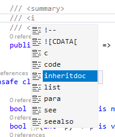

# Visual Studio 16.3 & 16.4 Preview 1

(日本時間だと)昨晩深夜、[.NET Conf 2019](https://www.youtube.com/watch?v=W8yL8vRnUnA)がありましたね。

キーノートはなんか[gRPC](https://docs.microsoft.com/ja-jp/aspnet/core/grpc/aspnetcore?view=aspnetcore-3.0&tabs=visual-studio)一色だった感じが…

要は、ASP.NET Core 3.0 の目玉の1つが gRPC 対応なんですけども。
それを、

- proto ファイルから ASP.NET のサーバーを作るデモ
- 同じ proto ファイルからクライアントコードを生成するデモ
- [WinForms](https://docs.microsoft.com/ja-jp/dotnet/framework/winforms/) とか [WPF](https://docs.microsoft.com/ja-jp/dotnet/framework/wpf/getting-started/) が .NET Core で使えるようになった → WinForms のデモでも生成した gRPC クライアントを利用
- Xamarin にも、[hot リロード、hot デプロイ機能が入る(プレビュー)](https://docs.microsoft.com/ja-jp/xamarin/xamarin-forms/xaml/hot-reload) → Xamarin のデモでも同じ gRPC クライアントを利用
- [Blazor](https://docs.microsoft.com/ja-jp/aspnet/core/blazor/?view=aspnetcore-3.0) のデモでも同じ gRPC
- 生成した gRPC クライアントは C# 8.0 対応 → [`await foreach`](../../../../study/csharp/async/asyncstream.md#await-foreach) のデモに利用

という感じ。

ちなみに、[2018年11月ごろから gRPC のチームと協力してフル managed な実装を頑張ったんですって](https://twitter.com/Johnmont/status/1176410731656269825)。

ところで、Unity だといつ使えるようになるんですかね…

## Visual Studio 16.3 & 16.4 Preview 1

とりあえず、予告通り、.NET Core 3.0 が正式リリースされました。

- [Announcing .NET Core 3.0](https://devblogs.microsoft.com/dotnet/announcing-net-core-3-0/)

予告通り。(build で発表した通りに行くか多少心配してた。)

伴って、Visual Studio も 16.3 になり、プレビューチャネルの方でも 16.4 Preview 1 が配信されました。

- [Visual Studio 2019 バージョン16.3.0](https://docs.microsoft.com/ja-jp/visualstudio/releases/2019/release-notes#16.3.0)
- [Visual Studio 2019 バージョン 16.4 Preview 1](https://docs.microsoft.com/ja-jp/visualstudio/releases/2019/release-notes-preview#16.4.0-pre.1.0)

(今回は ja-jp のリンクを貼れて安心してる。機械翻訳なのにやたら反映が遅かったりするんで… 前よりだいぶ改善してるのかな。)

ちなみに、16.4 ですが、C# 的には単にバグ修正になりそう。
既知のバグは例えば、

- [C# 7.3 以前にしていても 8.0 の機能が使えちゃう](https://github.com/dotnet/roslyn/pull/38116)
- [`t == default` と書いた時の `default` の型推論を間違う](https://github.com/dotnet/roslyn/pull/37596)

みたいなやつです。

あと、ひそかに inheritdoc コメントに対応するみたい。

こいつは、[Sandcastle](https://ewsoftware.github.io/XMLCommentsGuide/html/86453FFB-B978-4A2A-9EB5-70E118CA8073.htm)は昔から持ってる機能だったんですけど、Visual Studio 上のコード補完では出てこなかったやつです。
「派生クラスと同じ」しか doc コメントに書くことがないときに使うもの。
ついに補完候補に。

## C# 8.0

まあ、いつも通り、「自分は RC の頃には触りつくしてるのでリリース時点では話すことがない」状態ではあります。

[「 C# によるプログラミング入門」の C# 8.0 がらみ](../../../../study/csharp/cheatsheet/ap_ver8.md)は9割5分くらいは書けてるんですけども。
今回ちょっとリリースまでに書き損ねてる項目あったり。

残タスク: [null 許容参照型](https://github.com/ufcpp/UfcppSample/issues/255)、[こまごまとしたやつ](https://github.com/ufcpp/UfcppSample/issues/269)、あと、非同期ストリームは[利用例](../../../../study/csharp/async/asyncstream.md#usage)を足したい

とりあえず、正式リリースになったので使い放題！
みんなー、もう Visual Studio 16.3 のインストールはしてくれたかな？
容赦なく C# 8.0 の機能を使ったコミット出すよ！
とか思いながら 16.3 を触ってみていたんですが…
なんか、以下のような感じで、微妙にまだ使えないかも…

- TargetFramework が .NET Core 3.0、.NET Standard 2.1 のプロジェクトの場合普通に default で C# 8.0 になる
- TargetFramework が .NET Core 2.1 とか 2.2、 .NET Standard 2.0 のプロジェクトは default が C# 7.3 のまま
  - [LangVersion](../../../../study/csharp/cheatsheet/langversionoption.md#langversion) に latest を指定すると C# 8.0 になる

あれー… なんでこんな挙動なのかわからず。
単に、「古い SDK だとコンパイラーが更新されてない」というのも疑ってみてるんですけども。
それなら LangVersion は preview にしないと C# 8.0 にならないはずのような…

とりあえず、C# 7.3 の時も、 .NET Core SDK を更新したら 2.0 とか 1.6 でも C# 7.3 を使えるようになったので、しばらく様子見ですかね。
今の、 .NET Core SDK 2.1 と 2.2 は9月10日リリースのもののままのようなので。
