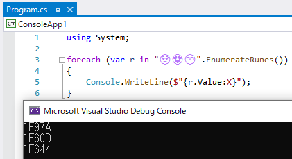

# ピックアップRoslyn 7/19: そろそろ C# 9.0 機能は fix、10.0 向けトリアージ

Visual Studio 16.7 Preview 4 が出てるのと、Design Meeting 議事録を1件紹介。

- [Visual Studio 2019 バージョン 16.7 Preview 4](https://docs.microsoft.com/ja-jp/visualstudio/releases/2019/release-notes-preview#16.7.0-pre-4.0)
- [C# Language Design Meeting for July 13th, 2020](https://github.com/dotnet/csharplang/blob/master/meetings/2020/LDM-2020-07-13.md)

16.7 Preview 4 で、`LangVersion` に `9.0` が入りました。
また、7月13日の Meeting 議事録は C# 9.0 よりも先の話が出てきています。
一部のちょっとした修正を除けば、「C# 10.0 候補として採用」、「C# 10.0 のタイミングで再検討」みたいな結論のものが多いです。

## 16.7 Preview 4 と C# 9.0

[16.7 Preview 3 のとき](../../6/cs9vs16_7p3/index.md)から目立った新機能はないんですが、Preview 3 の時に気になっていたバグは治っていました。

特に、Top-level statements が安心して使えるようになったのは結構な嬉しさがあります。
(Preview 3/3.1 の時は、誤判定で「未使用 private メソッド扱い」されて挙動不審だった。)

以下のような、`class Program` も `static void Main` も要らないコードが書けます。

```csharp {title="Top-level statements"}
using System;

foreach (var r in "🥺😍🙄".EnumerateRunes())
{
    Console.WriteLine($"{r.Value:X}");
}
```



これまで、C# 9.0 候補の機能は Preview としてだけ提供されていて、`LangVersion` に `preview` を指定しないと使えませんでした。

```xml {title="LangVersion preview" highlight-text="preview"}
<Project Sdk="Microsoft.NET.Sdk">

  <PropertyGroup>
    <OutputType>Exe</OutputType>
    <TargetFramework>net5.0</TargetFramework>
    <LangVersion>preview</LangVersion>
  </PropertyGroup>

</Project>
```

これに対して、VS 16.7 Preview 4 で、「`9.0`」が追加され、以下のように言語バージョンを明示できるようになりました。

```xml {title="LangVersion 9.0" highlight-text="9.0"}
<Project Sdk="Microsoft.NET.Sdk">

  <PropertyGroup>
    <OutputType>Exe</OutputType>
    <TargetFramework>net5.0</TargetFramework>
    <LangVersion>9.0</LangVersion>
  </PropertyGroup>

</Project>
```

また、 .NET 5 がターゲット(`TargetFramework` が `net5.0`)の場合、
デフォルト挙動(`LangVersion` を省略、もしくは、`default` 指定)が C# 9.0 になりました。
なので、以下の書き方(`net5.0` で `LangVersion` 省略)でも C# 9.0 になります。

```xml
<Project Sdk="Microsoft.NET.Sdk">

  <PropertyGroup>
    <OutputType>Exe</OutputType>
    <TargetFramework>net5.0</TargetFramework>
  </PropertyGroup>

</Project>
```

## 10.0 向けトリアージ

- [C# Language Design Meeting for July 13th, 2020](https://github.com/dotnet/csharplang/blob/master/meetings/2020/LDM-2020-07-13.md)

スケジュール的に、今年11月リリースを予定されている .NET 5/C# 9.0 にはこれ以上大き目の機能は追加されない状態になりました。
(いくつか小さめの機能が入る可能性や、現状入っている機能に対して修正が加わる可能性はまだまだあります。)
なので、C# Language Design Meeting ではそろそろ「10.0」(来年11月)を見据えた話になっています。

### Generics and generic type parameters in aliases

- `using MyList<T> = System.Collections.Generic.List<T>;` みたいに、using エイリアスに型引数を書きたいという話
- その他、タプルとかにもエイリアスを書けるようにしたい
- (ファイル単位じゃなく)グローバルに影響する using も検討の対象
- C# 10.0 に向けて検討

### "closed" enum types

- `enum` に対して、`switch` で網羅性チェックが効く(その代わり、後からのメンバー追加が破壊的変更(`switch` に警告・エラーが出る)ようにしたいという話
- 元々 C# 10.0 として検討されていた Discriminated Union (Record の延長戦上)と一緒に検討したい

### Allow ref assignment for switch expressions

- `switch` 式で `ref` 戻り値を返したい
- `ref var r = ref x switch { 0 => ref a, _ => ref b };` みたいなの
- ちなみに、条件演算子の場合は今でも `ref var r = ref (x ? ref a : ref b);` と書ける
- 「Any Time」(優先度低め。コミュニティ貢献があれば実現するかも、くらい)扱い

### Null suppressions nested under propagation operators

- null 抑止の後起き `!` の挙動がちょっと怪しいらしい
- 「`!` の有無によって実行時の挙動は変わらない」(あくまで警告抑止の効果しかない)ということになっているのに、挙動を変えちゃうことがあるみたい
- `a?.b.c!.d.e` が `(a?.b.c)!.d.e` として解釈されてて、このせいで、`?.` のショートサーキットの掛かり方が変わるとのこと
- この挙動はまずそうなので、破壊的変更になってでも直したい
- C# 9.0 のタイミングで検討

### Relax rules for trailing whitespaces in format specifier

- `$"{date:yyyy-MM-dd}` と `$"{date:yyyy-MM-dd }` みたいに、文字列補間のフォーマット指定で、`{}` 内の空白の有無で挙動が変わるのは変じゃないか
- Rejcted。変じゃない。意図的。元から、`date.ToString("yyyy-MM-dd")` と `date.ToString("yyyy-MM-dd ")` で出力が変わるので

### Private field consideration in structs during definite assignment analysis

- `struct Result { public object Value { get; } }` みたいに、自動実装プロパティから生成されてるはずの private フィールドが、構造体の「[確実な初期化](../../../../study/csharp/resource/rm_struct.md#definite-assignment)」解析から漏れるバグがあるらしい
- native compiler (C# 5.0 以前の、C++ 実装の C# コンパイラー)時代からのバグで、「バグまで含めて破壊的変更を起こさないように移植した結果」とのこと
- でも、結構まずいバグなので変更することに前向き
- 「来週しっかり検討」という扱い(たぶん、C# 9.0 で修正しそう)

### Remove restriction that optional parameters must be trailing

- `void M(int x, int y = 0, int z)` みたいに、末尾以外にオプション引数を認めたいという話
- .NET のメタデータ的には許される構造で、C# が禁止してるだけ
- まあ、制限を緩めてもいいかも
- Any Time (あまり積極的ではない)

### List patterns

- パターン マッチングで、`x is [1, 2, 3]` みたいな書き方で配列/リストに対するマッチングをしたいという話
- コミュニティ貢献ですでにプロトタイプがある
- それを元に詳細を検討する必要がある
- C# 10.0 に向けて検討

### Property-scoped fields and the `field` keyword

- プロパティの `get`/`set`/`init` 内でだけアクセスできるフィールドを定義したいという話
- ものすごく昔からたびたび似た要求が上がっては「そのうちね」な空気感だったやつ
- ついに C# 10.0 で検討

### File-scoped namespaces

- `namespace X { ... }` みたいに `{}` でくくってインデントが1段下がる書き方じゃなく、`namespace X;` みたいな1行でインデントを下げずに名前空間定義したいという話
- 同上、これもついに C# 10.0 で検討

### Allowing ref/out on lambda parameters without explicit type

- `(ref x, ref y) => {}` みたいなラムダ式を書きたいという話
- 実装できない大きな問題もなさそうだけど、優先度が付くほど需要もない
- Any Time

### Using declarations with a discard

- `using var _ = new X();` とか `using (new X()) { }` とかは書けるんだから、`using _ = new X();` とか `using new X();` を認めてほしいという話
- `X.X` (「いつかは取り組む」くらい。Any Time よりは多分前向き)

### Allow null-conditional operator on the left hand side of an assignment

- `x?.Value = 1;` みたいなので、`if (x != null) x.Value = 1;` 扱いしてほしいという話
- `X.X`

### Top level statements and functions

- Top level statements 自体は C# 9.0 に入る
- まだ検討課題として残っているものとして、top level に書いたメソッドはプロジェクト全体から呼べるべきかどうかという話がある
- 9.0 ではあくまで「生成される Main メソッド内のローカル関数扱い」、「top level メソッドは top level statement からしか呼べない」という実装で行く
- 「プロジェクト全体から呼べるかどうか」は「top level statements part 2」としてC# 10.0 で再度ディスカッションを設ける

### Implicit usings

- プロジェクト全体にしたして影響する `using` ディレクティブが欲しい
- C# スクリプト構文だとこれに類するものが認められてて、例えば Visual Studio の C# Interactive では `using System;` はなくても `System` 名前空間の型を使える
- top level statements 文法とスクリプト文法の差異を少しでも減らすためには、通常 C# でもこの手の暗黙的な `using` があった方がいいのではないか
- 現状、csc のオプションとして `csc -using:System` みたいな与え方を検討
- C# 10.0 のタイミングでディスカッション
