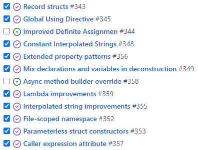

# RC 出てた話からの、GA 迫ってたりする話

[8月](../../8/invariantculture/index.md)からしばらくブログをさぼっていたわけですが。
ブログとしてはお久しぶりです。

## C# 10.0 記事

まあ、とはいえ、別に消息不明になっていたわけでもなく、[C# によるプログラミング入門](../../../../study/csharp/index.md)の方の記事書きをちゃんとしていただけでして。

<section class="latest-posts sub-info-section">
<header><h3>更新履歴</h3></header>
<article>
<time datetime="2021-10-24T00:00:00.0000000">2021/10/24</time>
<header>
<h4>更新：<a href="../../../../study/csharp/cheatsheet/ap_ver10.md">C# 10.0 の新機能</a></h4>
[C#]
</header>
</article>
<article>
<time datetime="2021-10-17T00:00:00.0000000">2021/10/17</time>
<header>
<h4>更新：<a href="../../../../study/csharp/functional/fun_localfunctions.md">ローカル関数と匿名関数</a></h4>
[C#]
</header>
</article>
<article>
<time datetime="2021-09-23T00:00:00.0000000">2021/09/23</time>
<header>
<h4>更新：<a href="../../../../study/csharp/start/improvedinterpolatedstring.md">C# 10.0 の補間文字列の改善</a></h4>
[C#]
</header>
</article>
<article>
<time datetime="2021-09-20T00:00:00.0000000">2021/09/20</time>
<header>
<h4>更新：<a href="../../../../study/csharp/datatype/patterns.md">パターン マッチング</a></h4>
[C#]
</header>
</article>
<article>
<time datetime="2021-09-12T00:00:00.0000000">2021/09/12</time>
<header>
<h4><a href="../../../../study/csharp/start/miscreservedattribute.md">[雑記] コンパイル結果に影響を及ぼす属性</a></h4>
[C#]
</header>
</article>
</section>

[C# 10.0 機能リスト](https://github.com/ufcpp/UfcppSample/issues/342)のうち、最低限必要なものは埋まったというか、残りは、

* 限られた人だけが使う(大部分の人は間接的恩恵しか受けない)もの
* 細かい挙動変更
* C# 10.0 リリース時点でどの道 `<LangVersion>preview</LangVersion>` 必須なもの

だけのはずです。

まあこの時期どうせネタ元であるところの [csharplang](https://github.com/dotnet/csharplang/) も [roslyn](https://github.com/dotnet/roslyn/) も11月の .NET 6.0 / C# 10.0 正式リリースに向けた作業をしているわけで、
うちのサイト的にも C# 入門ページを更新する方の優先度高めでおかしくないはず。
(という言い訳。)

## RC (リリース候補版)出てた

そうこうしている間に、
[.NET 6 も RC になり](https://github.com/ufcpp-live/UfcppLiveAgenda/issues/45)、
[Visual Studio も RC になり](https://github.com/ufcpp-live/UfcppLiveAgenda/issues/47)、
それに対するライブ配信では「今日の本題は "go-live" の一言で終わりです。あとはその先の話を」とかやっていたりしました。

## GA (正式リリース)する

そして、Visual Studio 2022 も .NET 6.0 も C# 10.0 も、来週には正式リリース(Generally Available)になりますね。
正式リリースされた暁には…
毎年あるあるなんですが、プレビューの時に遊びつくしていてリリースのタイミングで改めて言うこともないので記念雑談でもしようかと…

[C# 10.0 / .NET 6.0 / Visual Studio 2022 正式リリース記念](https://github.com/ufcpp-live/UfcppLiveAgenda/issues/49)

<iframe width="400" height="225" src="https://www.youtube.com/embed/-5jmoMUCQnc" title="YouTube video player" frameborder="0" allow="accelerometer; autoplay; clipboard-write; encrypted-media; gyroscope; picture-in-picture" allowfullscreen></iframe>

今年、なんか、[.NET Conf](https://www.dotnetconf.net/) の前日に [Visual Studio 2022 のローンチ イベント](https://visualstudio.microsoft.com/ja/launch/)をやるみたいですね。
Visual Studio 2022 はそのタイミングで正式リリースとのこと。

ということで、上記「記念配信」は、Visual Studio はリリース済み(アメリカ太平洋標準時8日以降)、
.NET Conf 開催(同 PST 9日8時半)直前のはずの、日本時間の9日夜にする予定です。

## その先の話しようか

上記 RC ライブ配信でも「その先の話」してましたし、直近のライブ配信なんて「[時代は既に what's next for VS](https://github.com/ufcpp-live/UfcppLiveAgenda/issues/48)」とかやってたわけでして。

要は、うちのブログで「ピックアップRoslyn」って銘打ってやってる話を最近さぼり気味で、ネタがたまり気味…

C# 10.0 記事の方が(ニッチなネタを除けば)落ち着いたんで、ちょこちょこ消化していければいいなぁと思う所存です。(「明日から本気出す」なやつ。)
