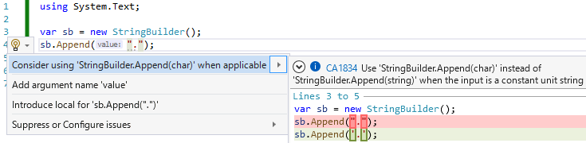

# 【C# 10.0】 AppendLiteral(" ")

C# 10.0 で、[文字列補間に対するパフォーマンス改善](../../../../study/csharp/cheatsheet/ap_ver10.md#improved-string-interpolation)が入りました。
例えば、以下のようなコードがあったとして、

```csharp {title="文字列補間の例"}
static string A(int x, int y) => $"({x}, {y})";
static string B(int a, int b, int c) => $"{a}.{b}.{c}";
```

C# 10.0 では `$""` の部分がそれぞれ以下のように展開されます。

```csharp {title="文字列補間の C# 10.0 での展開結果"}
using System.Runtime.CompilerServices;

static string A(int x, int y)
{
    DefaultInterpolatedStringHandler h = new(4, 2);
    h.AppendLiteral("(");
    h.AppendFormatted(x);
    h.AppendLiteral(", ");
    h.AppendFormatted(y);
    h.AppendLiteral(")");
    return h.ToStringAndClear();
}

static string B(int a, int b, int c)
{
    DefaultInterpolatedStringHandler h = new(4, 2);
    h.AppendFormatted(a);
    h.AppendLiteral(".");
    h.AppendFormatted(b);
    h.AppendLiteral(".");
    h.AppendFormatted(c);
    return h.ToStringAndClear();
}
```

今日の話はこの `AppendLiteral` のところの最適化の話。

## インライン展開

上記の展開結果を最初に見た時の感想は「`AppendLiteral(char)` はなくていいの？」でした。
C# 的に、文字 (`'.'`) は単なる数値(2バイトの値型)なのに対して、文字列(`"."`) は参照型(ヒープ アロケーションが掛かる)なので、効率が悪いんじゃないかと。

実際、例えば類似のメソッドとして、`StringBuilder.Append` なんかは「文字列じゃなくて文字のオーバーロードを使え」というコード解析が出てきたりします。



何も対処しないと確かに問題になるっぽいんですが、これに対して、`DefaultInterpolatedStringHandler.AppendLiteral` の実装を工夫して、効率を落とさないようにしているそうです。

今現在(2021/11/7)の `DefaultInterpolatedStringHandler.AppendLiteral` の中身は以下のような感じ。

[DefaultInterpolatedStringHandler.cs#L136](https://github.com/dotnet/runtime/blob/f54ab52d24ee524a246e463d754e526832850d4a/src/libraries/System.Private.CoreLib/src/System/Runtime/CompilerServices/DefaultInterpolatedStringHandler.cs#L136)

まんまコメントが書かれていますが、

> AppendLiteral is expected to always be called by compiler-generated code with a literal string.
> By inlining it, the method body is exposed to the constant length of that literal, allowing the JIT to
> prune away the irrelevant cases.  This effectively enables multiple implementations of AppendLiteral,
> special-cased on and optimized for the literal's length.  We special-case lengths 1 and 2 because
> they're very common, e.g.
>
>     1: ' ', '.', '-', '\t', etc.
>     2: ", ", "0x", "=>", ": ", etc.
>
> but we refrain from adding more because, in the rare case where AppendLiteral is called with a non-literal,
> there is a lot of code here to be inlined.

文字列長が1文字と2文字のときの特殊分岐を書いた上で、
`AggressiveInlining` を付けています。
要点だけを抜き出すと以下のようなコード。

```csharp {title="AppendLiteral 中の特殊分岐"}
using System.Runtime.CompilerServices;

[MethodImpl(MethodImplOptions.AggressiveInlining)]
void AppendLiteral(string value)
{
    if (value.Length == 1)
    {
        // value[0] しか参照しないコード
        return;
    }

    if (value.Length == 2)
    {
        // value[0], value[1] しか参照しないコード
        return;
    }

    // 汎用ロジック
    AppendStringDirect(value);
}
```

`AppendLiteral` には文字通りリテラルしか渡ってこないという前提ありきですが、
これで1文字の場合と2文字の場合はかなり速くなるとのこと。

JIT 時最適化で、
1文字の文字列リテラルが渡ってきたときには `if (value.Length) == 1)`、
2文字のが渡ってきたときには `if (value.Length) == 2)` の中身しか残らないそうです。
