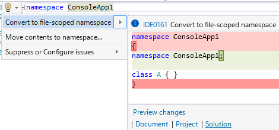

# 【C# 10.0】ファイル スコープ名前空間 (一斉置換設定)

昨日、C# 10.0 が正式リリースされたわけですが、皆様もう C# 10.0 へのアップグレードはお済でしょうか(当日アプグレが当たり前のような口調)。

まあ、
C# はそんなに大きな破壊的変更はしない言語ですし、
TargetFramework や LangVersion を書き換えるだけならそこまで大きな問題は起きないんじゃないかと思います。
(たぶん。
僕は [CryptoStream の破壊的変更](https://docs.microsoft.com/en-us/dotnet/core/compatibility/core-libraries/6.0/partial-byte-reads-in-streams)由来のテスト失敗を1件踏みましたが。)

あえて踏み込むのであれば、

* 名前空間を `namespace N {}` からファイル スコープな `namespace N;` に書き換え
* `ImplicitUsings` を true にして未使用 `using` になる部分をごっそり削除

とかやると、機械的にできてリスクは低いものの大量の差分行を産むコミットを作れたりします。
[ASP.NET では95万行の差分が出たそうですよ](https://twitter.com/ufcpp/status/1456993276066627591)(もちろん、「Hide whitespace」とかやるとほとんどの行が消える)。

とりあえず今日はこのうち前者、
ファイル スコープ名前空間の一斉全置換の話をしようかと思います。

## ファイル スコープ名前空間

C# 10.0 のテーマの1つは「[シンプル プログラム](../../../../study/csharp/cheatsheet/ap_ver10.md#simple-program)」になっています。
その一環で、

```csharp
namespace Namespace
{
    class A { }
}
```

という従来コードを、

```csharp
namespace Namespace;

class A { }
```

と書き換えられる機能([ファイル スコープ名前空間](../../../../study/csharp/structured/sp_namespace.md#file-scoped-namespace))が入りました。

まあ、名前空間とかパッケージ宣言とかで1段インデントを下げない言語の方が多いですしね。

C# はこの手の「新しい体験が得られるわけではなく、単にシンプルに書けるようになるだけ」みたいな新文法はこれまでそんなに積極的に追加はしてこなかったんですけども、
最近の流暢に乗ってついに折れた感じはします。

## ファイル スコープ名前空間を採用する？

正直まあ、「新しい体験」は何もなく、単なる書式的な問題になるわけで、
既存コードに導入するモチベーションはそんなに高くないと思います。
手動で書き換えろと言われたら絶対に拒否。

ですが、全自動だと言われたら？

既存コードベースは1操作で変換可能で、
新規 C# ソースコードの追加時にもデフォルトでファイル スコープ名前空間な状態のファイルができるとしたら？

自分は「全自動ならまあ、やってもいいかな」くらいには思っています。

## 設定が必要 (.editorconfig)

ただまあ、この機能、「絶対にやれ」とも「絶対にやるな」とも言いにくい割かしどっちでもいい機能なわけでして。
「使えるならファイル スコープ名前空間を率先して使う」というモードにするためには設定が必要です。

書式・Code Fix 上の問題なので、Visual Studio のオプションで設定するか、
.editorconfig に設定を書くかする必要があります。
どちらを好むかはプロジェクトごとに違うでしょうから、Visual Studio オプション(全部のプロジェクトに影響)ではなく、
.editorconfig で設定する方が好ましいと思います。
(なのでそちらだけ説明します。)

ファイル スコープ名前空間を率先して使いたい方は .editorconfig に以下の行を追加してみてください。

```csharp
[*.{cs,vb}]
csharp_style_namespace_declarations=file_scoped:suggestion
```

これで、Visual Studio の一斉置換機能が働くようになります。



この行だけを修正するか、ドキュメント全体、プロジェクト全体、ソリューション全体を一斉置換するかはお好みでどうぞ。
ソリューション一斉置換とかすると数千～数万行の差分を作れます。
僕は昨日・今日で合計10万行くらいの差分を作りました。

末尾の suggestion (Visual Studio の Error List ペインにメッセージが出ちゃう)のところは silent (何もメッセージは出ないものの Code Fix を掛けることはできる)でも warning (修正しないと警告が出る)でも大丈夫です。

ちなみに、warning にしておけば、`dotnet format` コマンドでの自動整形も掛かります。
過激派の方はぜひとも warning に。
