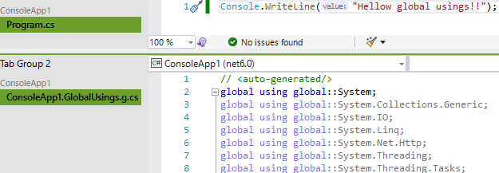

# 【C# 10.0】 ImplicitUsings (自動 global using)

今日は[先日のファイル スコープ名前空間の話](../fix-all-file-scoped-namespace/index.md)に続いて、
[global using](../../../../study/csharp/cheatsheet/ap_ver10.md#global-using) に関する話を[最初にブログに書いたとき](../../8/newprojecttemplate/index.md)にちょこっと「正式リリースまでには変更が掛かる予定」と話していた `ImplicitUsings` の話をしたいと思います。

## global using

何回か話してはいるんですが、 .NET 6 SDK から、C# プロジェクトのテンプレートの初期状態が以下のような(コメントを除けば)1行だけのソースコードになっています。

```csharp {title="新コンソール アプリ テンプレート"}
Console.WriteLine("Hello, World!");
```

C# コンパイラーとしては [global using](../../../../study/csharp/cheatsheet/ap_ver10.md#global-using) という文法を追加したわけですが、
わざわざ C# の文法として追加した(コンパイル オプションにはしなかった)のは [Source Generator](../../../../study/csharp/misc/analyzer-generator.md) を使って global using を生成するような手法も取れるようにするためです。

ただし、主な用途は上記のような「テンプレートの初期状態を簡素化する」というもので、
多くの場合「自動的に裏のどこかで global using が追加されている」みたいな使われ方になります。

## global using の自動生成

で、誰が「自動的に global using を追加」しているかというと、.NET 6 SDK です。
.NET 6 / Visual Studio 2022 で新規プロジェクトを作って、1回 build してみて、
`obj/Debug/net6.0` フォルダーを覗いてみると以下のようなファイルが `ConsoleApp1.GlobalUsings.g.cs` みたいな名前で作られています。

(`Debug` のところは build 設定次第では `Release` になりますし、
`net6.0` のところは TargetFramework、
`ConsoleApp1` のところはプロジェクト名によって変わります。)



ちなみに、このコードはコンソール アプリの場合の結果で、
プロジェクトのタイプごとに生成される global using 対象の名前空間が変わります。

例えば Windows Forms の場合は `System.Drawing` と `System.Windows.Forms` が、
Web アプリの場合は `Microsoft.AspNetCore.*`、`Microsoft.Extensions.*`、`System.Net.Http.Json` などの名前空間も追加されます。
この辺りは Windows Forms や Web を作っているチームごとのポリシーによるみたいです。

## ImplicitUsings

[.NET 6 Preview 7 の頃に書いたブログ](../../8/newprojecttemplate/index.md)で、初期案としては「TargetFramework が `net6.0` の時は無条件に global using を自動追加」みたいなことをやろうとしていました。

が、global using は既存コードベースに後から追加するとたまに事故ります。
分かりやすい例でいうと、自前で LINQ っぽい拡張メソッドを定義した場合。
例えば .NET 5 の頃に以下のようなコードを書いていたとして、
これを .NET 6 にアップデートしたら、「`Select` が `System.Linq` と `MyExtensions` の2か所にあって弁別できない」というエラーが起き得ます。
(実際、Preview 7 の頃はエラーになりました。)

```csharp {title="自前 LINQ で global using が競合する例"}
using System;
using MyExtensions;

var result = new[] { 1, 2, 3, 4 }.Select(x => x * x);

namespace MyExtensions
{
    static class Enumerable
    {
        public static IEnumerable<T2> Select<T1, T2>(this IEnumerable<T1> array, Func<T1, T2> selector)
        {
            // 実装は省略。
            return null!;
        }
    }
}
```

わざわざ `Select` を自作する人は少ないかもしれませんが、
例えば、「これまで標準でなかったから `MinBy`、`MaxBy` を自作していた。これらが .NET 6 で標準入りした」みたいな衝突は割かし起こるんじゃないかと思います。

その他、被りやすい名前でいうと `Task` クラスがそうで、`global using System.Threading.Tasks;` の自動追加が問題になったりします。

あと、「TargetFramwork は `net6.0` だけど、 LangVersion は 9 とか 8 とかで維持したい」みたいな場合に「global using を生成してしまったけど C# 9.0 以前では使えない」というコンパイル エラーを起こしていました。

ということで、明示的に設定を追加したときだけ「global using の自動追加」が働くように変更されました。
具体的には、csproj に以下の1行(`ImplicitUsings` オプションが true もしくは enable)があるときにだけ自動追加が働きます。

```xml {title="ImplicitUsings"}
    <ImplicitUsings>enable</ImplicitUsings>
```

で、この行は、.NET 6 SDK を使って新規プロジェクトを作成すると、初期状態で入っています。
.NET 6 SDK の、例えばコンソール アプリの csproj の初期状態は以下のような感じ。

```xml {title=".NET 6 で dotnet new console した直後の csproj の中身"}
<Project Sdk="Microsoft.NET.Sdk">
 
  <PropertyGroup>
    <OutputType>Exe</OutputType>
    <TargetFramework>net6.0</TargetFramework>
    <ImplicitUsings>enable</ImplicitUsings>
    <Nullable>enable</Nullable>
  </PropertyGroup>
 
</Project>
```

## Using オプション

ちなみに、(C# ソースコードで global using を書くのではなくあくまで csproj 設定で) 自動的に global using される名前空間を追加したり削除したりする手段も用意されています。

`ItemGroup` 配下に `Using` というタグを書いて、

* `Include` 属性を書くと名前空間追加
* `Remove` 属性を書くと名前空間削除

になります。

例えば以下のように書くと、`System.Text.RegularExpressions` 名前空間が追加されて(`Regex` クラスなどが使える)、
`System.Linq` 名前空間が削除されます(自前 LINQ との衝突がなくなる)。

```xml {title="Using タグの例"}
<Project Sdk="Microsoft.NET.Sdk">

  他の設定は省略

  <ItemGroup>
    <Using Include="System.Text.RegularExpressions"/>
    <Using Remove="System.Linq"/>
  </ItemGroup>
 
</Project>
```

## 全域一括 ImplicitUsings

この `ImplicitUsings` と、あと、 C# 8.0 / の頃からある `Nullable` オプションですが、まあ、既存コードベースを壊さないために opt-in (明示的に書かないと有効化されない、デフォルトで無効)なわけです。

とはいえ、今、まっさらな状態から新規コードを書き始めるにはこの2つは「ノイズ」です。
そこでお薦めするのが [`Directory.Build.props`](../../../2018/12/directorybuild/index.md) に書き足してしまう手法。

この名前のファイルに csproj に入れたい設定類を書いておくと、
そのファイルがあるフォルダー配下にある全 csproj に対して設定が有効化されます。
なので、リポジトリのルート フォルダーに以下の内容で `Directory.Build.props` ファイルを置いておけば、リポジトリ全域に対して `ImplicitUsings` と `Enullable` が有効化されます。

```xml {title="お薦め Directory.Build.props"}
<Project>
 
  <PropertyGroup>
    <ImplicitUsings>enable</ImplicitUsings>
    <Nullable>enable</Nullable>
  </PropertyGroup>
 
</Project>
```

新規リポジトリにはこのファイルを置いておいていいんじゃないでしょうか。
(`ImplicitUsings` に関しては既存リポジトリに対しても、前述のような名前の衝突は経験上、数千～数万行に1個くらいしか起きない程度なので割かし追加しちゃっていいと思います。)
