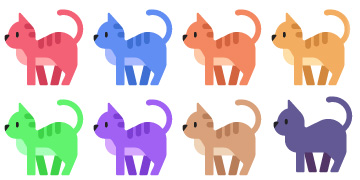

# 任意色絵文字？

🐈‍⬛

Windows にもついに Unicode 13.0 が来ました(今更)。

## Unicode 13.0

Unicode 13.0 のリリース、2020年3月なんですよね。
ずいぶんと前。

それに対して、Windows 10 の間は Unicode 13.0 には一向に対応せず…
今思えば新しい絵柄(Windows 11 の新絵文字)を作っていたから、古い絵柄(Windows 10 の絵文字)を更新するリソースを割かなかったんだろうなとは思うんですが。

Unicode 13.0 の新文字の分かりやすいのが本項冒頭の黒猫でして、
🐈‍⬛ の文字、Windows 10 だと 🐈⬛ (ネコ + 黒四角)になるはずです。

というか、Windows 11 でも対応したのはつい最近です。
こないだ[ニンジャキャット終了のお知らせ](../ninjacatdies/index.md)のときに書いた新絵文字のタイミングでやっと黒猫が表示できるようになりました。

iOS とかから遅れること1年半以上…

[にじさんじの新人さん(今年7月デビュー)](https://twitter.com/AXIA_96NE)が 🐈‍⬛ を推し絵文字に決定した時には「やべ、Windows で表示できねぇ…」ってなって焦りました。

## 色選択

さてこの黒猫、典型的な ZWJ シーケンスです。
最近書いた[UTF-8の敗北話](../regional-indicator/index.md)とか、
[ニンジャキャット終了のお知らせ](../ninjacatdies/index.md)とかでも触れてるんですが、

🐈 (U+1F408)、ZWJ (U+200D)、⬛ (U+2B1B)

という3文字から構成される、🐈 の色違い絵文字です。

ちなみにこの ⬛ なんですが、「Black Large Square」という名前の文字です。
そして、実は Large Square シリーズ、現在(Unicode 12.0 以降)、他に7色あります。

* 🟥 (U+1F7E5) Large Red Square
* 🟦 (U+1F7E6) Large Blue Square
* 🟧 (U+1F7E7) Large Orange Square
* 🟨 (U+1F7E8) Large Yellow Square
* 🟩 (U+1F7E9) Large Green Square
* 🟪 (U+1F7EA) Large Purple Square
* 🟫 (U+1F7EB) Large Brown Square

これもしや、もはやゲーミング動物絵文字が作れるのでは…

※画像はイメージです



どう見ても「文字コード」の仕様の範疇を超えてますけども。

実際、こういうのは「文字」のレイヤーの1段上の「マークアップ」とかを使ってやってくれ(要するに、Unicode の債務ではなく、HTML の style 属性とか CSS とかを使って色を付けて欲しい)ということになってたはずなんですけども。

絵文字で Unicode に色の概念を持ち込んじゃったから…
むしろ今、カラー絵文字には foreground-color が効かないですからねぇ。

まあ、こんなカラフル動物絵文字が [RGI](https://unicode.org/reports/tr51/#def_rgi_set) (どのベンダーも実装すべきという推奨絵文字)に採用されるとは思えませんが。
むしろ、なんで黒猫を足しちゃったんですかね…

## 某4色窓

そしてこのカラフル四角形があるなら…

```text
🟥🟩
🟦🟨
```

あのロゴ行けるんじゃない？
ZWJ シーケンスで四角を4つ繋げば。

みたいな話も [C# ライブ配信](https://www.youtube.com/channel/UCY-z_9mau6X-Vr4gk2aWtMQ)中ではよくコメントが付いたりします。

まあ、[先日、権利的にまずそうなロゴは Unicode に採用しかねる](../ninjacatdies/index.md#apple-log)という話を書いたところなので、こんな絵文字が採用されることはあり得ないんですけども。

特に[この会社、ロゴ利用のガイドラインがものすごくしっかり規定されてるんで](https://www.microsoft.com/ja-jp/mscorp/legal/trademarks-corplogo.aspx)、簡単に色々抵触しそうですし。
