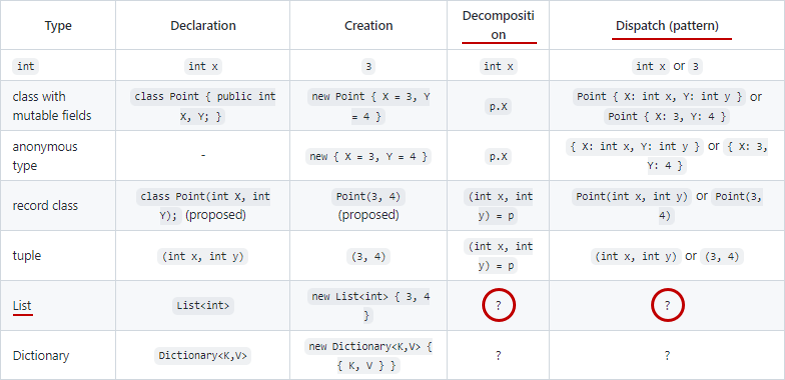

# 【C# 11 候補】リスト パターン【VS 17.1 p2 で追加予定】

C# に[パターン](../../../../study/csharp/datatype/patterns.md)がまた1個増えます。
今回はリスト。`is [..]` とかで配列や `List<T>` にマッチ。
これをリスト パターンと言います。

Roslyn 化(C# コンパイラーを C# で書き直し)した初期の頃から、C# の進化の長期テーマになってる ["Programming With Data"](https://github.com/dotnet/csharplang/discussions/3107) の続きです。
以下の表の赤丸を付けたところ。



ちなみにこのリスト パターンは Visual Studio 17.1 Preview 2 向けですでに merge 済み。近々動くコンパイラーを実際に触れるはずです。

## <a id="square-bracket">角括弧</a>

リスト パターンには `[]` を使うことになりました。

当初予定は `{}` (プロパティ パターンと被る)とか `[]{}` (これはこれでキモイ)とかも検討されていたんですが。
配列初期化子とかコレクション初期化子との対称性のためでしたが、
構文解析的にきつくて断念。

```csharp {title="当初案(没)"}
var array = new[] { 1, 2 };

// 当初案1:
// int[] array = { 1, 2 }; との対比。
// { Length: > 0 } とかとの区別が付かなくて断念。
if (array is { })
{
}

// 当初案2:
// var array = new[] { 1, 2 }; との対比。
// まだ {} の部分がきついのと、length を必要としないときに [] を付けるのがだいぶつらい。
const int length = 2;
if (array is [length] { 1, _ })
{
}
```

結果的に、`[]` だけにすることに。

```csharp {title="[] でリスト パターンを表現"}
var array = new[] { 1, 2 };

Console.WriteLine(array is []); // 長さ0マッチ。false。
Console.WriteLine(array is [_, _]); // 長さ2マッチ。true。
Console.WriteLine(array is [ .. ]); // 任意長さマッチ。true。

Console.WriteLine(array is [ 1 ]); // 長さ1マッチ。false。
Console.WriteLine(array is [ 1, .. ]); // 1で開始、任意長さ。true。
Console.WriteLine(array is [ .., 2 ]); // 2で終了、任意長さ。true。
Console.WriteLine(array is [ 1, .., 2 ]); // 1で開始、2で終了、任意長さ。true。
```

基本的には「長さピッタリ」にだけマッチします。
任意長さとマッチさせたい場合は `..` を挟むという仕様です。

## <a id="slice-pattern">..パターン</a>

ちなみに、 `..` の後ろには入れ子でパターンを書けます。
主に [var パターン](../../../../study/csharp/datatype/patterns.md#var)で「マッチ結果の一部分」を抜き出すのに使います。

```csharp {title="..var"}
ReadOnlySpan<int> a = new[] { 1, 2, 3, 4, 5 };

if (a is [1, ..var middle, 5])
{
    Console.WriteLine(middle.Length); // 2, 3, 4 で長さ3
}
```

あんまり意味はないですが、`[..[]]` とかも書けます。

```csharp {title=".. の後ろに再度 []"}
ReadOnlySpan<int> a = new[] { 1, 2, 3, 4, 5 };
Console.WriteLine(a is [1, ..[2, 3, 4], 5]); // true
```

`[1, ..[2, 3, 4], 5]` と `[1, 2, 3, 4, 5]` が同じ意味になるので、
ある意味スプレッド演算([JavaScript とかにある配列を展開するやつ](https://developer.mozilla.org/en-US/docs/Web/JavaScript/Reference/Operators/Spread_syntax))です。

## <a id="lowering">展開結果</a>

リスト パターンは、`Length` チェックと[インデックス・範囲処理](../../../../study/csharp/data/dataranges.md)を使ったようなコードに展開されます。

例えば先ほどの `a is [1, ..var middle, 5]` であれば、以下のようなコードと同じ結果になります。

```csharp {title="[1, ..var middle, 5] を展開"}
ReadOnlySpan<int> a = new[] { 1, 2, 3, 4, 5 };

if (a.Length >= 2 && a[0] == 1)
{
    var middle = a[1..^1];
    if (a[^1] == 5)
    {
        Console.WriteLine(middle.Length);
    }
}
```

`^` と `..` もさらに展開すると以下のコードと同じ意味。

```csharp {title="^ と .. も展開"}
ReadOnlySpan<int> a = new[] { 1, 2, 3, 4, 5 };

var length = a.Length;
if (length >= 2 && a[0] == 1)
{
    var middle = a.Slice(1, length - 1 - 1);
    if (a[length - 1] == 5)
    {
        Console.WriteLine(middle.Length);
    }
}
```

ちなみに、`Length` か `Count` プロパティとインデクサーを持っている型に対してリスト パターンを使えます。

## <a id="collection-literal">[] リテラル (C# 11 より後かも)</a>

`new[] {}` との対称性をあきらめてパターン側を `[]` にしたわけですが、
ここで逆の発想が出て来たみたいです。
配列・コレクションの初期化の方も `[]` リテラルでやる案。

```csharp {title="[] でコレクション初期化"}
using System.Collections.Immutable;

int[] array = [ 1, 2 ];
Span<int> span = [ 1, 2 ];
ReadOnlySpan<int> ros = [ 1, 2 ];
List<int> list = [ 1, 2 ];
ImmutableArray<int> immutable = [1, 2];
```

これの話はまた回を改めて書くと思いますが、`ImmutableArray` の初期化も視野に入れています。 (`ImmutableArray` は今の `new() { 1, 2 }` だと望まれる動作にならない。)
