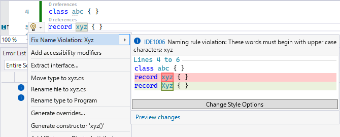

# 【近々警告追加】小文字 a～z 型名

## 型名のコードスタイル

C# も最近はコードスタイル的なものに対するおせっかいをするようになってきました。
そのうちの1つが「型名は小文字始まりやめろ」。



現在はこれが Suggestion レベルのメッセージ(警告ほど深刻ではないものの、Visual Studio 上で常に下線が表示されて結構「直せ」圧強め)になります。

まあ、このスタイルに違反する人はそんなにいないんじゃないかと思います。
C# の型名と言えば大体大文字始まりの UpperCamelCase。
類縁なプログラミング言語の Java でも型名は UpperCamel なのでこれに関して宗教論争になることはほとんどないかと思われます。

## 型名とキーワードの弁別

C# は後方互換性をものすごく大事にする言語で、
極端な話20年近く前の C# 1.0 時代に書いたコードも8～9割方そのまま今の C# 10.0 で動くんじゃないかと思います。

そんな言語なので、新文法のためにキーワードを追加したい場合、
ほとんどは「文脈キーワード」(contextual keyword)です。
文字通り「文脈を見てキーワードなのか、通常の識別子なのかを弁別」みたいなことをしています。
この辺り、[今年の2月にも同じような話をしています](../../2/lexicalkeywords/index.md)が、`var` なんかは

* `var` と言う名前の型がどこかに存在したら型名扱い
* それがなければキーワード

みたいな扱いになります。

で、その2月のブログでも言っていますが、
あんまりにも文脈に頼った弁別をするのはなかなかに大変と言う議題が上がっています。

特に、C# 9.0 で[レコード型](../../../../study/csharp/datatype/record.md)を追加するにあたって問題になったんですが、
(識別子の中でも特に)型名がキーワードとぶつかると弁別がかなりしんどいそうです。

ということで、`record` キーワードの追加にあっては破壊的変更(過去に `record` という名前の型を作って運用しているコードは C# 9.0 にするとコンパイルが通らなくなる)を認めることになりました。
例えば以下のコードは C# 8.0 と 9.0 で意味が変わります。

```csharp {title="C# 9.0 での破壊的変更"}
class A
{
    record record;
}
```

* C# 8.0: `record` と言う名前の型の、`record` という名前のフィールドになる
* C# 9.0: `record` という名前のレコード型を定義

この破壊的変更に際して、そもそもとして、「`record` という名前の型自体に警告」というのも追加しています。

```csharp
// C# 8.0 までは無警告。
// C# 9.0 で CS8860 警告を追加。
class record { }
```

## lowerCase 型名要る？

`record` キーワードの件、
C# にしては珍しい規模の大胆な破壊的変更なんですが。

でも実際のところ、誰かこれで困った人はいらっしゃいます？

今のところ C# チームにもこれを問題視するクレームは全然入ってこないそうです。

そりゃまあ。
そもそも lowerCase な型名、C# では使わないですからね。

そして次の C# 11.0 候補として `required` というキーワードを足したいそうなんですが、
ここでも改めて「`required` という名前の型には警告」を出すかどうかが議題に上がりました。

* [[Open Question]: required parsing #5439](https://github.com/dotnet/csharplang/issues/5439)

ぶっちゃけ、`record` の時と比べると文脈を見た弁別は簡単だそうです。
とはいえ、`record` (この名前の方がよっぽど使われる可能性が高い)でも問題を起こさなかったんだから、いっそ `required` も警告にした方が幸せなのではないかと。

## 全部小文字 a～z 型名の禁止

ということで、将来キーワードとして被りかねない型名は全部警告にしてしまえという話があります。

* [Report a level 7 warning for lower-cased type names #56905](https://github.com/dotnet/roslyn/pull/56905)

C# において、キーワードはすべて「小文字のラテンアルファベットのみ」なので、小文字 a～z だけの型名を全部警告に。
Visual Studio 17.1 で導入される予定です。

本項の冒頭の `class abc` とか `record xyz` は Suggestion どころではなく、警告になります。
`class var` とか `class dynamic` とかもダメですよ！

ちなみに、どうしても小文字アルファベットな型名が必要な場合、`@` を付けておけば警告は出ないそうです。

```csharp {title="CS8981 警告の追加"}
// class record だと CS8860 警告。
// class @record だと IDE1006 suggest だけ。
class @record { }

// class abc だと今後 CS8981 警告が出る予定。
// class @abc だと IDE1006 suggest だけ。
class @abc { }
```

## 小文字型名警告に備える

dotnet/runtime 内ではすでにこの警告追加に対する備え済み。

* [Escape lower-cased type names #62507](https://github.com/dotnet/runtime/pull/62507)

ほとんどはちゃんと UpperCamelCase になるようにリネームして対処しています。

一部、[C/C++ との相互運用の場合は元の型名をそのまま引き継いだ方がいい](https://github.com/dotnet/runtime/pull/62507#issuecomment-988711116)という理由でそのまま。
これは `@` を付けて対処したようです。
