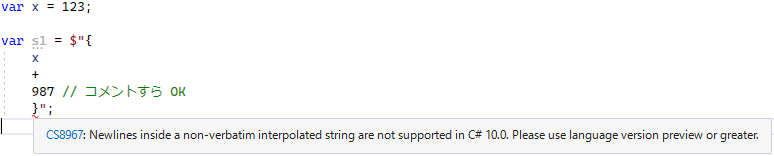

# 【C# 11 候補】 {} 中の改行

今日は「実は Visual Studio 17.1 Preview 1 (先月) の時点で既に入ってた」という機能の話。

C# 11 で、`$"{ここ}"` みたいな「補完穴」(interpolation hole: 補完文字列の `{}` の中)の改行に関する仕様がちょっと変わります。

## <a id="new-line-in-string">文字列リテラル中の改行</a>

C# の[文字列リテラル](../../../../study/csharp/start/st_embeddedtype.md#charl)は、`@` を付けると逐語的(`\` を使ったエスケープをしなくなる)になって、その中には改行を直接入れることができます。

<pre class="source" title="@ を付けると文字列内での改行 OK になる">
<code>// @ を付けると文字列内での改行 OK になる。

var s1 = &quot;&quot;; // 改行入れれない。
var s2 = @&quot;
&quot;; // 改行 OK。
var s3 = &quot;
&quot;; // 当然これはコンパイル エラー。
</code></pre>

この仕様、[補間文字列](../../../../study/csharp/start/st_string.md#key-interpolated-string)に対しても同様です。

<pre class="source" title="">
<code>// @ を付けると文字列内での改行 OK になるのは $&quot;&quot; でも一緒。

var x = 123;

var s1 = $&quot;{x}&quot;; // 改行入れれない。
var s2 = @$&quot;
{x}
&quot;; // 改行 OK。
var s3 = $&quot;{x}
&quot;; // 当然これはコンパイル エラー。
</code></pre>

## <a id="new-line-in-interpolation-hole">補間穴中の改行</a>

C# はほぼ全ての構文で改行の有無を問わないので、例えば以下の2つのコードは全く同じ意味になります。

<pre class="source" title="1行">
<code>var x = 123 + 987;
</code></pre>

<pre class="source" title="改行を入れたもの">
<code>var
    x
    =
    123
    +
    987
    ;
</code></pre>

で、補間穴 (`{}`)の中は普通の C# 構文になります。
前述のような「改行の有無を問わない」という常識に照らし合わせると、
以下のようなコードを書けていいはずです。
(C# 10 まではなぜかダメ。)

<pre class="source" title="{} 中の改行">
<code>// なぜかダメだったコード。

var x = 123;

var s1 = $&quot;{
    x
    }&quot;;
</code></pre>

ちなみに、これに `@` を付けると C# 10 でもコンパイルできます。
というか、さらに言うと割かし何でも書けます。
`//` コメントすら書けます。

<pre class="source" title="@ を付ければなぜか OK">
<code>// @ を付ければなぜか OK。

var x = 123;

var s1 = $@&quot;{
    x
    +
    987 // コメントすら OK
    }&quot;;
</code></pre>

## <a id="new-line-in-interpolation-hole-11">C# 11 での変更</a>

で、まあ、`$"{}"` と `$@"{}"` で挙動が違うの、
[仕様](https://github.com/dotnet/csharpstandard/blob/draft-v6/standard/grammar.md)的にもそうなってるらしいんですが、
中の人曰く「[改行を禁止した実際の理由、覚えてない](https://github.com/dotnet/csharplang/blob/main/meetings/2021/LDM-2021-09-20.md#newlines-in-non-verbatim-interpolated-strings)」とのこと。

挙動が違うのも変なのでさらっと直したみたいです。
気づいたタイミング的に [C# 10](../../../../study/csharp/cheatsheet/ap_ver10.md) 正式リリースには間に合わなかったものの、
ほぼ修正は終わってたみたいで、即座に merge、実は 17.1 Preview 1 には入っていたみたいです。

ということで、実は [LangVersion preview](../../../../study/csharp/cheatsheet/langversionoption.md#langversion) を入れればもう動くらしい。

(このスクショは Visual Studio 17.1.0 Preview 1.1 で撮影。)

さよなら、LangVersion default。おかえり、preview (1年ぶり2度目)。

ということで、以下のようなコード、C# 11 候補になっていて、
preview 指定すると現在でもコンパイルできたりします。

<pre class="source" title="C# 11 で有効になりそうなコード">
<code>// C# 11 候補。

var x = 123;

var s1 = $&quot;こっちは C# 11 から OK {
    x
    +
    987 // コメントすら OK
    }&quot;;

var s2 = $@&quot;こっちは元から OK
{
    x
    +
    987 // コメントすら OK
    }
def&quot;;
</code></pre>

と言うのを[昨日の Pull Request](https://github.com/dotnet/roslyn/pull/58250) を見て初めて気づいたという話でした。
