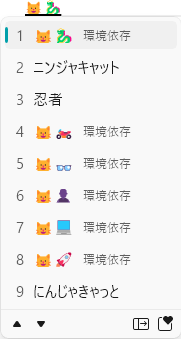
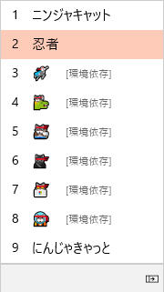
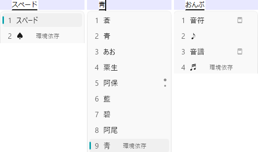

# ニンジャキャット🐱‍👤

ニンジャキャット終了のお知らせ。

そんなキャラはいなかった。いいね？

## <a id="new-emoji-glyph-win11">Windows の絵文字の絵柄一新</a>

Windows 11 で Unicode 絵文字の絵柄が一新されると言われていたわけですが。
Windows 11 初期リリースでは変更がなく、[先月ようやく新絵文字の一般提供開始](https://forest.watch.impress.co.jp/docs/news/1368473.html)されました。
そろそろ万人に(Dev 版とか Beta 版に登録してない人にも)届く頃ではないかと思います。

その結果が冒頭の絵文字。
ちなみに、同じものをこれまでの(Windows 10 とかの)絵文字で表示すると以下のようになります。

## <a id="windows-original-emoji">Windows オリジナル絵文字</a>

この猫の絵文字、Windows のオリジナル絵文字です。
一応、ニュースになるくらいにはなってたんですが:

* [Windows 10にオリジナル絵文字「ニンジャキャット」が追加されることが明らかに](https://gigazine.net/news/20160413-emoji-ninja-cat/)

こいつ、元々は「内輪ネタ」だそうです。

このバージョンの Windows 10 (Build 14316)は ZWJ シーケンス(後述)に対応した初めてのバージョンっぽい(たぶん)ので、
それの社内テスト用に「内輪のキャラ」を使っていたんですかね。
なぜ公開した…

ちなみに、[Windows 公式ブログ](https://blogs.windows.com/windows-insider/2016/04/06/announcing-windows-10-insider-preview-build-14316/)では「いろんな絵文字に対応したよ」というアピールはあるものの、
「オリジナル絵文字を足したよ」なんて言葉はどこにもないので、
特に「良かれと思って足した文字」ではないんじゃないかと思います。
ただの茶目っ気。

## <a id="uax29">Unicode の仕様的な話</a>

Unicode の絵文字がらみの仕様には何段階かあるんですが…

* [Graphme Cluster Boundaries](https://unicode.org/reports/tr29/#Grapheme_Cluster_Boundaries)
  * 「一連の文字を、ユーザーインターフェース上は1文字として扱え」という仕様
  * 例えば、「[発音区別符号](https://ja.wikipedia.org/wiki/%E3%83%80%E3%82%A4%E3%82%A2%E3%82%AF%E3%83%AA%E3%83%86%E3%82%A3%E3%82%AB%E3%83%AB%E3%83%9E%E3%83%BC%E3%82%AF)の手前で切ってはいけない」みたいなの
* [ZWJ シーケンス](https://unicode.org/reports/tr29/#GB11)
  * Graphme Cluster の作り方の1つ
  * 「[接合子](https://ja.wikipedia.org/wiki/%E3%82%BC%E3%83%AD%E5%B9%85%E6%8E%A5%E5%90%88%E5%AD%90)と呼ばれる文字の前後で切ってはいけない」という仕様
  * わりかし機械的に判定可能
  * 「複数の絵文字を ZWJ でつないで別の絵文字を作る」という仕様あり
* [RGI 絵文字](https://unicode.org/reports/tr51/#def_rgi_set)
  * Recommended for General Interchange (一般にやり取り可能にすることを推奨)
  * 最低ラインどのベンダーでも実装してくれることを期待する絵文字の一覧
  * 1文字1文字リストアップしていて機械判定できない
* [RGI 絵文字 ZWJ シーケンス](https://unicode.org/reports/tr51/#def_emoji_ZWJ_sequences)
  * ZWJ シーケンスとして定義されている RGI 絵文字
  * もし対応していない場合、ZWJ を無視して複数の絵文字で描画すればいいと言うことになってる

みたいな仕様があります。

([12月4日に書いたブログのネタ](../regional-indicator/index.md)もこの類です。)

## <a id="ninja-cat-dies">ニンジャキャット終了</a>

で、ニンジャキャットは、「RGI ではない ZWJ 絵文字シーケンス」ということになります。なので、

* ZWJ シーケンスの仕様に沿って機械判定で「1文字扱い」はどのベンダーでもできる
* RGI ではないので別に Windows 以外のベンダーが実装する義理は全くない
* 対応していないベンダーでは単に「🐱 と 👤 の2文字」とかで描画すればいい

という文字。

で、冒頭の画像に戻るわけですが、

Windows 10 の頃:

Windows 11 (最近のアップデート):

はい、オリジナル絵文字だったものが、「対応していないので2文字で表示します」状態に変わりました。

元から本当に公開するつもりで作った絵文字なのかどうかすら定かではないですからねぇ。
絵柄一新時に追加するとも思えず…

消えたのは順当。
むしろ、IME の変換候補に痕跡が残ってることが問題…

まあ、「[対応する必要性がない ZWJ シーケンス用のテストデータ](https://github.com/ufcpp/emoji/blob/3e1196a129e5dc1aa557ef2e2c4eeee982a012fc/src/RgiSequenceFinder.Test/FallbackFindIndexTest.cs#L177-L185)」としては結構便利だったんですけどね。

## <a id="kankyo-izon-windows">Windows 曰く、環境依存</a>

もう1個、IME の問題なんですけども…
Windows の IME は「[JIS X 0208](https://ja.wikipedia.org/wiki/Shift_JIS) にない文字は全部環境依存扱いする」というのがありまして。

要するに Unicode が普及する前、Shift_JIS が主流、かつ、Windows ([CP932](https://ja.wikipedia.org/wiki/Microsoft%E3%82%B3%E3%83%BC%E3%83%89%E3%83%9A%E3%83%BC%E3%82%B8932)) と Mac ([MacJapanese](https://ja.wikipedia.org/wiki/MacJapanese)) でそれぞれが Shift_JIS の独自拡張をしていた時代の名残り。

今となっては Windows でも Mac でも Linux でも iOS でも Android でも表示できる文字も「環境依存」扱いしてきます。
以下一例。

ちなみに、ひとくくりに環境依存と言っても「何の環境に依存した文字か」が全然違います。

* Unicode からの逆輸入で現在の Shift_JIS ([Shift_JIS-2004](https://ja.wikipedia.org/wiki/Shift_JIS-2004)) には入っている文字
  * スペード(♠): MacJapanese にあった文字
  * あお(靑): CP932 にあった文字
  * おんぷ(♬): Unicode 1.1 での追加
* Unicode にもない文字
  * にんじゃきゃっと(🐱‍👤とか): Windows 以外で表示するつもりのない真に独自の文字

真に Windows 独自の文字と、今となっては Shift_JIS にすら入っている文字を同じ「環境依存」でくくるのはさすがにどうかと思うんですけどねぇ…

## <a id="kankyo-izon-nowadays">現代の環境依存文字</a>

### <a id="benzene">⌬</a>

ちなみに、[12月8日に書いたベンゼン環 ⌬ ⏣](../unicode-benzene/index.md)は、Unicode にはあるけども意図的に Shift_JIS には逆輸入されなかった文字です。

あと、Unicode に入っている以上、たいていの環境で表示はできる(実際、iOS でも Android でも大丈夫)ので、「環境依存」かと言われると微妙。

(まあ、こいつは IME では変換できませんが。文字コード直打ちからの変換とかネットで検索してコピペ以外の手段で入力する方法、一通りどの OS でも僕は知らないです。)

### <a id="apple-log">林檎</a>

他に、MacJapanese にはあって Unicode には輸入されなかった文字として[某林檎マーク](https://emojipedia.org/apple-logo/)とかがあったりします。
「特定の一社のロゴマークとかは Unicode に採用しかねる」という理由で Unicode には入らず、
Mac、iOS では[私用領域](https://ja.wikipedia.org/wiki/%E7%A7%81%E7%94%A8%E9%9D%A2)を使って林檎マークを表示しています。

私用領域なのでどこの誰がどういう文字のために使おうと自由です。
そういう意味で本当に環境依存。
どこかの誰かがこの文字コードに対して💩を表示しようとも文句は言えません。

今だったら🍎(U+1F34E、red apple)と🌈(U+1F308、rainbow)を使った ZWJ シーケンスとかで表現するんでしょうけどねぇ。
MacJapanese から Unicode への移行期には絵文字も ZWJ シーケンスの仕様もありませんでしたから。
