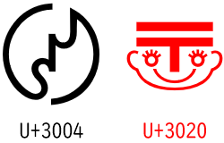

# 悪い意味でお気に入りの文字 〠〄

こないだ書いた[ベンゼン環の話](../unicode-benzene/index.md)と[ニンジャキャット終了のお知らせ](../ninjacatdies/index.md)はある意味前振りだったりしまして。

個人的にやべぇなと思う Unicode の文字で1・2を争うのは 〠 と 〄 だったりします。

* 〠: U+3020、postal mark face、顔郵便マーク
* 〄: U+3004、Japanese industrial standard symbol、JIS マーク

[アップルロゴ](../ninjacatdies/index.md#apple-log)の話で書きましたが、
商標になるようなものを Unicode に入れるとか普通は考えられないわけですが。
〠 と 〄 は一体…

## 出どころ

2文字とも出自は [MacJapanese](https://ja.wikipedia.org/wiki/MacJapanese) でして。
要は Shift_JIS の Mac 独自拡張。

どうも元々は日本の中小印刷所が使っていた外字だったらしい？
それがデファクトスタンダード化して Mac OS に取り込まれ。
それとの「互換性用文字」として Unicode にも含まれてしまったという経緯。

商標的にも怪しいですし、今の Unicode は「1国のローカルでだけ通用する記号の類」を文字として追加することには否定的なんで、今の基準でいうと絶対に入らなさそうな文字です。
ただ、MacJapanse としてもう流通してしまっている以上、互換性用としては必要。

とはいえ、商標の権利上の懸念から[アップルのロゴ](https://emojipedia.org/apple-logo/)は Unicode には収録されなかったわけで、
じゃあどうして 〠 と 〄 は平気だったのか…
私企業じゃく公的な物だとか、商標登録されてるかとかの差はあるでしょうけども。

## 〠

郵便番号を 〒 で表すこと自体、日本独自です。
この記号は逓信(ていしん)の「テ」か「T」から来てるとする説が有力らしく、今となってはその元ネタの「逓」の文字すら使われておらず。

まして顔の方。
郵政省のマスコットですよね？

一応、正確に言うと、〠 に手と胴体の付いたキャラクターが「[ナンバーくん](https://ja.wikipedia.org/wiki/%E9%A1%94%E9%83%B5%E4%BE%BF%E3%83%9E%E3%83%BC%E3%82%AF#%E3%83%8A%E3%83%B3%E3%83%90%E3%83%BC%E3%81%8F%E3%82%93)」という郵政省(郵政民営化前)のマスコットだったみたいです。
(「胴体が付いてないからナンバーくんではない」と言えなくもない。)

そしてこの「ナンバーくん」は「役割を終えた」、「民営化に伴い新会社では『撤去が望ましい』」とか言われているそうで。
日本郵便のマスコット キャラクターとしては今現在「ポストンくん」という別キャラがいるそうです。

ちなみに、[Wikipedia のポストンくんのところ](https://ja.wikipedia.org/wiki/%E9%A1%94%E9%83%B5%E4%BE%BF%E3%83%9E%E3%83%BC%E3%82%AF#%E3%83%9D%E3%82%B9%E3%83%88%E3%83%B3%E3%81%AE%E5%B0%8E%E5%85%A5)を読んでると、「フォントのメイリオでは、ベータ版公開時には郵便マークのコードポイントのU+3020にポストンの記号が使用されていた」とか書かれていたりします。
要は、互換性のためだけに存在する文字(しかも権利的に怪しい文字)に対して字形変更をすべきかどうか問題が発生。

## 〄

要は JIS マーク。
「JIS 適合していることを認証された」というのを1文字で印刷所に送れるのは昔は重宝したんでしょうね…

ところでこの記号、よく見てください。
いわゆる「旧 JIS マーク」になっています。
2004年に工業規格の法改正に伴って JIS マークも刷新されています。
「ポストンくん」問題同様、こっちでも「[Unicode 中の 〄 もグリフ字形すべき？](https://www.unicode.org/mail-arch/unicode-ml/y2009-m07/0111.html)」みたいな話があったりします。

## 新字形の文字コード

ここでまあ、[ベンゼン環は ⌬ と ⏣ の2文字ある](../unicode-benzene/index.md)という話につながります。

JIS マークも「やるんだったら新旧両方の字体があるべきだろう」という所までは話した出ており。
現実的には、元々の 〄 (U+3004) に[異体字セレクター](https://ja.wikipedia.org/wiki/%E7%95%B0%E4%BD%93%E5%AD%97%E3%82%BB%E3%83%AC%E3%82%AF%E3%82%BF)でも付けるのがいいんじゃないかということになっています。

ちなみに、需要がなさ過ぎて具体的な議論は進んでいないので、
そんな文字が Unicode に追加されることはまあまずないと思います。

ただ、[GlyphWiki](https://glyphwiki.org/) (共同編集で保守されている文字字形 Wiki)には 〄 のバリエーションとして[新 JIS マークのページ](https://glyphwiki.org/wiki/u3004-var-001)があったり、
一部の DTP 向けフォントには外字として新 JIS マークがあるらしかったり、
今でも日本には「文字として JIS マークを印刷したい」需要はあるんですね…

## まとめ

ということで改めて 〠 と 〄、

* 互換性のためだけにある
* 権利関係が謎
* しかも今現在、新意匠が作られたのでもう使われなくなった字形
* Unicode 的にも字形変更すべきか議論がある

というなかなかに罪深い文字だったりします。

なので絵文字に関する地雷話をしてるときとかに、「まあ絵文字じゃなくてもこんなやべぇやつがいるんで今更」みたいな話をよくしたり。
