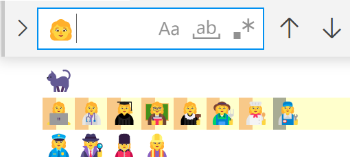

# Regional Indicator (国旗絵文字)

今日は[10/31 にやった配信で出てた国旗絵文字の話とか](https://youtu.be/7-E3GYiQU9o?t=2546)。

絵文字を検索したら別の絵文字が引っかかるというのの原理的な話になります。



## 元ネタ

まず配信中になんで国旗の話が出たか(「先日、国旗絵文字をどうデコードするか問題を見たなぁ」というのの元ネタ)の紹介。

この配信の数日前に、こんなネタがバズっておりまして。

* [EUC-JP では『海』 (b3 a4) を検索した際に『ここ』(a4 b3 a4 b3) にマッチしてしまう](https://twitter.com/hsjoihs/status/1453681402130534400)
* [UTF-8は自己同期になるように考えられているし、UTF-16だってサロゲートペアもハイサロゲートとローサロゲートを分けているのに、国旗絵文字は教訓を生かしておらず](https://twitter.com/mandel59/status/1453685117650563072)

ここから派生して、国旗絵文字の仕様がいかにひどいかという話に…

## UTF-8 の勝利

UTF-8 「多バイト文字の1バイト目」と「多バイト文字の2バイト目以降」が被らないように作ってあります。
その結果、任意のバイト列の任意の区間を切り出したとしても、以下の3つのうちのいずれかであることが確実に判定できます。

* 前後に何がつながろうと関係なく、一意にデコードできる
* 前後数バイトを読まないと正しくデコードできないことがわかる
* 前後に何がつながろうと関係なく、不正な(デコードできない)バイト列だとわかる

上記の「『ここ』の中に『海』が見つかる」みたいな、「一部区間を切り取ると別の文字に見える」みたいな問題を絶対に起こしません。
(ただしこれは符号点レベルでの話。「国旗絵文字問題」みたいな、書記素って単位で区切る必要があるものに関しては UTF-8 でも今だ問題あり。後述。)

## UTF-16

UTF-16 も「2バイトずつ区切る」という前提を持つ限りには同様に、「一部区間を切り取ると別の文字に見える」みたいな問題を絶対に起こしません。

UTF-16 には4バイト使って表現する文字があるんですが、
それも[ハイ サロゲート(上位2バイト)とロー サロゲート(下位2バイト)](http://www.asahi-net.or.jp/~ax2s-kmtn/ref/unicode/surrogate.html)と呼ばれる文字コードが完全に分かれていて、順序が違ったり、ペアになってない文字は「不正な UTF-16 データ列である」という判定ができます。一部区間を切り取ったとしても別の文字と誤認識することはありません。

ただし、これはあくまで「2バイトずつ区切る」という前提の話で、
「1バイト削る」とかやってしまうと誤判定します。
そういう意味では UTF-16 は Shift_JIS とか EUC-JP とかの時代からそんなに変わっていないです。
(この辺りも UTF-8 が主流になった理由の1つ。)

分かりやすいのは以下のような文字列。この例だと ‰ (パーミル記号)が〠 (顔郵便マーク)に化けています。

```csharp {title="UTF-16 から1バイト削るとかやっちゃダメ"}
using System.Text;

// UTF-16 (Little Endian) だと…
var s1 = "‰‰"; // 30 20 30 20
var b = Encoding.Unicode.GetBytes(s1);
var s2 = Encoding.Unicode.GetString(b[1..^1]); // 20 30
Console.WriteLine(s2); // 〠 (U+3020)
```

他にも、2バイト目に ASCII 文字を含む文字なんかも地雷です。
2バイト目(UTF-16 Little Endian だとすると上位バイト)が 5C (ASCII だと \ 記号)の文字とかはなかなかやばい地雷を踏めます。
C 言語みたいに \ 記号に特別な意味がある言語がありますんで。

割と使いそうな文字だと 尺、尼、尾、局、居、届 とかですかね。
例えば「局」は U+5C40 なんですが、これを UTF-16 LE で保存してから ASCII とか UTF-8 で読み込みなおすと @\ になります。

C 言語だと、行末に \ を置くと「改行コードを無視して次の行とつなぐ」みたいに意味になるので、 `//局` みたいなコメントを書いて、UTF-16 で保存して、文字コード指定なし(今時だいたいのコンパイラーで UTF-8 扱い)でコンパイルするとコメントの後ろの行が消えます。

```cpp {title="UTF-16 から1バイト削るとかやっちゃダメ"}
#include <stdio.h>

void main()
{//局
    printf("Hello World"); // なぜか表示されない
}
```

## UTF-8 の逆転敗北(主に絵文字のせい)

「コンピューター内部における[文字ってなんだ](https://www.buildinsider.net/language/csharpunicode/01)」という話になってくるんですが、結局、Unicode には「複数の文字を組み合わせて1文字を表現する」みたいな仕様があったりします。

前述の「符号点レベルでは大丈夫だけど、書記素のレベルではダメ」という話なんですが、

* 符号点 (code point): 32ビット数値を振られている文字
* 書記素 (grapheme): レンダリング上1文字に見える単位。複数の符号点から成り立つことがある

みたいなのがあります。

例えば以下のような「文字」(書記素)。

* 人 + 職業
  * 👩‍💻: 👩 (U+1F469), U+200D, 💻 (U+1F4BB)
  * 👩‍⚕️: 👩 (U+1F469), U+200D, ⚕ (U+2695), U+FE0F
  * 👩‍🎓: 👩 (U+1F469), U+200D, 🎓 (U+1F393)
  * 👩‍🏫: 👩 (U+1F469), U+200D, 🏫 (U+1F3EB)
* 職業 + 性別
  * 👮‍♀️: 👮 (U+1F46E), U+200D, ♀ (U+2640), U+FE0F
  * 🕵️‍♀️: 🕵 (U+1F575), U+FE0F, U+200D, ♀ (U+2640), U+FE0F
  * 💂‍♀️: 💂 (U+1F482), U+200D, ♀ (U+2640), U+FE0F
  * 👷‍♀️: 👷 (U+1F477), U+200D, ♀ (U+2640), U+FE0F

まあ、理由は分かりますよね… この例の場合はジェンダー問題。
この他に、肌の色とか髪の色とかのバリエーションもあります。

「亜種のために符号点は増やさない」というのが現在の絵文字の方針っぽい雰囲気でして、
最近(Unicode 13.0)だと「色違いの動物」絵文字とかも「符号点を複数組み合わせた書記素」として追加されました。
(Unicode 13.0 (2020年リリース)は Windows 10 だと表示できないので注意。Android, iOS, Windows 11 では表示できます。)

* 色違い亜種の動物
  * 🐈‍⬛: 🐈 (U+1F408), U+200D, ⬛ (U+2B1B) の3符号点
  * 🐻‍❄️: 🐻 (U+1F43B), U+200D, ❄ (U+2744),️ U+FE0F の4符号点

で、「文字の中に別の文字が現れる」問題が再発します。

それで冒頭のスクショになります。再掲:


👩‍💻👩‍⚕️👩‍🎓👩‍🏫👩‍⚖️👩‍🌾👩‍🍳👩‍🔧 という絵文字列の中に 👩 という別の絵文字が見つかってしまいます。

(ほんとはそれは「正しく書記素を扱えていない」ということになるのでエディターの不具合なんですが。
後述しますが、書記素単位で検索するというのが必ずしもいいことではないのでなんとも。)

## 書記素分割の仕様

符号点は単純に UTF-8 とか UTF-16 をデコードしたら得られる32ビット数値なので非常にわかりやすいんですが。
書記素の方はどうなっているかと言うと、結構複雑な仕様があります。

* [UAX29 Unicode Text Segmentation](https://unicode.org/reports/tr29/)

この仕様の中に「ここで文字を区切ってはいけない」とか「ここで文字を区切る」みたいなルールが書かれています。
このうち、絵文字の分割は「[3 Grapheme Cluster Boundaries](https://unicode.org/reports/tr29/#Grapheme_Cluster_Boundaries)」(書記素クラスターの境界)の仕様に従います。

この「区切ってはいけない」のルールに従うのではあれば、
「👩‍💻 の中に 👩 を見つけてしまう」みたいなことも避けられます。
U+200D (Zero Width Joiner、2つの符号点をくっつけるための文字)の前後は区切ってはいけないというルールがあるので、👩‍💻 (U+1F469, U+200D, U+1F4BB) を 👩 (U+1F469)と 💻 (U+1F4BB)に分けてはいけないということになります。

## 改行も書記素

ちなみにまあ、絵文字以外にも書記素になるものはあって、
日本人でも注意が必要なものとしては「CR と LF の間は区切ってはいけない」([GB3](https://unicode.org/reports/tr29/#GB3))というルールがあります。

歴史的背景から、Windows での改行コードは CR LF (U+000D, U+000A)で、
Unix 系 OS の改行コードは LF (U+000A) なわけですが。
これを横着して、「LF で検索すれば CR LF でも LF でも引っかかるはず」と思っていると事故る(CR LF にマッチしない)可能性があるということです。
書記素として見るなら CR LF と LF は別の文字ということになります。

「まあ普通『書記素として検索』とかしませんよね！」
とか思っていたら、C# でも1回事故ってるんですよね。

* [Breaking change with string.IndexOf(string) from .NET Core 3.0 -> .NET 5.0
](https://github.com/dotnet/runtime/issues/43736)

.NET Core 3.0 から .NET 5.0 にアップグレードしたら `IndexOf` と `Contains` で改行文字の扱いが変わってしまったという。
(ちなみにこれ、[カルチャー依存問題](../../8/invariantculture/index.md)です。
さらに言うと結局、.NET 6.0 で改行の扱いが .NET Core 3.0 と同じに戻ったみたいです。)

## 国旗 (Regional Indicator)

で、そんな元からつらい絵文字の中でも、国旗絵文字の仕様は特にひどいんですよね…

「国コードに相当する2文字を並べて国旗を表現」とかやります。
このために使う文字を [Regional Indicator](https://en.wikipedia.org/wiki/Regional_indicator_symbol) といって、U+1F1E6～1F1FF の範囲に並んでいます。

そりゃね… [KR](https://emojipedia.org/flag-south-korea/) (韓国)と [US](https://emojipedia.org/flag-united-states/) (アメリカ)を並べたら [RU](https://emojipedia.org/flag-russia/) (ロシア)が出てきますとも…

UAX29 の分割アルゴリズム的にはどう対処しているかと言うと…

**[奇数個の Region Indicator では区切るな。](https://unicode.org/reports/tr29/#GB12)**

はい。個数依存です。
先ほどの 👩‍💻 なら U+200D の周りだけ見れば判定可能なんですが。
Regional Indicator の場合は国旗が連続しているとき、端っこまでさかのぼった上で、通算の個数を数えないと判定できません。

AZ (アゼルバイジャン)と ZA (南アフリカ)みたいな国コードもあるので、同じ国の国旗を大量に並べるだけで、2国のうちどちらなのか判定するのが急に大変になります。

(極端な話、1,000個くらい同じ国旗を並べたら、8,000バイトくらいさかのぼらないと AZ なのか ZA なのかが確定しない場合があります。
完全に冒頭の「EUC-JP における『こ』と『海』」と同じ問題を踏んでいて、
「国旗絵文字は教訓を生かしていない」と言われても仕方がない状態。)

「さかのぼる」とか「繰り返す」みたいな処理は他の書記素分割アルゴリズムでも出てくるんですが、「個数を数える」は本当に Region Indicator だけ。

## 国旗 (Tag Sequence)

「国」(country)というと角が立つんで本当は「地域」(territory)とすべきなんですが、
まあ国旗(地域の旗)絵文字はその後、3つほど追加されています。
[England](https://emojipedia.org/flag-england/)、
[Scotland](https://emojipedia.org/flag-scotland/)、
[Wales](https://emojipedia.org/flag-wales/)。
(要するに、連合王国内の country を「国」と訳してしまうと国旗になってしまう3地域。)

さすがに Regional Indicator のクソ仕様は反省しているみたいで、新しい旗は別の構成方法を取っています。

例えば England 旗は U+1F3F4, U+E0067, U+E0062, U+E0065, U+E006E, U+E0067, U+E007F という並びになっていて、

* U+1F3F4: 元々ある「黒い旗」絵文字🏴。
* U+E0000～E007F: 0～7F の ASCII 文字に対応する「タグ文字」と呼ばれる文字
* 地域の旗は「黒い旗」から始めて、地域コード(gbeng, gbsct, gbwls)に相当するタグ文字を並べ、最後にエスケープ タグ(U+E007F)で閉じる

という仕様。

開始文字と終端文字が決まっているので、Region Indicator 時代にあったみたいな「連続していると最初まで延々とさかのぼらないと確定しない」問題はなくなっています。

(他に、原理的には、2文字の制限がなくなったのでかなり細かい単位の地域の旗であっても対応できるとか、開始文字を変えることで旗以外の地域に関連した何かを表現するとかできるので、将来の拡張性も非常に高いです。
この仕様に対応していない文字レンダリング環境では単に黒旗🏴が表示されますし、その意味でも親切設計。)

こういう仕様を Tag Sequence って言うみたいです。
無茶苦茶変な仕様ですし、1文字辺りのバイト数もすごいこと(上記の3つの旗はいずれも UTF-8 で28バイト)になるんですが、まあ Region Indicator の反省を踏まえた結果こうなっています。
